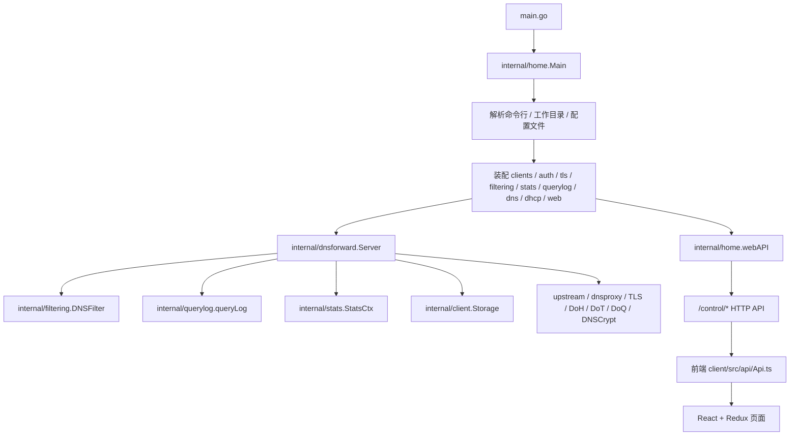
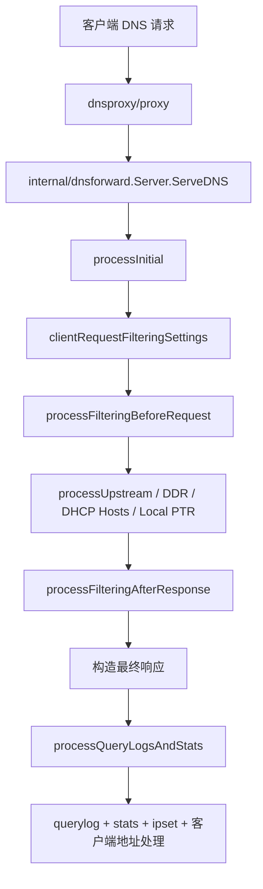

# AdGuard Home 开发导图

本文档用于当前目录 `C:\WWWS\Documents\AdGuardHome-0.108.0-b.88` 的开发定位、阅读导图、调用链梳理与改动入口速查。

适用范围：

- 当前这份目录快照，不是完整 Git 工作树，当前目录下没有 `.git`。
- 根目录已有预编译前端产物 `build/static`，也保留了前端源码 `client/src`。
- 根目录已有一份历史技术文档 `AGHTechDoc.md`，但它更偏概念/旧说明；本文档更偏“下次开发时如何快速落点到文件、代码、函数”。

当前快照统计：

- Go 源文件约 `450` 个。
- Go 测试文件约 `149` 个。
- 前端 `client/src` 下 `ts/tsx` 文件约 `204` 个。
- 前端 E2E 用例 `10` 个。
- OpenAPI 路径约 `81` 个，标签约 `15` 个。

阅读建议：

1. 先看“总览”和“核心调用链”，建立脑图。
2. 再看“后端目录定位”“前端目录定位”，找到实际改动目录。
3. 真正开始改功能时，直接跳到“常见开发任务如何定位”。
4. 如果要精确查函数名，用文末的 `rg` 检索模板。

说明：

- 下文里的行号是按当前快照整理的，后续改动后会漂移。
- 真正定位时，优先使用“文件路径 + 函数名”。

## 1. 一眼看懂项目

这是一个“Go 后端 + React/Redux 前端 + 预编译静态资源嵌入 + 本地 DNS/DHCP/TLS/过滤/日志/统计/升级”的完整桌面/服务型应用。

最重要的两套入口：

- 默认旧主线：`main.go` -> `internal/home.Main(clientBuildFS)`
- 新实验主线：`main_next.go` -> `internal/next/cmd.Main(frontend)`

技术栈速览：

- 后端语言：Go `1.26.3`
- 前端语言：TypeScript / React `16` / Redux / webpack `5`
- DNS 代理核心依赖：`github.com/AdguardTeam/dnsproxy`
- 过滤规则依赖：`github.com/AdguardTeam/urlfilter`
- DHCP/底层抓包依赖：`gopacket`、`dhcp`、`mdlayher/*`
- 持久化：YAML 配置、BoltDB、查询日志文件

非常重要的架构分层：

- `internal/home`：旧主线总编排层，负责启动、配置、模块装配、Web API、TLS、用户认证、首次安装向导。
- `internal/dnsforward`：DNS 请求生命周期的核心执行层，处理监听、过滤、转发、缓存、统计、查询日志、访问控制。
- `internal/filtering`：过滤内核，负责规则列表、SafeBrowsing、Parental、SafeSearch、Rewrites、Blocked Services。
- `internal/dhcpd`：旧主线使用的 DHCP 管理层和 HTTP API。
- `internal/dhcpsvc`：更底层的 DHCP 服务实现与协议处理逻辑。
- `internal/client`：设备/客户端模型，含持久客户端、运行期客户端、rDNS/WHOIS/ARP/DHCP 信息整合。
- `client/src`：前端控制台。
- `build/static`：编译好的前端，最终被 Go `embed` 进二进制。

## 2. 总体脑图



默认主线的核心认知：

- `internal/home` 不是单一业务模块，而是“启动器 + 装配器 + Web 控制平面 + 配置写回中心”。
- `internal/dnsforward` 才是 DNS 请求真正经过的主战场。
- `internal/filtering` 是规则引擎，`dnsforward` 通过它决定是否拦截、重写、返回阻断响应。
- 前端并不知道 `/control/...` 的完整前缀，前端 `Api.ts` 里只写相对路径，基地址在 `client/constants.js` 里是 `control`。

## 3. 启动与运行主链

### 3.1 默认旧主线

入口文件：

- `main.go`
  - `//go:build !next`
  - 嵌入 `build/`
  - 调用 `internal/home.Main`

关键启动链：

- `internal/home/home.go:82` `Main(clientBuildFS fs.FS)`
  - 初始化命令行选项
  - 初始化工作目录
  - 推导配置文件路径
  - 配置日志
  - 建立信号处理器
  - 如果是 service 控制命令则走 `handleServiceControlAction`
  - 否则进入 `run(...)`

- `internal/home/home.go:757` `run(...)`
  - `aghtls.Init`
  - `detectFirstRun`
  - 构造 `http.ServeMux` + `aghhttp.DefaultRegistrar`
  - `setupContext` 读取/迁移配置
  - `configureOS`
  - `filtering.InitModule`
  - `newDefaultConfigModifier`
  - `initContextClients`
  - `initTLS`
  - `setupDNSFilteringConf`
  - `setupOpts`
  - `initUpdate`
  - `initUsers`
  - `newWeb`
  - `runDNSServer`（非首次安装）
  - `checkPermissions`
  - `web.start`

### 3.2 首次安装与正常运行分叉

- `internal/home/home.go:1345` `detectFirstRun(...)`
  - 没有配置文件时视为首次启动。

首次启动时：

- `setupContext(...)` 不加载完整配置，只做宿主检查。
- `newWebAPI(...)` 会注册安装向导相关 handler。
- 浏览器入口会被导向 `install.html`。
- DNS/DHCP 等完整模块不会像正常模式那样直接全部启动。

正常运行时：

- `parseConfig(...)` 读取并迁移 YAML 配置。
- `runDNSServer(...)` 装配并启动 DNS/TLS/DHCP。
- `/control/*` 管理 API 全量可用。

### 3.3 `next` 新主线

入口文件：

- `main_next.go`
  - `//go:build next`
  - 调用 `internal/next/cmd.Main(frontend)`

新主线特征：

- 更偏“服务对象 + 配置管理器”结构。
- 关键包：
  - `internal/next/cmd`
  - `internal/next/configmgr`
  - `internal/next/dnssvc`
  - `internal/next/websvc`
- 当前默认构建仍是旧主线，`next` 更像重构中的新架构。

## 4. 目录总览

### 4.1 根目录重要文件

| 路径 | 作用 |
| --- | --- |
| `main.go` | 默认编译入口，嵌入 `build/` 并进入 `internal/home` |
| `main_next.go` | `next` 架构入口 |
| `go.mod` | Go 模块定义，依赖与工具链 |
| `Makefile` | 总构建入口，串联前后端构建、测试、lint、release |
| `README.md` | 当前 fork 项目说明、上游来源声明、安装与构建方法 |
| `AGHTechDoc.md` | 历史技术文档，偏概念与 API 行为 |
| `HACKING.md` | 开发规范入口，已跳转到外部代码规范仓库 |
| `openapi/openapi.yaml` | 当前主要 OpenAPI 规范 |
| `openapi/next.yaml` | `next` 相关 API 规范 |
| `CHANGELOG.md` | 版本更新记录 |

### 4.2 根目录重要目录

| 目录 | 作用 | 开发时是否高频进入 |
| --- | --- | --- |
| `internal/` | 后端核心源码 | 是 |
| `client/` | 前端源码、构建配置、前端测试 | 是 |
| `build/` | 已编译前端静态资源 | 高频只读 |
| `scripts/` | 构建、发布、翻译、数据更新脚本 | 中高 |
| `openapi/` | API 规范 | 中 |
| `doc/` | 架构图等静态文档 | 中 |
| `docker/` | Dockerfile 集合 | 中 |
| `snap/` | Snap 打包配置 | 低到中 |
| `bamboo-specs/` | Bamboo CI/CD 规格 | 低 |
| `.github/workflows/` | GitHub CI 入口 | 中 |

## 5. 构建系统与产物关系

### 5.1 Makefile 主命令

`Makefile` 关键目标：

- `make` / `make build`
  - 等价于 `deps` + `quick-build`
- `make deps`
  - `js-deps` + `go-deps`
- `make quick-build`
  - `js-build` + `go-build`
- `make test`
  - `js-test` + `go-test`
- `make lint`
  - `js-lint` + `go-lint`
- `make build-release`
  - 全平台打包
- `make build-docker`
  - 生成 Docker 镜像

### 5.2 前端产物如何进入后端

编译链：

1. 前端源码在 `client/src`
2. webpack 输出到 `build/static`
3. `main.go` 通过 `//go:embed build` 嵌入整个 `build/`
4. `internal/home/web.go` 用 `http.FileServer(http.FS(conf.clientFS))` 对外提供静态资源

因此：

- 改前端源码后，如果要让 Go 二进制看到新页面，必须重新构建前端。
- `build/static` 是生成物，不是实际业务源码。

### 5.3 前端 webpack 入口

`client/webpack.common.js` 定义三个入口：

- `src/index.tsx` -> 主控制台 `main`
- `src/install/index.tsx` -> 安装向导 `install`
- `src/login/index.tsx` -> 登录页 `login`

当前 `client/src` 仍处于历史 `.js` 与新 `.ts/.tsx` 并存阶段，因此 `resolve.extensions` 必须优先 `ts/tsx`，否则无扩展名导入会在构建时误命中旧 `.js` 文件，并在 ESM 规则下触发 fully specified 解析错误。

输出位置：

- `../build/static`

开发时代理：

- `client/webpack.dev.js` 会读取上层 `AdguardHome.yaml` 里的 `bind_host` / `bind_port`
- dev server 反向代理到本地后端

## 6. 默认旧主线核心调用链

### 6.1 Web API 调用链


关键点：

- `internal/home/control.go` 注册全局控制类接口。
- 业务模块自行注册自己的 `/control/*` 路由：
  - `internal/dnsforward/http.go`
  - `internal/filtering/http.go`
  - `internal/querylog/http.go`
  - `internal/stats/http.go`
  - `internal/dhcpd/http_unix.go`
  - `internal/home/clientshttp.go`
  - `internal/home/tls.go`

### 6.2 DNS 请求调用链



关键入口：

- `internal/dnsforward/requesthandler.go:18` `ServeDNS`
- `internal/dnsforward/process.go`
- `internal/dnsforward/filter.go`
- `internal/dnsforward/stats.go`
- `internal/dnsforward/msg.go`

### 6.3 配置读写链

读取：

- `internal/home/config.go:682` `parseConfig(...)`
- 内部会调用 `configmigrate` 迁移旧 schema

写回：

- `internal/home/config.go:871` `(c *configuration) write(...)`
- 统一通过 `defaultConfigModifier.Apply(...)` 落盘

配置 schema：

- `internal/configmigrate/configmigrate.go:5` `LastSchemaVersion = 35`

## 7. 后端目录定位

## 7.1 `internal/home`：旧主线总编排层

目录职责：

- 启动流程
- 首次安装向导
- Web 管理 API 框架
- 用户认证与 session
- TLS 管理
- 客户端管理 API
- 配置读取/写回
- 服务安装/控制
- 进程信号处理

文件定位：

| 文件 | 主要职责 | 关键类型/函数 |
| --- | --- | --- |
| `internal/home/home.go` | 应用主启动链、模块装配总控 | `Main`、`run`、`runDNSServer`、`initTLS`、`initUpdate`、`initUsers`、`detectFirstRun` |
| `internal/home/config.go` | YAML 配置结构、读取、校验、写回 | `configuration`、`parseConfig`、`validateConfig`、`(configuration).write`、`defaultConfigModifier` |
| `internal/home/dns.go` | 统计/日志/过滤/DNS server 装配 | `initDNS`、`initDNSServer`、`newServerConfig`、`registerDoHHandlers` |
| `internal/home/web.go` | Web API server、自带静态资源、HTTP/HTTPS/HTTP3 | `webAPIConfig`、`webAPI`、`newWebAPI`、`start`、`serveTLS`、`mustStartHTTP3` |
| `internal/home/webpanel.go` | 面板 URL 前缀校验、DoH Web bridge、nginx 风格 404 | `wrapPanelHandler`、`panelURLForRequest`、`registerDoHBridgeHandlers` |
| `internal/home/control.go` | 全局控制接口注册与 HTTP 中间层 | `handleStatus`、`registerControlHandlers`、`ensure`、`postInstallHandler` |
| `internal/home/controlinstall.go` | 首次安装向导 API | `handleInstallGetAddresses`、`handleInstallCheckConfig`、`handleInstallConfigure`、`finalizeInstall` |
| `internal/home/controlupdate.go` | 版本检查与在线升级 API | `handleVersionJSON`、`requestVersionInfo`、`handleUpdate`、`finishUpdate` |
| `internal/home/auth.go` | 用户模型与 auth 核心装配 | `webUser`、`authConfig`、`auth`、`newAuth` |
| `internal/home/authhttp.go` | 登录/登出/session/cookie/默认认证中间件 | `handleLogin`、`handleLogout`、`authMiddlewareDefault` |
| `internal/home/adminhttp.go` | 管理员账号重置 API | `adminUpdateJSON`、`handleAdminUpdate` |
| `internal/home/authglinet.go` | GL.iNet 模式认证中间件 | `authMiddlewareGLiNet`、`checkToken` |
| `internal/home/authratelimiter.go` | 登录失败限速与封禁 | `authRateLimiter`、`check`、`inc` |
| `internal/home/clients.go` | 客户端容器装配，连接 `internal/client` 与 web/querylog | `clientsContainer`、`Init`、`Start`、`findMultiple` |
| `internal/home/clientshttp.go` | 客户端 CRUD/Search API | `handleGetClients`、`handleAddClient`、`handleUpdateClient`、`handleSearchClient` |
| `internal/home/tls.go` | TLS 配置、证书校验、端口校验、热重载 | `tlsManager`、`newTLSManager`、`handleTLSStatus`、`handleTLSConfigure`、`validateCertificates` |
| `internal/home/service.go` | 系统服务安装/启停/状态命令 | `program`、`handleServiceControlAction`、`handleServiceCommand` |
| `internal/home/signal.go` | 信号监听、优雅关闭、重载 | `signalHandler`、`handle`、`shutdown`、`reloadConfig` |
| `internal/home/options.go` | 命令行参数定义与解析 | `options`、`initCmdLineOpts`、`parseCmdOpts` |
| `internal/home/profilehttp.go` | 用户 profile（主题/语言等）API | `Theme`、`handleGetProfile`、`handlePutProfile` |
| `internal/home/i18n.go` | 当前语言查询/切换 | `handleI18nCurrentLanguage`、`handleI18nChangeLanguage` |
| `internal/home/mobileconfig.go` | Apple `.mobileconfig` 下载接口 | `mobileConfigHandler`、`handleMobileConfigDoH`、`handleMobileConfigDoT` |
| `internal/home/log.go` | 日志器初始化与配置 | `newSlogLogger`、`configureLogger` |
| `internal/home/httpclient.go` | 内部 HTTP client、UA、代理配置 | `httpClient`、`httpProxy` |
| `internal/home/middlewares.go` | HTTP handler 组合与请求体限制 | `withMiddlewares`、`limitRequestBody` |
| `internal/home/context.go` | Web 用户 context 注入/读取 | `withWebUser`、`webUserFromContext` |

`internal/home` 需要重点记住的事实：

- 这是最值得先读的包，但它本身不是 DNS 业务逻辑主体，而是“总线”。
- 很多路由不是在这里真正处理，只是在这里挂进去。
- 配置写回与模块装配都汇总到这里，所以改配置字段时通常绕不开这个包。

### `internal/home` HTTP API 注册重点

全局注册入口：

- `internal/home/control.go`
  - `/control/version.json`
  - `/control/update`
  - `/control/status`
  - `/control/i18n/change_language`
  - `/control/i18n/current_language`
  - `/control/profile`
  - `/control/profile/update`

认证注册入口：

- `internal/home/authhttp.go`
  - `/control/login`
  - `/control/logout`
  - `/control/admin/update`

客户端注册入口：

- `internal/home/clientshttp.go`
  - `/control/clients`
  - `/control/clients/add`
  - `/control/clients/delete`
  - `/control/clients/update`
  - `/control/clients/search`
  - `/control/clients/find`

TLS 注册入口：

- `internal/home/tls.go`
  - `/control/tls/status`
  - `/control/tls/configure`
  - `/control/tls/validate`

安装向导注册入口：

- `internal/home/controlinstall.go`
  - `/control/install/get_addresses`
  - `/control/install/check_config`
  - `/control/install/configure`

## 7.2 `internal/dnsforward`：DNS 请求核心执行层

目录职责：

- 监听 DNS 请求
- 调用过滤引擎
- 转发 upstream
- 处理 DoH/DoT/DoQ/DNSCrypt/TLS
- 缓存、速率限制、访问控制
- 调用 querylog / stats / ipset / client address processor

最关键的文件：

| 文件 | 主要职责 | 关键类型/函数 |
| --- | --- | --- |
| `internal/dnsforward/dnsforward.go` | `Server` 定义、生命周期、Prepare/Reconfigure/Start/Stop | `Server`、`NewServer`、`Prepare`、`Start`、`Reconfigure`、`ServeHTTP` |
| `internal/dnsforward/requesthandler.go` | DNS 入口 | `ServeDNS` |
| `internal/dnsforward/process.go` | DNS 处理主流水线 | `dnsContext`、`processInitial`、`processDDRQuery`、`processDHCPHosts`、`processUpstream`、`processFilteringAfterResponse` |
| `internal/dnsforward/filter.go` | 请求前后过滤、SVCB/HTTPS 记录过滤 | `filterDNSRequest`、`checkHostRules`、`filterDNSResponse` |
| `internal/dnsforward/msg.go` | 阻断/重写/空响应/NXDOMAIN/REFUSED 等消息构造 | `genDNSFilterMessage`、`makeResponseCustomIP`、`makeResponseNullIP`、`NewMsgNXDOMAIN` |
| `internal/dnsforward/config.go` | ServerConfig、proxy.Config 构造、TLS/DNSCrypt/ListenAddr 等 | `Config`、`ServerConfig`、`newProxyConfig`、`prepareTLS`、`preparePlain` |
| `internal/dnsforward/http.go` | `/control/dns_info` 等 DNS 配置 API | `jsonDNSConfig`、`handleGetConfig`、`handleSetConfig`、`handleTestUpstreamDNS`、`handleSetProtection` |
| `internal/dnsforward/access.go` | 客户端/IP/host 访问控制 | `accessManager`、`handleAccessList`、`handleAccessSet` |
| `internal/dnsforward/stats.go` | 每条查询进入 querylog/stats 的桥接 | `processQueryLogsAndStats`、`logQuery`、`updateStats` |
| `internal/dnsforward/middleware.go` | proxy middleware、client ID、TLS/UDP 日志 | `Wrap`、`isBlockedHost`、`clientIDFromDNSContext` |
| `internal/dnsforward/upstreams.go` | bootstrap/upstream 配置装配 | `newBootstrap`、`newUpstreamConfig` |
| `internal/dnsforward/configvalidator.go` | 上游 DNS 配置探测与校验 | `upstreamConfigValidator`、`check`、`status` |
| `internal/dnsforward/ipset.go` | 把解析结果写入 ipset | `ipsetHandler`、`process` |
| `internal/dnsforward/clientid.go` | 从 DoH/DoT/DoQ/HTTPS 请求提取 `ClientID` | `clientIDFromDNSContextHTTPS`、`clientServerNameFromHTTP` |
| `internal/dnsforward/dnsrewrite.go` | DNS rewrite 响应转换 | `filterDNSRewrite`、`ansFromDNSRewriteIP` 等 |
| `internal/dnsforward/dns64.go` | DNS64 辅助处理 | `setupDNS64`、`mapDNS64` |
| `internal/dnsforward/svcbmsg.go` | SVCB/HTTPS 记录构造 | `genAnswerHTTPS`、`genAnswerSVCB` |

这层要重点记住的事实：

- `Server` 是真正的 DNS 核心对象。
- `ServeDNS` 并不直接塞满所有逻辑，而是把处理拆到 `process.go` / `filter.go` / `msg.go`。
- Web 管理 API 对 DNS 配置的读写并不在 `internal/home`，而在 `internal/dnsforward/http.go`。

### `internal/dnsforward` API 注册点

在 `internal/dnsforward/http.go:823` 之后注册：

- `/control/dns_info`
- `/control/dns_config`
- `/control/test_upstream_dns`
- `/control/protection`
- `/control/access/list`
- `/control/access/set`
- `/control/cache_clear`

## 7.3 `internal/filtering`：过滤引擎与规则系统

目录职责：

- 全局过滤配置
- 过滤规则列表下载与刷新
- 用户自定义规则
- DNS rewrites
- SafeBrowsing
- Parental Control
- SafeSearch
- Blocked Services

关键文件：

| 文件 | 主要职责 | 关键类型/函数 |
| --- | --- | --- |
| `internal/filtering/filtering.go` | `DNSFilter` 主体、过滤总入口、状态切换、启动刷新循环 | `Settings`、`Config`、`DNSFilter`、`CheckHostRules`、`CheckHost`、`New`、`Start` |
| `internal/filtering/filter.go` | 规则列表加载、刷新、增删 URL、下载远程过滤器 | `FilterYAML`、`filterAdd`、`tryRefreshFilters`、`update`、`load` |
| `internal/filtering/http.go` | filtering 相关主 API | `handleFilteringStatus`、`handleFilteringConfig`、`handleFilteringAddURL`、`handleFilteringSetRules`、`handleCheckHost`、`RegisterFilteringHandlers` |
| `internal/filtering/blocked.go` | blocked services 总配置与 API | `BlockedServices`、`ApplyBlockedServices`、`handleBlockedServicesGet`、`handleBlockedServicesUpdate` |
| `internal/filtering/rewrites.go` | 文本型 classic rewrite 解析与匹配；解析时允许 `[]:[][][]` 外围空格，但配置原文保持原样保存 | `textRewriteRule`、`prepareRewrites`、`parseTextRewriteRules` |
| `internal/filtering/simplelist.go` | 文本型简单域名白名单/黑名单解析与匹配；域名、整标签通配符、注释行；拒绝 IP 地址，避免响应 IP 被误命中 | `simpleListRule`、`parseSimpleListRules`、`matchSimpleAllowlist`、`matchSimpleBlocklist` |
| `internal/filtering/rewritehttp.go` | rewrite 文本读写与设置 API | `handleRewriteTextGet`、`handleRewriteTextUpdate`、`handleRewriteSettings` |
| `internal/filtering/dnsrewrite.go` | `urlfilter` 结果转 `DNSRewriteResult` | `DNSRewriteResult`、`processDNSRewrites` |
| `internal/filtering/safesearch.go` | SafeSearch 对外桥接 | `SafeSearch` 接口、`checkSafeSearch` |
| `internal/filtering/safesearchhttp.go` | SafeSearch API | `handleSafeSearchStatus`、`handleSafeSearchSettings` |
| `internal/filtering/servicelist.go` | 巨大的 blocked services 数据表 | `blockedService`、`serviceGroup` |
| `internal/filtering/result.go` | 过滤结果结构 | `Result`、`ResultRule` |
| `internal/filtering/reason.go` | 过滤原因枚举 | `Reason` |
| `internal/filtering/hosts.go` | 系统 hosts 匹配与 hosts rewrites | `matchSysHosts`、`hostsRewrites` |

子包定位：

| 子包 | 作用 |
| --- | --- |
| `internal/filtering/rewrite` | 新型 rewrite 存储层，`Item` + `Storage` |
| `internal/filtering/rulelist` | 规则列表引擎、下载、解析、缓存、刷新 |
| `internal/filtering/hashprefix` | SafeBrowsing / Parental 的 hash-prefix 检查器 |
| `internal/filtering/safesearch` | SafeSearch 引擎具体实现 |

特别提醒：

- `internal/filtering/servicelist.go` 很大，本质上是数据文件，通常不是手工维护的业务逻辑热点。
- blocked services、rewrite、safe search 这些功能虽然都在 filtering 领域，但 API handler 分散在不同文件里。

### `internal/filtering` API 注册点

在 `internal/filtering/http.go:720` 之后注册：

- SafeBrowsing：`/control/safebrowsing/*`
- Parental：`/control/parental/*`
- SafeSearch：`/control/safesearch/*`
- Rewrite：`/control/rewrite/*`
- Simple Domain Lists：`/control/simple_allowlist/text`、`/control/simple_blocklist/text`
- Blocked Services：`/control/blocked_services/*`
- Filtering 主配置：`/control/filtering/*`

## 7.4 `internal/dhcpd` 与 `internal/dhcpsvc`

这两个目录很容易混淆。

### `internal/dhcpd`

定位：

- 旧主线实际对接的 DHCP 管理层。
- 包含 DHCP HTTP API。
- 按 OS 区分实现，Unix/Linux/BSD/Windows 差异很大。

关键文件：

| 文件 | 主要职责 | 关键点 |
| --- | --- | --- |
| `internal/dhcpd/dhcpd.go` | 旧主线 DHCP server 对象、启停、lease 接口 | `Create`、`Start`、`Stop`、`AddStaticLease` |
| `internal/dhcpd/config.go` | DHCP 配置结构 | `ServerConfig`、`V4ServerConf`、`V6ServerConf` |
| `internal/dhcpd/http_unix.go` | Unix 下的 DHCP 管理 API | `/control/dhcp/*` 主要都在这里 |
| `internal/dhcpd/http_windows.go` | Windows 下 DHCP API 全部 `notImplemented` |
| `internal/dhcpd/v4_unix.go` | DHCPv4 核心租约与报文处理 | `handleDiscover`、`handleRequest`、`handleRenew`、`Start` |
| `internal/dhcpd/v6_unix.go` | DHCPv6 核心处理 | `process`、`Start`、`initRA` |
| `internal/dhcpd/options_unix.go` | DHCP 自定义 options 解析 | `parseDHCPOption*` |
| `internal/dhcpd/routeradv.go` | IPv6 Router Advertisement | `raCtx`、`createICMPv6RAPacket` |
| `internal/dhcpd/db.go` | lease 落盘 | `dbLoad`、`dbStore` |
| `internal/dhcpd/migrate.go` | 老 lease DB 迁移 | `migrateDB` |

### `internal/dhcpsvc`

定位：

- 更协议/底层的 DHCP 服务实现层。
- 提供 `DHCPServer`、接口抽象、报文帧处理、租约索引等。
- 旧 `dhcpd` 与这里共享 `Lease` 等结构，理解租约模型时要一起看。

关键文件：

| 文件 | 主要职责 | 关键点 |
| --- | --- | --- |
| `internal/dhcpsvc/server.go` | `DHCPServer` 生命周期与接口聚合 | `New`、`Start`、`Shutdown`、`AddLease` |
| `internal/dhcpsvc/config.go` | 总配置 | `Config`、`InterfaceConfig` |
| `internal/dhcpsvc/v4.go` | IPv4 配置与接口对象 | `IPv4Config`、`dhcpInterfaceV4` |
| `internal/dhcpsvc/handler4.go` | DHCPv4 报文处理 | `handleDiscover`、`handleRequest`、`handleRenew` |
| `internal/dhcpsvc/options4.go` | DHCPv4 options 处理 | `requestedOptions4` 等 |
| `internal/dhcpsvc/v6.go` | IPv6 配置与接口对象 | `IPv6Config`、`dhcpInterfaceV6` |
| `internal/dhcpsvc/handler6.go` | DHCPv6 报文处理 | `handleSolicit`、`handleRequest`、`handleRenew` |
| `internal/dhcpsvc/options6.go` | DHCPv6 options 处理 | `iaNAOption`、`clientDUID6` |
| `internal/dhcpsvc/interface.go` | 单网卡 lease 分配/索引逻辑 | `netInterface` |
| `internal/dhcpsvc/lease.go` | 租约结构 | `Lease`、`Clone`、`IsBlocked` |
| `internal/dhcpsvc/leaseindex.go` | 地址/名称索引 | `leaseIndex` |
| `internal/dhcpsvc/networkdevice.go` | 网络设备抽象与帧结构 | `NetworkDevice`、`frameData4/6` |

理解 DHCP 时的建议：

1. 先看 `internal/dhcpd/http_unix.go`，弄清管理 API。
2. 再看 `internal/dhcpd/v4_unix.go` / `v6_unix.go`，理解旧主线实际行为。
3. 如果涉及租约结构、底层帧或未来重构，再下钻 `internal/dhcpsvc/*`。

## 7.5 `internal/client`：客户端模型层

这里的 `internal/client` 是后端“设备/客户端”模型，不是前端目录 `client/`。

职责：

- 持久客户端配置
- 运行期客户端信息
- 多来源地址信息整合（hosts/ARP/DHCP/rDNS/WHOIS）
- 客户端维度的过滤配置与自定义 upstream

关键文件：

| 文件 | 主要职责 | 关键点 |
| --- | --- | --- |
| `internal/client/storage.go` | 客户端总存储、查找、更新、运行期信息聚合 | `Storage`、`NewStorage`、`Find`、`FindLoose`、`ApplyClientFiltering` |
| `internal/client/persistent.go` | 持久客户端定义 | `Persistent`、`SetIDs`、`Identifiers`、`ShallowClone` |
| `internal/client/client.go` | 运行期客户端定义 | `ClientID`、`Runtime`、`Info`、`WHOIS` |
| `internal/client/index.go` | 持久客户端多维索引 | `index`、`findByIP`、`findByMAC`、`clashes` |
| `internal/client/runtimeindex.go` | 运行期客户端索引 | `runtimeIndex` |
| `internal/client/addrproc.go` | 地址处理管线，驱动 rDNS/WHOIS | `DefaultAddrProc`、`Process`、`processRDNS`、`processWHOIS` |
| `internal/client/upstreammanager.go` | 客户端自定义 upstream 缓存管理 | `CommonUpstreamConfig`、`upstreamManager` |

实际联动：

- `internal/home/clients.go` 把这里的存储包装成 Web API 与 querylog 可用的容器。
- `internal/dnsforward` 会调用客户端过滤设置与自定义 upstream。

## 7.6 `internal/querylog`：查询日志

职责：

- 内存 ring buffer
- 文件落盘与轮转
- JSON 编解码
- 检索、过滤、按条件搜索
- Web API

关键文件：

| 文件 | 主要职责 | 关键点 |
| --- | --- | --- |
| `internal/querylog/querylog.go` | 对外接口定义与构造 | `QueryLog`、`Config`、`AddParams`、`New` |
| `internal/querylog/qlog.go` | 主体对象、启动/关闭、Add、内存缓冲 | `queryLog`、`Start`、`Shutdown`、`Add`、`ShouldLog` |
| `internal/querylog/querylogfile.go` | 缓冲刷盘、轮转 | `flushLogBuffer`、`encodeEntries`、`rotate` |
| `internal/querylog/qlogfile.go` | 单日志文件读取与定位 | `qLogFile`、`SeekStart`、`ReadNext`、`seekTS` |
| `internal/querylog/qlogreader.go` | 多日志文件读取器 | `qLogReader`、`seekTS`、`ReadNext` |
| `internal/querylog/search.go` | 搜索主逻辑 | `searchMemory`、`searchFiles`、`readEntries` |
| `internal/querylog/searchcriterion.go` | 单个条件匹配器 | `searchCriterion`、`match` |
| `internal/querylog/http.go` | `/control/querylog*` API | `handleQueryLog`、`handlePutQueryLogConfig`、`parseSearchParams` |
| `internal/querylog/json.go` | 日志项转前端 JSON | `entryToJSON`、`answerToJSON`、`client_proto/client_transport` 输出 |
| `internal/querylog/decode.go` | 从日志文件解码条目 | `decodeLogEntry`、`translateResult` |
| `internal/querylog/entry.go` | 日志项结构 | `logEntry`、`addResponse` |

## 7.7 `internal/stats`：统计

职责：

- 统计单元聚合
- BoltDB 持久化
- Top clients / domains / upstreams 汇总
- Web API

关键文件：

| 文件 | 主要职责 | 关键点 |
| --- | --- | --- |
| `internal/stats/stats.go` | `StatsCtx` 主体、flush、load、ShouldCount | `Config`、`StatsCtx`、`New`、`Update`、`TopClientsIP` |
| `internal/stats/unit.go` | 统计单元模型与序列化/反序列化 | `Entry`、`unit`、`unitDB`、`dataFromUnits` |
| `internal/stats/http.go` | `/control/stats*` API | `handleStats`、`handlePutStatsConfig`、`handleStatsReset` |

## 7.8 `internal/aghtls`、`internal/aghuser`、`internal/updater`、`internal/configmigrate`、`internal/next`

### `internal/aghtls`

职责：

- TLS 公共工具
- 证书文件 watcher + manager
- Root CA 装载

关键点：

- `aghtls.go`：`ParseCiphers`、`SaferCipherSuites`
- `manager.go`：`Manager` 接口
- `defaultmanager.go`：文件监听式 `DefaultManager`
- `root.go` / `root_linux.go`：系统根证书加载

### `internal/aghuser`

职责：

- 后台用户、密码、session、BoltDB 持久化

开发时关注：

- 用户模型和 session 问题要看这里。
- 登录 HTTP 流程仍然在 `internal/home/auth*.go`。

### `internal/updater`

职责：

- 版本检查
- 下载包
- 解压替换
- 备份与清理

关键文件：

- `updater.go`
  - `Updater`
  - `Update`
  - `prepare`
  - `downloadPackageFile`
  - `unpackTarGz` / `unpackZip`
- `check.go`
  - `VersionInfo`
  - `VersionInfo(...)`
  - `parseVersionResponse(...)`

### `internal/configmigrate`

职责：

- 配置 schema 迁移

开发时关注：

- `configmigrate.go:5` 当前最新 schema 版本 `34`
- `migrator.go` 定义统一迁移器
- `v1.go` 到 `v34.go` 每个文件对应一次 schema 升级

只要你新增/重命名/移动 YAML 字段，这个目录大概率要同步修改。

### `internal/next`

职责：

- 新架构重构线

关键文件：

| 文件 | 作用 |
| --- | --- |
| `internal/next/cmd/cmd.go` | 新主线入口 |
| `internal/next/configmgr/configmgr.go` | 配置管理器 |
| `internal/next/dnssvc/dnssvc.go` | 新 DNS service |
| `internal/next/websvc/websvc.go` | 新 Web service |
| `internal/next/jsonpatch/jsonpatch.go` | PATCH 辅助类型 |

如果你不是在专门推进 `next` 重构，默认先看旧主线。

## 7.9 其他辅助后端包快速索引

| 包 | 作用 |
| --- | --- |
| `internal/agh` | 通用配置修改器、外部命令构造器等基础接口 |
| `internal/aghalg` | 小型算法/泛型工具，如 `NullBool`、`SortedMap`、唯一性校验 |
| `internal/aghhttp` | HTTP/JSON 响应封装与路由注册器；当前 `DefaultRegistrar` 支持同一路径按不同 HTTP method 分发，并为未匹配 method 提供 405 回退 |
| `internal/aghnet` | 网络工具、接口枚举、静态 IP、hosts container、ignore engine、bootstrap 解析 |
| `internal/aghos` | OS 工具，文件监听、权限、syslog、用户切换、rlimit |
| `internal/aghrenameio` | 安全写文件/原子替换 |
| `internal/aghslog` | DNS/upstream 相关日志字段常量 |
| `internal/aghtest` | 测试工具桩件 |
| `internal/arpdb` | 系统 ARP 邻居表读取 |
| `internal/ipset` | Linux ipset 写入 |
| `internal/ossvc` | 系统服务安装/启停/状态 |
| `internal/permcheck` | 目录/文件权限检查与迁移 |
| `internal/rdns` | 反向 DNS 解析缓存 |
| `internal/schedule` | 每周时间段调度模型 |
| `internal/version` | 版本、channel、verbose 版本串 |
| `internal/whois` | WHOIS 查询与缓存 |

## 8. 前端目录定位

## 8.1 前端核心事实

- 技术栈：React 16 + Redux + redux-thunk + react-router-dom v5 + webpack 5
- 路由：`HashRouter`，不是 `BrowserRouter`
- API 基地址：`client/constants.js` 中 `BASE_URL = 'control'`
- 入口分 3 个：
  - 主控制台 `src/index.tsx`
  - 安装页 `src/install/index.tsx`
  - 登录页 `src/login/index.tsx`

## 8.2 `client/src` 核心文件

| 文件 | 作用 |
| --- | --- |
| `client/src/index.tsx` | 主控制台入口，创建 store，挂载 `App` |
| `client/src/configureStore.ts` | Redux store 配置 |
| `client/src/reducers/index.ts` | 主 reducer 合并 |
| `client/src/initialState.ts` | 前端各业务域状态结构定义，极其重要 |
| `client/src/i18n.ts` | 多语言初始化 |
| `client/src/api/Api.ts` | 所有后端接口封装中心 |
| `client/src/api/fetch.ts` | 统一请求封装 |

## 8.3 主控制台路由

路由定义位置：

- `client/src/components/App/index.tsx`

路由常量位置：

- `client/src/helpers/constants.ts`

主路由：

| 路由 | 页面组件 |
| --- | --- |
| `/` | `Dashboard` |
| `/logs` | `Logs` |
| `/guide` | `SetupGuide` |
| `/certificates` | `CertificateManager` |
| `/settings` | `Settings` |
| `/dns` | `Dns` |
| `/encryption` | `Encryption` |
| `/dhcp` | `Dhcp` |
| `/admin` | `Admin` |
| `/clients` | `Clients` |
| `/filters` | `DnsBlocklist` |
| `/dns_allowlists` | `DnsAllowlist` |
| `/dns_rewrites` | `DnsRewrites` |
| `/domain_blacklist` | `DomainBlacklist` |
| `/domain_whitelist` | `DomainWhitelist` |
| `/custom_rules` | `CustomRules` |
| `/blocked_services` | `Services` |

前端路由关键事实：

- 真正页面入口在 `components/App/index.tsx` 的 `ROUTES` 常量。
- `containers/*.ts` 基本是 `connect` 包装层。
- 实际 UI 代码大多在 `components/*`。
- `/certificates` 是独立的证书管理页面，现已接入真实后端：`acme-overview / acme-install / acme-issue / acme-renew / acme-push / acme-account-save / acme-dns-account-save` 等接口都走 `/control/certificate_manager/*`。
- ACME 工作目录仍固定落在 `AdGuardHome/data/acme.sh`；证书库存与托管证书文件固定落在 `AdGuardHome/data/cert`，其中数据库文件当前使用 `bbolt` 单文件存储。和早期只认固定脚本路径不同，现在后端还会额外探测系统里已有的 `acme.sh`（如 `$HOME/.acme.sh/acme.sh`、`PATH` 里的 `acme.sh`）；前端通过 `managedInstalled` 区分“当前项目受管运行时”与“仅检测到本地脚本”。
- 证书页的“安装版本”下拉现在改成懒加载：页面首屏只拉 `acme-overview`，用户聚焦版本下拉时才会请求 `/control/certificate_manager/acme-versions`；接口也改成了分页返回（`page / per_page / hasMore`），前端保留“加载更多版本...”哨兵项，避免一进页就因为 GitHub 抖动弹错。
- “删除 ACME.SH” 现在只允许删除当前项目受管运行时；如果只是检测到系统本地脚本，页面会明确标成“本地脚本 + 当前项目工作目录”，删除动作不会碰用户系统里的 `acme.sh`。
- 证书列表已保留“查看证书 / 手动续签 / 强制续签 / 自动续签 / 推送到目录 / 删除证书 / 应用到面板 / 应用到 DNS 加密”链路；证书应用关系现在由证书 ID 驱动，接口是 `/control/certificate_manager/acme-apply` 与 `/control/certificate_manager/acme-unapply`。
- “申请证书”按钮允许在 `acme.sh` 未安装时先打开弹窗查看/填写参数，但底部提交按钮会保持禁用并明确提示先安装运行时；如果用户反馈“点了没反应”，先看这里是不是又被改回了依赖 `installed` 的硬禁用。
- “申请证书”弹窗里的 `IP 列表` 已经不是纯文本框：前端改为 `react-select/creatable` 多选控件，候选项来自 `GET /control/certificate_manager/ip-options`，前端归一化逻辑集中在 `client/src/components/CertificateManager/ipOptions.ts`；如果要继续调 IP 证书交互，优先看这两个位置。
- IP 证书当前有几条硬约束：前端最多允许 100 个 IP、支持手动输入并自动规范化；后端在 `internal/home/certificate_manager.go` 也会再次限制最大 100 个 IP，并强制收口到 `Let's Encrypt`，同时不再接受单独指定 ACME 账号，避免前后端口径跑偏。
- 自动续签不再依赖打开证书页触发，当前是在 `internal/home/certificate_manager.go` 内启动后台按小时检查；联合审查时如果发现“自动续签没跑”，优先看这条后台循环和 `renewCertificateLocked`。
- `components/CertificateManager/*` 里的 DNS 弹窗通过 `ReactModal` portal 渲染，弹窗颜色变量不要只定义在 `.certificate-manager` 容器内，否则 portal 内容会丢失变量并出现透明穿透。
- 证书页的 issue 弹窗内容区现在单独带 `certificate-manager__modal-content--issue`，这是为了让 IP 选择下拉菜单不被 modal 的 `overflow: hidden` 裁切；如果后面发现“下拉框弹不出来 / 被截断”，先看这里是不是被改掉了。
- `ReactModal` 若传字符串形式的 `overlayClassName`，默认的全屏 fixed overlay 内联样式会失效；这里更稳妥的做法是保留默认 overlay，再通过 portal class 定制遮罩外观。
- 证书页里 DNS Provider 的前端目录要和原型来源保持一致；当前可对照 `G:\kwor\s-ui-main\service\acme_service.go` 里的 `defaultAcmeDNSProviderCatalog`，避免 UI 只写了部分供应商。

## 8.4 前端状态树

`client/src/reducers/index.ts` 合并了这些业务域：

- `settings`
- `dashboard`
- `queryLogs`
- `filtering`
- `toasts`
- `dhcp`
- `encryption`
- `clients`
- `access`
- `rewrites`
- `services`
- `stats`
- `dnsConfig`
- `loadingBar`

高频状态文件：

| reducer | 关注点 |
| --- | --- |
| `reducers/dashboard.ts` | 全局运行状态、版本、保护开关、客户端列表、主题、profile |
| `reducers/dnsConfig.ts` | DNS 配置页状态 |
| `reducers/filtering.ts` | 过滤列表、自定义规则、刷新状态 |
| `reducers/queryLogs.ts` | 查询日志分页/过滤/配置 |
| `reducers/dhcp.ts` | DHCP 状态、接口、lease |
| `reducers/clients.ts` | 客户端列表与 modal |
| `reducers/encryption.ts` | TLS/DoH/DoT/DoQ 配置状态 |
| `reducers/stats.ts` | 图表与统计数据 |

如果后端响应字段变了，前端最容易同时要改的文件通常是：

1. `client/src/api/Api.ts`
2. `client/src/actions/*.ts`
3. `client/src/reducers/*.ts`
4. `client/src/initialState.ts`
5. 对应页面组件

## 8.5 前端 API 封装分组

全部接口都集中在：

- `client/src/api/Api.ts`

重要分组：

| API 组 | 典型 path |
| --- | --- |
| Global | `status`、`version.json`、`update` |
| Filtering | `filtering/status`、`filtering/add_url`、`filtering/set_rules` |
| Parental | `parental/status`、`parental/enable` |
| SafeBrowsing | `safebrowsing/status`、`safebrowsing/enable` |
| SafeSearch | `safesearch/status`、`safesearch/settings` |
| DHCP | `dhcp/status`、`dhcp/interfaces`、`dhcp/set_config` |
| Install | `install/get_addresses`、`install/check_config`、`install/configure` |
| TLS | `tls/status`、`tls/configure`、`tls/validate` |
| Clients | `clients`、`clients/add`、`clients/update`、`clients/search` |
| Access | `access/list`、`access/set` |
| Rewrite | `rewrite/text`、`rewrite/settings`、`rewrite/settings/update` |
| Simple Domain Lists | `simple_allowlist/text`、`simple_blocklist/text` |
| Blocked Services | `blocked_services/get`、`blocked_services/update` |
| Stats | `stats`、`stats/config`、`stats/config/update` |
| Query Log | `querylog`、`querylog/config`、`querylog_clear` |
| Auth/Profile | `login`、`profile`、`profile/update` |
| DNS Config | `dns_info`、`dns_config`、`protection`、`cache_clear` |

记忆技巧：

- 前端 path 不带 `/control/`
- 后端注册时带 `/control/`

## 8.6 前端目录热点

### `client/src/actions`

对应业务操作层：

- `actions/index.tsx`：全局/仪表盘/设置等大杂烩 action，体量最大
- `actions/dnsConfig.ts`：DNS 配置页 action
- `actions/filtering.ts`：过滤器列表、自定义规则
- `actions/queryLogs.ts`：查询日志
- `actions/stats.ts`：统计
- `actions/rewrites.ts`：DNS rewrites 文本规则读写与总开关
- `actions/clients.ts`：客户端管理
- `actions/access.ts`：访问控制
- `actions/encryption.ts`：TLS/证书配置
- `actions/services.ts`：blocked services
- `actions/install.ts`：首次安装向导
- `actions/login.ts`：登录

### `client/src/containers`

这是 Redux `connect` 包装层，通常只做：

- `mapStateToProps`
- `mapDispatchToProps`
- 页面组件连接

真正的 UI/交互细节一般不在这里。

### `client/src/components`

组件规模统计：

| 子目录 | 文件数 | 说明 |
| --- | --- | --- |
| `App` | 2 | 应用壳、总路由 |
| `CertificateManager` | 2 | 证书管理真实页面，已接入 ACME 运行时、ACME 账号、DNS 账号、证书库存与查看/续签/推送链路 |
| `Dashboard` | 12 | 仪表盘 |
| `Filters` | 25 | 过滤页与表单 |
| `Header` | 3 | 顶部导航 |
| `Logs` | 18 | 查询日志页 |
| `ProtectionTimer` | 1 | 保护恢复倒计时 |
| `Settings` | 46 | DNS/TLS/DHCP/客户端等设置页 |
| `SetupGuide` | 2 | 引导页 |
| `Toasts` | 3 | 通知 |
| `ui` | 53 | 通用展示组件 |

高频页面组件：

- `components/App/index.tsx`
- `components/Settings/Dns/*`
- `components/Settings/Dhcp/*`
- `components/Settings/Admin/*`
- `components/Settings/Clients/*`
- `components/Logs/index.tsx`
- `components/Filters/*`
- `components/Dashboard/*`

## 8.7 安装页与登录页

安装向导源码：

- `client/src/install/index.tsx`
- `client/src/install/Setup/*`
  - `Greeting.tsx`
  - `Devices.tsx`
  - `Settings.tsx`
  - `Auth.tsx`
  - `Submit.tsx`

登录页源码：

- `client/src/login/index.tsx`
- `client/src/login/Login/index.tsx`
- `client/src/login/Login/Form.tsx`

## 8.8 前端辅助目录

| 目录/文件 | 作用 |
| --- | --- |
| `client/src/helpers/constants.ts` | 大量前端常量、路由、校验、状态映射 |
| `client/src/helpers/helpers.tsx` | 通用工具函数 |
| `client/src/helpers/validators.ts` | 表单校验 |
| `client/src/helpers/trackers/*` | tracker / companies 数据 |
| `client/src/__locales/*` | 前端通用翻译 |
| `client/src/__locales-services/*` | 服务列表翻译 |

## 8.9 前端测试

单元测试：

- `client/src/__tests__/*`

E2E：

- `client/tests/e2e/control-panel.spec.ts`
- `client/tests/e2e/dhcp.spec.ts`
- `client/tests/e2e/dns-settings.spec.ts`
- `client/tests/e2e/filtering.spec.ts`
- `client/tests/e2e/general-settings.spec.ts`
- `client/tests/e2e/login.spec.ts`
- `client/tests/e2e/querylog.spec.ts`
- `client/tests/e2e/rewrites.spec.ts`

## 9. 配置、OpenAPI、文档与脚本

## 9.1 配置系统

配置定义核心：

- `internal/home/config.go`

重要配置块：

- `HTTPConfig`
- `DNS`
- `TLS`
- `QueryLog`
- `Stats`
- `Filtering`
- `DHCP`
- `Clients`
- `Log`
- `OSConfig`
- `SchemaVersion`

配置迁移：

- `internal/configmigrate/*`

## 9.2 OpenAPI

规范文件：

- `openapi/openapi.yaml`
- `openapi/next.yaml`

关键事实：

- OpenAPI 版本：`3.0.3`
- `servers.url = /control`
- 主要描述的是旧主线 HTTP API
- 前端控制台就是围绕这套 API 建的

## 9.3 内置文档与图

| 路径 | 作用 |
| --- | --- |
| `AGHTechDoc.md` | 历史技术文档 |
| `doc/agh-arch.png` | 架构图 |
| `doc/agh-filtering.png` | 过滤流程图 |
| `README.md` | 使用和构建文档 |

## 9.4 脚本目录

`scripts/README.md` 已对脚本用途做了总说明。

高频目录：

| 目录 | 作用 |
| --- | --- |
| `scripts/make` | Makefile 实际调用的 shell 脚本 |
| `scripts/translations` | 多语言拉取/上传 |
| `scripts/blocked-services` | 更新 blocked services 数据 |
| `scripts/vetted-filters` | 更新 vetted filters 数据 |
| `scripts/companiesdb` | 更新 tracker/companies 前端数据 |
| `scripts/dev-debug` | VSCode 调试辅助脚本 |
| `scripts/snap` | Snap 构建/下载/上传 |

## 9.5 发布与 CI

| 路径 | 作用 |
| --- | --- |
| `.github/workflows/build.yml` | GitHub 构建流程 |
| `.github/workflows/lint.yml` | GitHub lint 流程 |
| `docker/*.Dockerfile` | Docker / CI / frontend / snap 构建镜像 |
| `snap/*` | Snapcraft 相关 |
| `bamboo-specs/*` | Bamboo CI/CD 配置 |

当前 GitHub fork 发布入口：

- 当前仓库：`https://github.com/nicelic/AdGuardHome-fork`。
- 上游官方仓库：`https://github.com/AdguardTeam/AdGuardHome`；`README.md` 顶部已声明本仓库 fork 自官方项目。
- `go.mod` 模块路径已改为 `github.com/nicelic/AdGuardHome-fork`，项目内部 Go import 路径已同步到该模块。
- 面向用户的项目链接主要集中在 `README.md`、`.github/ISSUE_TEMPLATE/*`、`.github/PULL_REQUEST_TEMPLATE`、`openapi/index.html`、`openapi/*.yaml`、`client/src/helpers/constants.*`。
- `scripts/install.sh` 的脚本自重跑地址使用 `raw.githubusercontent.com/nicelic/AdGuardHome-fork/main/scripts/install.sh`；安装包下载改为 GitHub Releases：`release` 频道走 `releases/latest/download`，其他频道走 `releases/download/<channel>`。
- `scripts/make/build-release.sh` 生成的 `version.json` 下载地址与公告地址已改为本仓库 GitHub Releases；`internal/updater.DefaultVersionURL` 也改为从本仓库 Release 读取 `version.json`。
- 代码注释、`CHANGELOG.md`、`internal/next/changelog.md` 中的官方 issue 链接保留为上游历史引用，不作为当前 fork 的发布入口。

## 10. 常见开发任务如何定位

### 10.1 我要改 DNS 配置页

后端：

- 读取/保存接口：`internal/dnsforward/http.go`
- 配置结构：`internal/home/config.go` 里的 `dnsConfig` 与 `dnsforward.Config`
- 运行时装配：`internal/home/dns.go` 的 `newServerConfig`
- A / AAAA 禁用开关真正生效点：
  `internal/dnsforward/process.go` 负责对 `A` / `AAAA` 请求直接回空响应，
  `internal/dnsforward/filter.go` 负责从 HTTPS/SVCB 响应里移除对应的 IPv4 / IPv6 hints
- 默认值源头：
  - 真实默认上游 / Bootstrap / 超时：`internal/dnsforward/dnsforward.go`
  - 运行时零值兜底：`internal/dnsforward/config.go` 的 `initDefaultSettings`
  - 旧主线全局默认：`internal/home/config.go` 里的 `config`
  - 当前这页最常改的默认值也在这里：
    `ratelimit=200`，`blocking_mode=null_ip`

前端：

- API：`client/src/api/Api.ts` 里的 `GET_DNS_CONFIG` / `SET_DNS_CONFIG`
- action：`client/src/actions/dnsConfig.ts`
- reducer：`client/src/reducers/dnsConfig.ts`
- 初始态默认值：`client/src/helpers/constants.ts`、`client/src/initialState.ts`
- 页面：`client/src/components/Settings/Dns/*`
- container：`client/src/containers/Dns.ts`

### 10.2 我要改过滤规则、过滤列表、SafeSearch、家长控制

后端：

- 主体：`internal/filtering/filtering.go`
- 过滤列表刷新：`internal/filtering/filter.go`
- API：`internal/filtering/http.go`
- rewrites：`internal/filtering/rewrites.go`、`rewritehttp.go`
- safesearch：`internal/filtering/safesearch*`
- blocked services：`internal/filtering/blocked.go`

前端：

- `client/src/actions/filtering.ts`
- `client/src/reducers/filtering.ts`
- `client/src/components/Filters/*`
- `client/src/actions/services.ts`
- `client/src/reducers/services.ts`

### 10.3 我要改查询日志

后端：

- 请求写入桥：`internal/dnsforward/stats.go`
- 日志主体：`internal/querylog/qlog.go`
- 文件落盘：`internal/querylog/querylogfile.go`
- 检索：`internal/querylog/search.go`
- API：`internal/querylog/http.go`

前端：

- API：`client/src/api/Api.ts` querylog 段
- action：`client/src/actions/queryLogs.ts`
- reducer：`client/src/reducers/queryLogs.ts`
- 页面：`client/src/components/Logs/*`
- 协议展示：`client/src/helpers/helpers.tsx` 的协议格式化 + `client/src/components/Logs/Cells/*`

### 10.4 我要改统计图

后端：

- `internal/stats/stats.go`
- `internal/stats/unit.go`
- `internal/stats/http.go`

前端：

- `client/src/actions/stats.ts`
- `client/src/reducers/stats.ts`
- `client/src/components/Dashboard/*`

### 10.5 我要改 DHCP

如果是管理 API / 表单：

- 后端 API：`internal/dhcpd/http_unix.go`
- 前端：`client/src/actions/index.tsx`、`client/src/reducers/dhcp.ts`、`client/src/components/Settings/Dhcp/*`

如果是 DHCP 协议行为 / 租约分配：

- 先看 `internal/dhcpd/v4_unix.go` / `v6_unix.go`
- 再看 `internal/dhcpsvc/*`

### 10.6 我要改客户端（设备）配置

后端：

- 客户端模型：`internal/client/persistent.go`
- 存储与查找：`internal/client/storage.go`
- Web API：`internal/home/clientshttp.go`
- Home 容器桥接：`internal/home/clients.go`

前端：

- API：`client/src/api/Api.ts` clients 段
- action：`client/src/actions/clients.ts`
- reducer：`client/src/reducers/clients.ts`
- 页面：`client/src/components/Settings/Clients/*`

### 10.7 我要改 TLS/证书/DoH/DoT/DoQ

后端：

- Web TLS API：`internal/home/tls.go`
- aghtls 文件监听：`internal/aghtls/defaultmanager.go`
- 证书选择与单层通配符匹配：`internal/aghtls/certselection.go`
- DNS TLS 装配：`internal/home/dns.go` 里的 `newDNSTLSConfig`
- Web 服务 TLS：`internal/home/web.go`
- 面板前缀 / DoH bridge：`internal/home/webpanel.go`
- TLS 运行时辅助：`internal/home/tlshelpers.go`
- TLS 配置比较：`internal/home/config.go` 里的 `tlsConfigSettings.setPrivateFieldsAndCompare`
  只比较声明式配置，不应把运行时装载的 `CertificateChainData` / `PrivateKeyData` 当成配置差异
- DNS 多证书路径模型：`tlsConfigSettings.CertificateKeyPairs` / `certificate_key_pairs`
- 面板多证书路径模型：`tlsConfigSettings.PanelCertificateKeyPairs` / `panel_certificate_key_pairs`
- 证书管理应用关系：`tlsConfigSettings.DNSAssignedCertificateIDs` / `dns_assigned_certificate_ids` 与 `tlsConfigSettings.PanelAssignedCertificateIDs` / `panel_assigned_certificate_ids`
- DNS 多证书校验结果：`tlsConfigStatus.CertificateKeyPairStatuses` / `certificate_key_pair_statuses`
- 面板多证书校验结果：`panelTLSConfigStatus.PanelCertificateKeyPairStatuses` / `panel_certificate_key_pair_statuses`
- 可保存状态：`tlsConfigStatus.CanApply` / `can_apply`
  用来区分“只是告警还能保存”（比如自签名链路告警）和“前端应阻止保存”（比如证书集合未覆盖 `panel_server_name` / `server_name`）

这块现在要特别注意 5 个运行规则：

1. 面板 TLS 与 DNS TLS 现在是强制分离模式：
   - `panel_server_port` 必填，不能再用 `0` 走共享模式。
   - 面板 HTTPS 走 `panel_server_port`。
   - DNS-over-HTTPS 走 `port_https`，由 `dnsproxy` 独立监听。
   - 当前后端会禁止 `panel_server_port == port_https`，前端会在保存时同步阻止保存。
   - 前端即时校验只保留证书内容、证书路径、私钥内容、私钥路径这类证书输入；普通端口/主机名/路径配置不在勾选或失焦时直接打断。
2. `panel_server_url_path` 和 `dns_over_quic_url_path` 都会做 URL 路径归一化：
   - `myui` 会变成 `/myui`
   - `/myui/` 会变成 `/myui`
   - 空值分别回退到 `/` 和 `/dns-query`
3. `panel_server_name` 和 `server_name` 都支持“单层通配符”：
   - `*.abc.cc` 可以匹配 `a.abc.cc`
   - 不能匹配 `a.a.abc.cc`
   - 想匹配 `a.a.abc.cc`，必须写精确域名，或写成 `*.a.abc.cc`
4. 面板 URL 前缀只给面板自己用：
   - 面板路径不对时，`wrapPanelHandler` 会延迟 30 秒后返回 nginx 风格 `404`
   - DNS-over-HTTPS 始终走独立 DNS 路径，不允许 `/面板前缀/dns-query`
5. 多证书选择顺序：
   - 先按 SNI 精确匹配
   - 再按单层 wildcard 规则匹配
   - 没有 SNI 时，再尝试按本地监听 IP 选择 IP 证书
   - 面板证书池只服务 `panel_server_name`；DNS 证书池只服务 `server_name`
   - `clientid.example.org` 这种“多一个前缀标签”的放宽规则只给 DNS 名用，不给面板名用
   - 配置保存前还会校验证书集合是否覆盖 `panel_server_name` / `server_name` 代表的服务名，避免“表单能保存、运行时其中一边握手失败”
   - 这一层公共逻辑在 `internal/aghtls/certselection.go`

前端：

- `client/src/actions/encryption.ts`
- `client/src/reducers/encryption.ts`
- `client/src/components/Settings/Encryption/*`
- 路径对表单状态：`certificate_key_pairs`

### 10.8 我要改登录/认证/session

后端：

- `internal/home/auth.go`
- `internal/home/authhttp.go`
- `internal/home/adminhttp.go`
- `internal/home/authratelimiter.go`
- `internal/aghuser/*`

前端：

- `client/src/login/*`
- `client/src/actions/login.ts`
- `client/src/components/Settings/Admin/index.tsx`
- 登录跳转逻辑也在 `client/src/api/Api.ts` 的错误处理里

### 10.9 我要新增一个 `/control/*` API

推荐路径：

1. 先选业务模块，不要什么都塞进 `internal/home/control.go`
2. 在对应模块增加 handler
3. 在对应模块的注册函数里注册路由
4. 如果要落盘配置，走 `ConfigModifier.Apply`
5. 前端在 `client/src/api/Api.ts` 加方法
6. 再补 `actions` / `reducers` / 页面组件
7. 最后同步 `openapi/openapi.yaml`

### 10.10 我要新增配置字段

最常见要改的位置：

1. `internal/home/config.go` 结构体字段
2. `internal/home/config.go` 读写/校验逻辑
3. 运行时装配函数，比如 `internal/home/dns.go` / `home.go`
4. 如果是旧版本兼容，改 `internal/configmigrate/*`
5. 如果前端需要可视化，再改 `client/src/api/Api.ts` + `actions` + `reducers` + 页面

## 11. 开发时的优先阅读顺序

如果你是第一次接这个项目，推荐顺序：

1. `main.go`
2. `internal/home/home.go`
3. `internal/home/config.go`
4. `internal/home/dns.go`
5. `internal/dnsforward/dnsforward.go`
6. `internal/dnsforward/requesthandler.go`
7. `internal/dnsforward/process.go`
8. `internal/filtering/filtering.go`
9. `client/src/components/App/index.tsx`
10. `client/src/api/Api.ts`

如果你已经知道要改哪块：

- 改控制台接口：先找 `client/src/api/Api.ts` + 对应后端 `Register(...)`
- 改 DNS 行为：从 `internal/dnsforward/requesthandler.go` 进
- 改过滤：从 `internal/filtering/filtering.go` 进
- 改配置落盘：从 `internal/home/config.go` 进

## 12. 快速检索命令

在当前目录中高频可用：

```powershell
rg -n "func Main|func run\\(" internal/home
rg -n "Register\\(http\\.Method" internal -g "*.go"
rg -n "type .*Config struct" internal -g "*.go"
rg -n "handle.*Config" internal -g "*.go"
rg -n "ServeDNS|processInitial|processUpstream" internal/dnsforward -g "*.go"
rg -n "CheckHost|RegisterFilteringHandlers|handleFiltering" internal/filtering -g "*.go"
rg -n "querylog|handleQueryLog" internal/querylog -g "*.go"
rg -n "stats|handleStats" internal/stats -g "*.go"
rg -n "dhcp" internal/dhcpd internal/dhcpsvc -g "*.go"
rg -n "BASE_URL|path: '" client/src/api/Api.ts client/constants.js
rg -n "const ROUTES|MENU_URLS|SETTINGS_URLS|FILTERS_URLS" client/src/components/App/index.tsx client/src/helpers/constants.ts
rg -n "handleActions\\(" client/src/reducers
rg -n "createAction\\(" client/src/actions
```

几个很有用的“反查”思路：

- 已知前端 path，反查后端：
  - 先搜 `client/src/api/Api.ts`
  - 再把 path 补成 `/control/...` 去 `internal/*` 里搜 `Register(`

- 已知页面，反查 action/reducer：
  - 先看 `containers/*.ts`
  - 再跳到 `actions/*.ts` 和 `reducers/*.ts`

- 已知配置字段，反查所有链路：
  - 从 `internal/home/config.go` 搜字段名
  - 再搜整个仓库字段名

## 13. 规模统计附录

后端包规模（非测试 Go 文件 / 测试文件）：

| 包 | Go 文件 | 测试文件 |
| --- | ---: | ---: |
| `home` | 24 | 15 |
| `dnsforward` | 20 | 15 |
| `filtering` | 28 | 23 |
| `dhcpd` | 18 | 15 |
| `dhcpsvc` | 19 | 11 |
| `client` | 7 | 5 |
| `querylog` | 13 | 7 |
| `stats` | 3 | 4 |
| `configmigrate` | 37 | 4 |
| `next` | 19 | 7 |
| `aghnet` | 20 | 13 |
| `ossvc` | 18 | 6 |

这张表的意义：

- `configmigrate` 文件多，但平时只有改配置 schema 时才需要进。
- 真正业务热点长期仍然是 `home`、`dnsforward`、`filtering`、`dhcpd`、`client/src`。

## 14. 最后给下次开发时的定位建议

把下面这套心智模型记住，后续会很快：

- “启动/装配/写回配置”看 `internal/home`
- “DNS 请求怎么走”看 `internal/dnsforward`
- “为什么被拦截/重写”看 `internal/filtering`
- “设备/客户端维度配置”看 `internal/client` + `internal/home/clientshttp.go`
- “后台页面和 API 对接”看 `client/src/api/Api.ts` + `client/src/actions/*` + `client/src/reducers/*`
- “看接口注册点”搜 `Register(http.Method`
- “看配置字段定义”搜 `internal/home/config.go`
- “看升级兼容”搜 `internal/configmigrate`

如果下次要继续深挖某个模块，优先从本文件对应章节开始，再跳到列出的文件和函数名，不要一上来在整个仓库盲搜。

## 15. 穷举型后端索引附录

这一部分不是概述，而是给下次开发时直接跳文件、跳函数用的。

使用方式：

- 先按模块找到文件。
- 再按函数名直接全文搜索。
- 行号是当前版本扫描结果，后续代码变动后可能会漂移，但文件名和函数名仍然有很高定位价值。

### 附录 A：internal/home 逐文件函数索引

### .\internal\home\auth_internal_test.go
- L15 func TestAuth_UsersList(t *testing.T) {

### .\internal\home\auth.go
- L26 type webUser struct {
- L39 func (wu *webUser) toUser() (u *aghuser.User) {
- L53 type authConfig struct {
- L89 type auth struct {
- L124 func newAuth(ctx context.Context, conf *authConfig) (a *auth, err error) {
- L159 func (a *auth) middleware() (mw httputil.Middleware) {
- L184 func (a *auth) usersList(ctx context.Context) (webUsers []webUser) {
- L204 func (a *auth) addUser(ctx context.Context, u *webUser, password string) (err error) {
- L230 func (a *auth) close(ctx context.Context) {

### .\internal\home\authglinet_internal_test.go
- L19 func TestAuthMiddlewareGLiNet(t *testing.T) {

### .\internal\home\authglinet.go
- L39 type authMiddlewareGLiNetConfig struct {
- L70 type authMiddlewareGLiNet struct {
- L82 func newAuthMiddlewareGLiNet(c *authMiddlewareGLiNetConfig) (mw *authMiddlewareGLiNet) {
- L99 func (mw *authMiddlewareGLiNet) Wrap(h http.Handler) (wrapped http.Handler) {
- L132 func (mw *authMiddlewareGLiNet) isDoHRoute(r *http.Request) (ok bool) {
- L144 func (mw *authMiddlewareGLiNet) isAuthenticated(ctx context.Context, r *http.Request) (ok bool) {
- L158 func (mw *authMiddlewareGLiNet) checkToken(ctx context.Context, token string) (ok bool) {
- L172 func (mw *authMiddlewareGLiNet) tokenDate(ctx context.Context, tokenFile string) (t time.Time) {

### .\internal\home\authhttp_internal_test.go
- L41 type testSessionStorage struct {
- L56 func newTestSessionStorage() (ts *testSessionStorage) {
- L78 func (ts *testSessionStorage) New(
- L87 func (ts *testSessionStorage) FindByToken(
- L96 func (ts *testSessionStorage) DeleteByToken(
- L105 func (ts *testSessionStorage) Close() (err error) {
- L110 type testUsersDB struct {
- L118 func newTestUsersDB() (ts *testUsersDB) {
- L139 func (db *testUsersDB) All(ctx context.Context) (users []*aghuser.User, err error) {
- L144 func (db *testUsersDB) ByLogin(
- L152 func (db *testUsersDB) ByUUID(ctx context.Context, id aghuser.UserID) (u *aghuser.User, err error) {
- L157 func (db *testUsersDB) Create(ctx context.Context, u *aghuser.User) (err error) {
- L162 type testAuthHandler struct {
- L171 func (h *testAuthHandler) ServeHTTP(w http.ResponseWriter, r *http.Request) {
- L176 func TestAuthMiddlewareDefault(t *testing.T) {
- L289 func TestAuthMiddlewareDefault_public(t *testing.T) {
- L364 func newTestUser(t *testing.T, userPassword string, login aghuser.Login) (user *aghuser.User) {
- L378 func authRequest(path string, c *http.Cookie, user, pass string) (r *http.Request) {
- L392 func TestAuth_ServeHTTP_firstRun(t *testing.T) {
- L505 func TestAuth_ServeHTTP_auth(t *testing.T) {
- L625 func writeGLFile(t *testing.T, tempDir string, testTTL int64) {
- L639 func generateAuthCookie(tb testing.TB, mux http.Handler, name, password string) (ac *http.Cookie) {
- L666 func assertHandlerStatusCode(tb testing.TB, h http.Handler, r *http.Request, wantCode int) {
- L675 func TestAuth_ServeHTTP_logout(t *testing.T) {
- L740 func TestRealIP(t *testing.T) {

### .\internal\home\authhttp.go
- L35 type loginJSON struct {
- L49 func realIP(r *http.Request) (ip netip.Addr, err error) {
- L85 func (web *webAPI) writeErrorWithIP(
- L108 func (web *webAPI) handleLogin(w http.ResponseWriter, r *http.Request) {
- L202 func newCookie(
- L246 func (web *webAPI) handleLogout(w http.ResponseWriter, r *http.Request) {
- L290 func (web *webAPI) registerAuthHandlers() {
- L299 func isPublicResource(p string) (ok bool) {
- L327 func (mw *authMiddlewareDefault) isDoHRoute(r *http.Request) (ok bool) {
- L343 type authMiddlewareDefaultConfig struct {
- L375 type authMiddlewareDefault struct {
- L387 func newAuthMiddlewareDefault(c *authMiddlewareDefaultConfig) (mw *authMiddlewareDefault) {
- L404 func (mw *authMiddlewareDefault) Wrap(h http.Handler) (wrapped http.Handler) {
- L429 func (mw *authMiddlewareDefault) handleAuthenticatedUser(
- L460 func (mw *authMiddlewareDefault) handlePublicAccess(
- L483 func (mw *authMiddlewareDefault) needsAuthentication(ctx context.Context) (ok bool) {
- L495 func (mw *authMiddlewareDefault) userFromRequest(
- L510 func (mw *authMiddlewareDefault) userFromCookie(
- L538 func sessionTokenFromHex(val string) (token aghuser.SessionToken, err error) {
- L557 func (mw *authMiddlewareDefault) userFromRequestBasicAuth(

### .\internal\home\authratelimiter_internal_test.go
- L12 func TestAuthRateLimiter_Cleanup(t *testing.T) {
- L62 func TestAuthRateLimiter_Check(t *testing.T) {
- L129 func TestAuthRateLimiter_Inc(t *testing.T) {
- L194 func TestAuthRateLimiter_Remove(t *testing.T) {

### .\internal\home\authratelimiter.go
- L13 type loginRateLimiter interface {
- L27 type emptyRateLimiter struct{}
- L34 func (rl emptyRateLimiter) check(_ string) (left time.Duration) {
- L39 func (rl emptyRateLimiter) inc(_ string) {}
- L42 func (rl emptyRateLimiter) remove(_ string) {}
- L45 type failedAuth struct {
- L51 type authRateLimiter struct {
- L60 func newAuthRateLimiter(blockDur time.Duration, maxAttempts uint) (ab *authRateLimiter) {
- L73 func (ab *authRateLimiter) cleanupLocked(now time.Time) {
- L82 func (ab *authRateLimiter) checkLocked(usrID string, now time.Time) (left time.Duration) {
- L96 func (ab *authRateLimiter) check(usrID string) (left time.Duration) {
- L109 func (ab *authRateLimiter) incLocked(usrID string, now time.Time) {
- L129 func (ab *authRateLimiter) inc(usrID string) {
- L139 func (ab *authRateLimiter) remove(usrID string) {

### .\internal\home\clients_internal_test.go
- L16 func newClientsContainer(tb testing.TB) (c *clientsContainer) {

### .\internal\home\clients.go
- L28 type clientsContainer struct {
- L68 type BlockedClientChecker interface {
- L79 func (clients *clientsContainer) Init(
- L154 func (clients *clientsContainer) Start(ctx context.Context) (err error) {
- L164 type clientObject struct {
- L198 func (o *clientObject) toPersistent(
- L276 func (clients *clientsContainer) forConfig() (objs []*clientObject) {
- L318 func (clients *clientsContainer) findMultiple(ids []string) (c *querylog.Client, err error) {
- L340 func (clients *clientsContainer) clientOrArtificial(
- L380 func (clients *clientsContainer) shouldCountClient(ids []string) (y bool) {
- L408 func (clients *clientsContainer) UpdateAddress(
- L419 func (clients *clientsContainer) close(ctx context.Context) (err error) {

### .\internal\home\clientshttp_internal_test.go
- L31 type testBlockedClientChecker struct {
- L40 func (c *testBlockedClientChecker) IsBlockedClient(
- L49 func newPersistentClient(name string) (c *client.Persistent) {
- L61 func newPersistentClientWithIDs(tb testing.TB, name string, ids []string) (c *client.Persistent) {
- L72 func assertClients(tb testing.TB, want, got []*client.Persistent) {
- L93 func assertPersistentClients(tb testing.TB, clients *clientsContainer, want []*client.Persistent) {
- L118 func assertPersistentClientsData(
- L141 func TestClientsContainer_HandleAddClient(t *testing.T) {
- L197 func TestClientsContainer_HandleDelClient(t *testing.T) {
- L260 func TestClientsContainer_HandleUpdateClient(t *testing.T) {
- L338 func TestClientsContainer_HandleFindClient(t *testing.T) {
- L405 func TestClientsContainer_HandleSearchClient(t *testing.T) {

### .\internal\home\clientshttp.go
- L26 type clientJSON struct {
- L68 type runtimeClientJSON struct {
- L78 type clientListJSON struct {
- L86 func whoisOrEmpty(r *client.Runtime) (info *whois.Info) {
- L96 func (clients *clientsContainer) handleGetClients(w http.ResponseWriter, r *http.Request) {
- L133 func initPrev(cj clientJSON, prev *client.Persistent) (c *client.Persistent, err error) {
- L187 func (clients *clientsContainer) jsonToClient(
- L238 func copySafeSearch(
- L268 func copyBlockedServices(
- L296 func clientToJSON(c *client.Persistent) (cj *clientJSON) {
- L329 func (clients *clientsContainer) handleAddClient(w http.ResponseWriter, r *http.Request) {
- L367 func (clients *clientsContainer) handleDelClient(w http.ResponseWriter, r *http.Request) {
- L403 type updateJSON struct {
- L411 func (clients *clientsContainer) handleUpdateClient(w http.ResponseWriter, r *http.Request) {
- L457 func (clients *clientsContainer) handleFindClient(w http.ResponseWriter, r *http.Request) {
- L490 func (clients *clientsContainer) findClient(
- L518 type searchQueryJSON struct {
- L524 type searchClientJSON struct {
- L530 func (clients *clientsContainer) handleSearchClient(w http.ResponseWriter, r *http.Request) {
- L573 func (clients *clientsContainer) findRuntime(
- L612 func (clients *clientsContainer) registerWebHandlers() {

### .\internal\home\config_internal_test.go
- L13 func TestConfigFilePath(t *testing.T) {

### .\internal\home\config.go
- L47 type logSettings struct {
- L80 type osConfig struct {
- L92 type clientsConfig struct {
- L101 type clientSourcesConfig struct {
- L113 type configuration struct {
- L183 type httpConfig struct {
- L199 type httpPprofConfig struct {
- L208 type doHConfig struct {
- L225 type dnsConfig struct {
- L293 type pendingRequests struct {
- L302 type tlsConfigSettings struct {
- L365 func (c *tlsConfigSettings) clone() (clone *tlsConfigSettings) {
- L391 func (c *tlsConfigSettings) setPrivateFieldsAndCompare(conf *tlsConfigSettings) (equal bool) {
- L401 type queryLogConfig struct {
- L428 type statsConfig struct {
- L632 func configFilePath(
- L659 func validateBindHosts(
- L682 func parseConfig(ctx context.Context, l *slog.Logger, workDir, confPath string) (err error) {
- L737 func logIPHint(ctx context.Context, l *slog.Logger, data []byte) {
- L773 func hasNilValue(m map[string]any) (ok bool) {
- L785 func validateConfig(ctx context.Context, l *slog.Logger, fileData []byte) (err error) {
- L837 type udpPort uint16
- L840 type tcpPort uint16
- L843 func addPorts[T tcpPort | udpPort](uc aghalg.UniqChecker[T], ports ...T) {
- L852 func readConfigFile(
- L871 func (c *configuration) write(
- L961 func validateTLSCipherIDs(cipherIDs []string) (err error) {
- L975 type defaultConfigModifier struct {
- L988 func newDefaultConfigModifier(
- L1007 func (cm *defaultConfigModifier) Apply(ctx context.Context) {
- L1015 func (cm *defaultConfigModifier) setAuth(a *auth) {
- L1020 func (cm *defaultConfigModifier) setTLSManager(m *tlsManager) {

### .\internal\home\context.go
- L12 type ctxKey uint8
- L22 func (k ctxKey) String() (s string) {
- L33 func panicBadType(key ctxKey, v any) {
- L38 func withWebUser(ctx context.Context, u *aghuser.User) (withUser context.Context) {
- L43 func webUserFromContext(ctx context.Context) (u *aghuser.User, ok bool) {

### .\internal\home\control.go
- L24 func appendDNSAddrs(dst []string, addrs ...netip.Addr) (res []string) {
- L40 func appendDNSAddrsWithIfaces(dst []string, src []netip.Addr) (res []string, err error) {
- L72 func collectDNSAddresses(tlsMgr *tlsManager) (addrs []string, err error) {
- L99 type statusResponse struct {
- L120 func (web *webAPI) handleStatus(w http.ResponseWriter, r *http.Request) {
- L179 func (web *webAPI) registerControlHandlers() {
- L221 type webMw struct {
- L232 func (mw *webMw) set(web *webAPI) {
- L243 func (mw *webMw) wrap(method string, h http.HandlerFunc) (wrapped http.Handler) {
- L251 func (web *webAPI) ensure(
- L285 func modifiesData(m string) (ok bool) {
- L292 func (web *webAPI) ensureContentType(w http.ResponseWriter, r *http.Request) (ok bool) {
- L340 func (web *webAPI) preInstallHandler(handler http.Handler) (wrapped http.Handler) {
- L357 func (web *webAPI) handleHTTPSRedirect(w http.ResponseWriter, r *http.Request) (proceed bool) {
- L428 func httpsURL(u *url.URL, host string, portHTTPS uint16) (redirectURL *url.URL) {
- L445 func (web *webAPI) postInstallHandler(handler http.Handler) (wrapped http.Handler) {

### .\internal\home\controlinstall.go
- L31 type getAddrsResponse struct {
- L46 func (web *webAPI) handleInstallGetAddresses(w http.ResponseWriter, r *http.Request) {
- L80 type checkConfReqEnt struct {
- L86 type checkConfReq struct {
- L92 type checkConfRespEnt struct {
- L97 type staticIPJSON struct {
- L103 type checkConfResp struct {
- L111 func (req *checkConfReq) validateWeb(tcpPorts aghalg.UniqChecker[tcpPort]) (err error) {
- L141 func (req *checkConfReq) validateDNS(
- L189 func (web *webAPI) handleInstallCheckConfig(w http.ResponseWriter, r *http.Request) {
- L220 func handleStaticIP(
- L268 func checkDNSStubListener(
- L316 func disableDNSStubListener(
- L359 type applyConfigReqEnt struct {
- L364 type applyConfigReq struct {
- L374 func copyInstallSettings(dst, src *configuration) {
- L384 func shutdownSrv(ctx context.Context, l *slog.Logger, srv *http.Server) {
- L407 func shutdownSrv3(ctx context.Context, l *slog.Logger, srv *http3.Server) {
- L431 func (web *webAPI) handleInstallConfigure(w http.ResponseWriter, r *http.Request) {
- L475 func (web *webAPI) finalizeInstall(
- L584 func decodeApplyConfigReq(r io.Reader) (req *applyConfigReq, restartHTTP bool, err error) {
- L614 func startMods(
- L645 func (web *webAPI) registerInstallHandlers() {

### .\internal\home\controlupdate.go
- L26 type temporaryError interface {
- L34 func (web *webAPI) handleVersionJSON(w http.ResponseWriter, r *http.Request) {
- L81 func (web *webAPI) requestVersionInfo(
- L119 func (web *webAPI) handleUpdate(w http.ResponseWriter, r *http.Request) {
- L176 type versionResponse struct {
- L188 func (vr *versionResponse) setAllowedToAutoUpdate(
- L214 func tlsConfUsesPrivilegedPorts(c *tlsConfigSettings) (ok bool) {
- L222 func finishUpdate(
- L252 func finalizeWindowsUpdate(ctx context.Context,

### .\internal\home\dns.go
- L46 func initDNS(
- L136 func initDNSServer(
- L203 func parseSubnetSet(nets []netutil.Prefix) (s netutil.SubnetSet) {
- L216 func isRunning() (ok bool) {
- L220 func ipsToTCPAddrs(ips []netip.Addr, port uint16) (tcpAddrs []*net.TCPAddr) {
- L235 func ipsToAddrPorts(ips []netip.Addr, port uint16) (addrs []netip.AddrPort) {
- L248 func ipsToUDPAddrs(ips []netip.Addr, port uint16) (udpAddrs []*net.UDPAddr) {
- L263 func newServerConfig(
- L327 func newDNSTLSConfig(
- L383 func newDNSCryptConfig(
- L421 type dnsEncryption struct {
- L429 func getDNSEncryption(tlsMgr *tlsManager) (de dnsEncryption) {
- L469 func startDNSServer() (err error) {
- L502 func stopDNSServer(ctx context.Context) (err error) {
- L522 func closeDNSServer(ctx context.Context) {
- L552 func checkStatsAndQuerylogDirs(
- L583 func checkDir(path string) (err error) {
- L598 func registerDoHHandlers(routes []string) {

### .\internal\home\home_internal_test.go
- L29 func newTestWeb(
- L70 func storeGlobals(tb testing.TB) {
- L86 func TestMain(m *testing.M) {

### .\internal\home\home.go
- L52 type homeContext struct {
- L82 func Main(clientBuildFS fs.FS) {
- L182 func setupContext(
- L225 func logIfUnsupported(ctx context.Context, l *slog.Logger, msg string, err error) (outErr error) {
- L237 func configureOS(ctx context.Context, l *slog.Logger, conf *configuration) (err error) {
- L278 func setupHostsContainer(ctx context.Context, baseLogger *slog.Logger) (err error) {
- L323 func setupOpts(opts options) (err error) {
- L339 func initContextClients(
- L384 func setupBindOpts(opts options) (err error) {
- L425 func setupDNSFilteringConf(
- L550 func checkPorts() (err error) {
- L580 func isUpdateEnabled(
- L611 type webConfig struct {
- L658 func newWeb(ctx context.Context, conf *webConfig) (web *webAPI, err error) {
- L718 func suggestedWebPort(ctx context.Context, l *slog.Logger) (p uint16) {
- L746 func fatalOnError(err error) {
- L757 func run(
- L869 func runDNSServer(
- L901 func initTLS(
- L950 func initUpdate(
- L992 func newUpdater(
- L1045 func checkPermissions(
- L1066 func initUsers(
- L1105 func (c *configuration) anonymizer() (ipmut *aghnet.IPMut) {
- L1127 func checkNetworkPermissions(ctx context.Context, l *slog.Logger) {
- L1159 func writePIDFile(fn string) bool {
- L1172 func initConfigFilename(
- L1192 func initWorkingDir(opts options) (workDir string, err error) {
- L1216 func cleanup(ctx context.Context) {
- L1244 func cleanupAlways() {
- L1252 func exitWithError() {
- L1259 func loadCmdLineOpts() (opts options) {
- L1286 func printWebAddrs(ctx context.Context, l *slog.Logger, proto, addr string, port uint16) {
- L1301 func printHTTPAddresses(ctx context.Context, l *slog.Logger, proto string, tlsMgr *tlsManager) {
- L1345 func detectFirstRun(ctx context.Context, l *slog.Logger, workDir, confPath string) (ok bool) {
- L1366 type jsonError struct {
- L1373 func cmdlineUpdate(

### .\internal\home\httpclient_internal_test.go
- L15 func TestCustomUserAgentTransport_RoundTrip(t *testing.T) {

### .\internal\home\httpclient.go
- L16 type customUserAgentTransport struct {
- L28 func newCustomUserAgentTransport(rt http.RoundTripper, ua string) (t *customUserAgentTransport) {
- L40 func (t *customUserAgentTransport) RoundTrip(req *http.Request) (resp *http.Response, err error) {
- L54 func httpClient(tlsMgr *tlsManager) (c *http.Client) {
- L80 func httpProxy(_ *http.Request) (u *url.URL, err error) {

### .\internal\home\i18n.go
- L52 type languageJSON struct {
- L60 func (web *webAPI) handleI18nCurrentLanguage(w http.ResponseWriter, r *http.Request) {
- L75 func (web *webAPI) handleI18nChangeLanguage(w http.ResponseWriter, r *http.Request) {

### .\internal\home\log.go
- L24 func newSlogLogger(ls *logSettings) (l *slog.Logger) {
- L51 func configureLogger(ls *logSettings, workDir string) (err error) {
- L90 func getLogSettings(
- L124 func readLogSettings(

### .\internal\home\middlewares_internal_test.go
- L15 func TestLimitRequestBody(t *testing.T) {

### .\internal\home\middlewares.go
- L12 type middleware func(http.Handler) http.Handler
- L17 func withMiddlewares(h http.Handler, middlewares ...middleware) (wrapped http.Handler) {
- L43 func expectsLargerRequests(r *http.Request) (ok bool) {
- L58 func limitRequestBody(h http.Handler) (limited http.Handler) {

### .\internal\home\mobileconfig_internal_test.go
- L18 func setupDNSIPs(tb testing.TB) {
- L34 func TestMobileConfigHandler_HandleMobileConfigDoH(t *testing.T) {
- L105 func TestMobileConfigHandler_HandleMobileConfigDoT(t *testing.T) {

### .\internal\home\mobileconfig.go
- L26 type dnsSettings struct {
- L50 type payloadContent struct {
- L67 type onDemandRule struct {
- L78 type mobileConfig struct {
- L97 type mobileConfigHandlerConfig struct {
- L104 type mobileConfigHandler struct {
- L110 func newMobileConfigHandler(c *mobileConfigHandlerConfig) *mobileConfigHandler {
- L116 func encodeMobileConfig(d *dnsSettings, clientID string) ([]byte, error) {
- L170 func respondJSONError(
- L190 func (m *mobileConfigHandler) handleMobileConfig(w http.ResponseWriter, r *http.Request, dnsp string) {
- L242 func (m *mobileConfigHandler) handleMobileConfigDoH(w http.ResponseWriter, r *http.Request) {
- L247 func (m *mobileConfigHandler) handleMobileConfigDoT(w http.ResponseWriter, r *http.Request) {

### .\internal\home\options_internal_test.go
- L14 func testParseOK(tb testing.TB, ss ...string) (o options) {
- L27 func testParseErr(tb testing.TB, descr string, ss ...string) {
- L36 func testParseParamMissing(tb testing.TB, param string) {
- L42 func TestParseVerbose(t *testing.T) {
- L48 func TestParseConfigFilename(t *testing.T) {
- L57 func TestParseWorkDir(t *testing.T) {
- L66 func TestParseBindHost(t *testing.T) {
- L77 func TestParseBindPort(t *testing.T) {
- L93 func TestParseBindAddr(t *testing.T) {
- L110 func TestParseLogfile(t *testing.T) {
- L116 func TestParsePidfile(t *testing.T) {
- L121 func TestParseCheckConfig(t *testing.T) {
- L126 func TestParseDisableUpdate(t *testing.T) {
- L131 func TestParsePerformUpdate(t *testing.T) {
- L137 func TestParseDisableMemoryOptimization(t *testing.T) {
- L145 func TestParseService(t *testing.T) {
- L151 func TestParseGLInet(t *testing.T) {
- L156 func TestParseUnknown(t *testing.T) {
- L165 func TestOptsToArgs(t *testing.T) {

### .\internal\home\options.go
- L22 type options struct {
- L94 func initCmdLineOpts() {
- L111 type effect func() (err error)
- L115 type cmdLineOpt struct {
- L350 func printHelp(exec string) {
- L390 func parseCmdOpts(cmdName string, args []string) (o options, eff effect, err error) {
- L406 func parseArg(
- L427 func applyOptNoValue(
- L444 func applyOptWithValue(
- L466 func findMatchingOpt(arg string) (opt cmdLineOpt, ok bool) {
- L477 func argMatches(opt cmdLineOpt, arg string) (ok bool) {
- L492 func updateOptsNoValue(
- L519 func chainEffect(prev, next effect) (eff effect) {
- L539 func optsToArgs(o options) (args []string) {

### .\internal\home\profilehttp_internal_test.go
- L26 func TestWeb_HandleGetProfile(t *testing.T) {
- L114 func TestWeb_HandlePutProfile(t *testing.T) {
- L224 func newProfileUpdateRequest(method string, body []byte, setCT bool) (req *http.Request) {

### .\internal\home\profilehttp.go
- L12 type Theme string
- L24 func (t *Theme) UnmarshalText(b []byte) (err error) {
- L41 type profileJSON struct {
- L48 func (web *webAPI) handleGetProfile(w http.ResponseWriter, r *http.Request) {
- L80 func (web *webAPI) handlePutProfile(w http.ResponseWriter, r *http.Request) {

### .\internal\home\service.go
- L35 type program struct {
- L53 func (p *program) Start(_ service.Service) (err error) {
- L74 func (p *program) Stop(_ service.Service) (err error) {
- L86 func (p *program) handleRun(
- L118 func restartService(ctx context.Context, baseLogger *slog.Logger) (err error) {
- L150 func handleServiceControlAction(
- L214 func handleServiceCommand(
- L251 func handleServiceStatusCmd(ctx context.Context, l *slog.Logger, mgr ossvc.Manager) (err error) {
- L274 func handleServiceReloadCmd(ctx context.Context, l *slog.Logger, mgr ossvc.Manager) (err error) {
- L292 func handleServiceInstallCmd(

### .\internal\home\signal.go
- L20 type signalHandler struct {
- L43 func newSignalHandler(
- L57 func (h *signalHandler) addClientStorage(s *client.Storage) {
- L65 func (h *signalHandler) addTLSManager(m aghtls.Manager) {
- L75 func (h *signalHandler) handle(ctx context.Context) {
- L102 func (h *signalHandler) shutdown(ctx context.Context) {
- L117 func (h *signalHandler) reloadConfig(ctx context.Context) {

### .\internal\home\tls_internal_test.go
- L41 func TestValidateCertificates(t *testing.T) {
- L116 func newCertWithoutIP(tb testing.TB) (
- L177 func newCertAndKey(tb testing.TB, n int64) (certDER []byte, key *rsa.PrivateKey) {
- L195 func writeCertAndKey(
- L232 func assertCertSerialNumber(tb testing.TB, conf *tlsConfigSettings, wantSN int64) {
- L241 func TestTLSManager_Reload(t *testing.T) {
- L309 func TestTLSManager_HandleTLSStatus(t *testing.T) {
- L345 func TestValidateTLSSettings(t *testing.T) {
- L441 func TestTLSManager_HandleTLSValidate(t *testing.T) {
- L494 func TestTLSManager_HandleTLSConfigure(t *testing.T) {
- L623 func requireReadFile(tb testing.TB, path string) (data []byte) {

### .\internal\home\tls.go
- L35 type tlsManager struct {
- L83 type tlsManagerConfig struct {
- L110 func newTLSManager(ctx context.Context, conf *tlsManagerConfig) (m *tlsManager, err error) {
- L169 func (m *tlsManager) setWebAPI(webAPI *webAPI) {
- L174 func (m *tlsManager) extendedTLSConfig() (extTLSConf *tlsConfigSettings) {
- L183 func (m *tlsManager) setCertFileTime(ctx context.Context) {
- L201 func (m *tlsManager) start(ctx context.Context) {
- L217 func (m *tlsManager) handleCertFileChange(ctx context.Context) {
- L238 func (m *tlsManager) reload(ctx context.Context) {
- L292 func (m *tlsManager) reconfigureDNSServer(ctx context.Context) (err error) {
- L319 func (m *tlsManager) loadTLSConfig(
- L361 func loadCertificateChainData(extTLSConf *tlsConfigSettings) (err error) {
- L381 func loadPrivateKeyData(extTLSConf *tlsConfigSettings) (err error) {
- L398 type tlsConfigStatus struct {
- L439 type tlsConfig struct {
- L446 type tlsConfigSettingsExt struct {
- L461 func (m *tlsManager) handleTLSStatus(w http.ResponseWriter, r *http.Request) {
- L484 func (m *tlsManager) handleTLSValidate(w http.ResponseWriter, r *http.Request) {
- L527 func (m *tlsManager) setConfig(
- L566 func (m *tlsManager) handleTLSConfigure(w http.ResponseWriter, r *http.Request) {
- L662 func (m *tlsManager) validateTLSSettings(setts tlsConfigSettingsExt) (err error) {
- L708 func validatePorts(
- L744 func (m *tlsManager) validateCertChain(
- L786 func (m *tlsManager) checkPortAvailability(
- L849 func (m *tlsManager) parseCertChain(
- L879 func parsePEMCerts(certs []*pem.Block) (parsedCerts []*x509.Certificate, err error) {
- L899 func validatePKey(pkey []byte) (keyType string, err error) {
- L936 func (m *tlsManager) validateCertificates(
- L983 func (m *tlsManager) validateCertificate(
- L1034 func parsePrivateKey(der []byte) (key crypto.PrivateKey, typ string, err error) {
- L1063 func unmarshalTLS(r *http.Request) (data tlsConfigSettingsExt, err error) {
- L1102 func (m *tlsManager) marshalTLS(
- L1122 func (m *tlsManager) registerWebHandlers() {

### .\internal\home\web_internal_test.go
- L64 type testDecoder struct {
- L70 func newTestDecoder(tb testing.TB) (d *testDecoder) {
- L90 func (d *testDecoder) decodeStatus(tb testing.TB, b []byte) (status int) {
- L101 func TestWebAPI_h2cVulnerability(t *testing.T) {
- L177 func waitForWebAPIReady(tb testing.TB, host string) {
- L201 func performH2CUpgradeAttack(tb testing.TB, host string) {
- L252 func performH2CSettingsExchange(
- L297 func sendH2CRequest(tb testing.TB, framer *http2.Framer, host string) {
- L325 func readH2CResponse(tb testing.TB, framer *http2.Framer, decoder *testDecoder) {

### .\internal\home\web.go
- L46 type webAPIConfig struct {
- L121 type httpsServer struct {
- L137 type webAPI struct {
- L178 func newWebAPI(ctx context.Context, conf *webAPIConfig) (w *webAPI) {
- L219 func (web *webAPI) tlsConfigChanged(ctx context.Context, tlsConf *tlsConfigSettings) {
- L257 func (web *webAPI) start(ctx context.Context) {
- L317 func (web *webAPI) close(ctx context.Context) {
- L340 func (web *webAPI) tlsServerLoop(ctx context.Context) {
- L353 func (web *webAPI) serveTLS(ctx context.Context) (next bool) {
- L406 func (web *webAPI) waitForTLSReady() (ok bool) {
- L426 func (web *webAPI) mustStartHTTP3(ctx context.Context, address string) {
- L451 func startPprof(baseLogger *slog.Logger, port uint16) {

### 附录 B：internal/dnsforward 逐文件函数索引

### .\internal\dnsforward\access_internal_test.go
- L13 func TestIsBlockedClientID(t *testing.T) {
- L28 func TestIsBlockedHost(t *testing.T) {
- L112 func TestIsBlockedIP(t *testing.T) {

### .\internal\dnsforward\access.go
- L22 type accessManager struct {
- L39 func processAccessClients(
- L66 func newAccessCtx(allowed, blocked, blockedHosts []string) (a *accessManager, err error) {
- L109 func (a *accessManager) allowlistMode() (ok bool) {
- L114 func (a *accessManager) isBlockedClientID(id string) (ok bool) {
- L130 func (a *accessManager) isBlockedHost(host string, qt rules.RRType) (ok bool) {
- L141 func (a *accessManager) isBlockedIP(ip netip.Addr) (blocked bool, rule string) {
- L169 type accessListJSON struct {
- L175 func (s *Server) accessListJSON() (j accessListJSON) {
- L187 func (s *Server) handleAccessList(w http.ResponseWriter, r *http.Request) {
- L194 func validateAccessSet(list *accessListJSON) (err error) {
- L222 func validateStrUniq(clients []string) (m *container.MapSet[string], err error) {
- L243 func (s *Server) handleAccessSet(w http.ResponseWriter, r *http.Request) {

### .\internal\dnsforward\clientid_internal_test.go
- L16 type testTLSConn struct {
- L25 func (c testTLSConn) ConnectionState() (cs tls.ConnectionState) {
- L31 func TestServer_clientIDFromDNSContext(t *testing.T) {
- L241 func newHTTPReq(cliSrvName string, inclTLS bool) (r *http.Request) {
- L262 func TestClientIDFromDNSContextHTTPS(t *testing.T) {

### .\internal\dnsforward\clientid.go
- L20 func clientIDFromClientServerName(
- L63 func clientIDFromDNSContextHTTPS(pctx *proxy.DNSContext) (clientID string, err error) {
- L84 type tlsConn interface {
- L91 func clientServerName(
- L130 func clientServerNameFromHTTP(r *http.Request) (srvName string, fromHost bool, err error) {

### .\internal\dnsforward\clientscontainer.go
- L11 type ClientsContainer interface {
- L26 type EmptyClientsContainer struct{}
- L33 func (EmptyClientsContainer) CustomUpstreamConfig(
- L42 func (EmptyClientsContainer) UpdateCommonUpstreamConfig(conf *client.CommonUpstreamConfig) {}
- L46 func (EmptyClientsContainer) ClearUpstreamCache() {}

### .\internal\dnsforward\config_internal_test.go
- L10 func TestAnyNameMatches(t *testing.T) {

### .\internal\dnsforward\config.go
- L37 type Config struct {
- L175 type EDNSClientSubnet struct {
- L189 type TLSConfig struct {
- L221 type DNSCryptConfig struct {
- L241 type ServerConfig struct {
- L320 type UpstreamMode string
- L331 func (s *Server) newProxyConfig(ctx context.Context) (conf *proxy.Config, err error) {
- L414 func newRatelimitMw(
- L437 func prepareCacheConfig(
- L464 func parseBogusNXDOMAIN(confBogusNXDOMAIN []string) (subnets []netip.Prefix, err error) {
- L480 func (s *Server) initDefaultSettings() {
- L508 func (s *Server) prepareIpsetListSettings(ctx context.Context) (ipsets []string, err error) {
- L530 func (conf *ServerConfig) loadUpstreams(
- L559 func collectListenAddr(
- L576 func (conf *ServerConfig) collectDNSAddrs() (
- L598 type addrPortSet interface {
- L607 type emptyAddrPortSet struct{}
- L610 func (emptyAddrPortSet) Has(_ netip.AddrPort) (ok bool) { return false }
- L614 type combinedAddrPortSet struct {
- L624 func (m *combinedAddrPortSet) Has(addrPort netip.AddrPort) (ok bool) {
- L630 func filterOutAddrs(upsConf *proxy.UpstreamConfig, set addrPortSet) (err error) {
- L660 func (conf *ServerConfig) ourAddrsSet(
- L697 func (s *Server) prepareDNSCrypt(proxyConf *proxy.Config) {
- L710 func (s *Server) prepareTLS(ctx context.Context, proxyConf *proxy.Config) (err error) {
- L761 func isWildcard(host string) (ok bool) {
- L767 func matchesDomainWildcard(host, pat string) (ok bool) {
- L773 func anyNameMatches(dnsNames []string, sni string) (ok bool) {
- L795 func (s *Server) onGetCertificate(ch *tls.ClientHelloInfo) (*tls.Certificate, error) {
- L812 func (s *Server) preparePlain(ctx context.Context, proxyConf *proxy.Config) (err error) {
- L837 func (s *Server) UpdatedProtectionStatus(
- L867 func (s *Server) enableProtectionAfterPause(ctx context.Context) {
- L886 func validateCacheTTL(minTTL, maxTTL uint32) (err error) {

### .\internal\dnsforward\configvalidator.go
- L19 type upstreamConfigValidator struct {
- L41 type upstreamResult struct {
- L54 type parseResult struct {
- L62 func newUpstreamConfigValidator(
- L93 func collectErrResults(
- L141 func insertConfResults(conf *proxy.UpstreamConfig, results map[string]*upstreamResult) {
- L155 func insertListResults(ups []upstream.Upstream, results map[string]*upstreamResult, specific bool) {
- L174 func (cv *upstreamConfigValidator) check(ctx context.Context, l *slog.Logger) {
- L219 func checkSrv(ctx context.Context, l *slog.Logger, res *upstreamResult, hc *healthchecker) {
- L230 func (cv *upstreamConfigValidator) close() {
- L260 func (cv *upstreamConfigValidator) status(
- L304 func upstreamResultToStatus(
- L345 func parseResultToStatus(
- L379 type domainSpecificTestError struct {
- L388 func (err domainSpecificTestError) Error() (msg string) {
- L396 func (err domainSpecificTestError) Unwrap() (wrapped error) {
- L401 type healthchecker struct {
- L414 func (h *healthchecker) check(u upstream.Upstream) (err error) {

### .\internal\dnsforward\context.go
- L9 type ctxKey int
- L17 func contextWithClientID(parent context.Context, id string) (ctx context.Context) {
- L22 func clientIDFromContext(ctx context.Context) (id string, ok bool) {

### .\internal\dnsforward\dialcontext.go
- L18 func (s *Server) DialContext(ctx context.Context, network, addr string) (conn net.Conn, err error) {

### .\internal\dnsforward\dns64_internal_test.go
- L30 func newRR(tb testing.TB, name string, qtype uint16, ttl uint32, val any) (rr dns.RR) {
- L66 func TestServer_ServeDNS_dns64(t *testing.T) {
- L323 func TestServer_dns64WithDisabledRDNS(t *testing.T) {

### .\internal\dnsforward\dns64.go
- L17 func (s *Server) setupDNS64() {
- L38 func (s *Server) mapDNS64(ip netip.Addr) (mapped net.IP) {

### .\internal\dnsforward\dnsforward_internal_test.go
- L48 func TestMain(m *testing.M) {
- L76 type clientsContainer struct {
- L89 func (c *clientsContainer) CustomUpstreamConfig(
- L98 func (c *clientsContainer) UpdateCommonUpstreamConfig(conf *client.CommonUpstreamConfig) {
- L104 func (c *clientsContainer) ClearUpstreamCache() {
- L111 func startDeferStop(tb testing.TB, s *Server) {
- L123 func applyEmptyClientFiltering(_ string, _ netip.Addr, _ *filtering.Settings) {}
- L127 func emptyFilteringBlockedServices() (bsvc *filtering.BlockedServices) {
- L136 func createTestServer(
- L185 func createServerTLSConfig(tb testing.TB) (*tls.Config, []byte, []byte) {
- L237 func createTestTLS(tb testing.TB, tlsConf *TLSConfig) (s *Server, certPem []byte) {
- L270 func createGoogleATestMessage() *dns.Msg {
- L274 func newGoogleUpstream() (u upstream.Upstream) {
- L287 func createTestMessage(host string) *dns.Msg {
- L301 func createTestMessageWithType(host string, qtype uint16) *dns.Msg {
- L310 func newResp(rcode int, req *dns.Msg, ans []dns.RR) (resp *dns.Msg) {
- L319 func assertGoogleAResponse(tb testing.TB, reply *dns.Msg) {
- L325 func assertResponse(tb testing.TB, reply *dns.Msg, ip netip.Addr) {
- L343 func sendTestMessagesAsync(tb testing.TB, conn *dns.Conn) {
- L369 func sendTestMessages(tb testing.TB, conn *dns.Conn) {
- L383 func TestServer(t *testing.T) {
- L427 func TestServer_timeout(t *testing.T) {
- L472 func TestServer_Prepare_fallbacks(t *testing.T) {
- L499 func TestServerWithProtectionDisabled(t *testing.T) {
- L526 func TestDoTServer(t *testing.T) {
- L550 func TestDoQServer(t *testing.T) {
- L574 func TestServerRace(t *testing.T) {
- L607 func TestSafeSearch(t *testing.T) {
- L729 func TestInvalidRequest(t *testing.T) {
- L763 func TestBlockedRequest(t *testing.T) {
- L797 func TestServerCustomClientUpstream(t *testing.T) {
- L881 func TestBlockCNAMEProtectionEnabled(t *testing.T) {
- L919 func TestBlockCNAME(t *testing.T) {
- L994 func TestClientRulesForCNAMEMatching(t *testing.T) {
- L1042 func TestNullBlockedRequest(t *testing.T) {
- L1096 func TestBlockedCustomIP(t *testing.T) {
- L1182 func TestBlockedByHosts(t *testing.T) {
- L1235 func TestBlockedBySafeBrowsing(t *testing.T) {
- L1292 func TestRewrite(t *testing.T) {
- L1412 func publicKey(priv any) any {
- L1426 type testDHCP struct {
- L1436 func (d *testDHCP) HostByIP(ip netip.Addr) (host string) { return d.OnHostByIP(ip) }
- L1439 func (d *testDHCP) IPByHost(host string) (ip netip.Addr) { return d.OnIPByHost(host) }
- L1442 func (d *testDHCP) Enabled() (ok bool) { return d.OnEnabled() }
- L1444 func TestPTRResponseFromDHCPLeases(t *testing.T) {
- L1502 func TestPTRResponseFromHosts(t *testing.T) {
- L1602 func TestNewServer(t *testing.T) {
- L1650 func doubleTTL(msg *dns.Msg) (resp *dns.Msg) {
- L1672 func TestServer_Exchange(t *testing.T) {

### .\internal\dnsforward\dnsforward.go
- L64 type DHCP interface {
- L81 type SystemResolvers interface {
- L99 type Server struct {
- L201 type DNSCreateParams struct {
- L221 func NewServer(p DNSCreateParams) (s *Server, err error) {
- L279 func (s *Server) Close(ctx context.Context) {
- L294 func (s *Server) WriteDiskConfig(c *Config) {
- L311 func (s *Server) LocalPTRResolvers() (localPTRResolvers []string) {
- L320 func (s *Server) AddrProcConfig() (c *client.DefaultAddrProcConfig) {
- L332 func (s *Server) UpstreamTimeout() (t time.Duration) {
- L342 func (s *Server) Resolve(ctx context.Context, net, host string) (addr []netip.Addr, err error) {
- L363 func (s *Server) Exchange(
- L416 func hostFromPTR(
- L463 func (s *Server) Start(ctx context.Context) error {
- L472 func (s *Server) startLocked(ctx context.Context) error {
- L483 func (s *Server) Prepare(ctx context.Context, conf *ServerConfig) (err error) {
- L539 func (s *Server) prepareUpstreamSettings(ctx context.Context, boot upstream.Resolver) (err error) {
- L586 type PrivateRDNSError struct {
- L591 func (e *PrivateRDNSError) Error() (s string) {
- L595 func (e *PrivateRDNSError) Unwrap() (err error) {
- L602 func (s *Server) prepareLocalResolvers(ctx context.Context) (uc *proxy.UpstreamConfig, err error) {
- L634 func (s *Server) prepareInternalDNS(ctx context.Context) (err error) {
- L679 func (s *Server) setupFallbackDNS() (uc *proxy.UpstreamConfig, err error) {
- L703 func (s *Server) setupAddrProc() {
- L727 func validateBlockingMode(
- L753 func (s *Server) prepareInternalProxy() (err error) {
- L780 func (s *Server) Stop(ctx context.Context) error {
- L791 func (s *Server) stopLocked(ctx context.Context) {
- L811 func logCloserErr(ctx context.Context, c io.Closer, msg string, l *slog.Logger) {
- L823 func (s *Server) IsRunning() bool {
- L838 func (s *Server) proxy() (p *proxy.Proxy) {
- L848 func (s *Server) Reconfigure(ctx context.Context, conf *ServerConfig) error {
- L888 func (s *Server) ServeHTTP(w http.ResponseWriter, r *http.Request) {
- L902 func (s *Server) IsBlockedClient(ip netip.Addr, clientID string) (blocked bool, rule string) {

### .\internal\dnsforward\dnsrewrite_internal_test.go
- L17 func TestServer_FilterDNSRewrite(t *testing.T) {

### .\internal\dnsforward\dnsrewrite.go
- L17 func (s *Server) filterDNSRewriteResponse(
- L43 func (s *Server) ansFromDNSRewriteIP(
- L62 func (s *Server) ansFromDNSRewriteText(
- L81 func (s *Server) ansFromDNSRewriteMX(
- L100 func (s *Server) ansFromDNSRewriteSVCB(
- L124 func (s *Server) ansFromDNSRewriteSRV(
- L143 func (s *Server) filterDNSRewrite(

### .\internal\dnsforward\filter_internal_test.go
- L18 func TestServer_filterDNSResponse(t *testing.T) {
- L183 func newSVCBHintsAnswer(target string, hints []dns.SVCBKeyValue) (rrs []dns.RR) {

### .\internal\dnsforward\filter.go
- L18 func (s *Server) clientRequestFilteringSettings(dctx *dnsContext) (setts *filtering.Settings) {
- L28 func (s *Server) filterDNSRequest(
- L81 func isRewrittenCNAME(res *filtering.Result) (ok bool) {
- L95 func (s *Server) checkHostRules(
- L116 func (s *Server) filterDNSResponse(
- L172 func removeIPv6Hints(rr *dns.HTTPS) {
- L183 func (s *Server) filterHTTPSRecords(
- L220 func (s *Server) filterSVCBHint(

### .\internal\dnsforward\http_internal_test.go
- L40 type emptySysResolvers struct{}
- L43 func (emptySysResolvers) Addrs() (addrs []netip.AddrPort) {
- L49 func loadTestData(tb testing.TB, casesFileName string, cases any) {
- L68 func TestDNSForwardHTTP_handleGetConfig(t *testing.T) {
- L154 func TestDNSForwardHTTP_handleSetConfig(t *testing.T) {
- L324 func newLocalUpstreamListener(tb testing.TB, port uint16, h dns.Handler) (real netip.AddrPort) {
- L347 func TestServer_HandleTestUpstreamDNS(t *testing.T) {

### .\internal\dnsforward\http.go
- L32 type jsonDNSConfig struct {
- L131 type jsonUpstreamMode string
- L145 func (s *Server) getDNSConfig(ctx context.Context) (c *jsonDNSConfig) {
- L231 func (s *Server) defaultLocalPTRUpstreams(ctx context.Context) (ups []string, err error) {
- L248 func (s *Server) handleGetConfig(w http.ResponseWriter, r *http.Request) {
- L256 func (req *jsonDNSConfig) checkBlockingMode() (err error) {
- L265 func (req *jsonDNSConfig) checkUpstreamMode() (err error) {
- L286 func (req *jsonDNSConfig) validate(
- L336 func (req *jsonDNSConfig) checkBootstrap() (err error) {
- L365 func (req *jsonDNSConfig) containsPrivateRDNS() (ok bool) {
- L372 func (req *jsonDNSConfig) checkPrivateRDNS(
- L405 func (req *jsonDNSConfig) validateUpstreamDNSServers(
- L449 func (req *jsonDNSConfig) validateCacheSettings(curCacheSize uint32) (err error) {
- L474 func (req *jsonDNSConfig) validateCacheSize(curCacheSize uint32) (err error) {
- L496 func (req *jsonDNSConfig) checkRatelimitSubnetMaskLen() (err error) {
- L512 func (req *jsonDNSConfig) checkUpstreamTimeout() (err error) {
- L522 func checkInclusion(ptr *uint, minN, maxN uint) (err error) {
- L539 func (s *Server) handleSetConfig(w http.ResponseWriter, r *http.Request) {
- L588 func (s *Server) setConfig(dc *jsonDNSConfig) (shouldRestart bool) {
- L620 func mustParseUpstreamMode(mode jsonUpstreamMode) (um UpstreamMode) {
- L636 func setIfNotNil[T any](currentPtr, newPtr *T) (hasSet bool) {
- L652 func (s *Server) setConfigRestartable(dc *jsonDNSConfig) (shouldRestart bool) {
- L695 type upstreamJSON struct {
- L704 func closeBoots(ctx context.Context, l *slog.Logger, boots []*upstream.UpstreamResolver) {
- L712 func (s *Server) handleTestUpstreamDNS(w http.ResponseWriter, r *http.Request) {
- L765 func (s *Server) handleCacheClear(w http.ResponseWriter, _ *http.Request) {
- L773 type protectionJSON struct {
- L779 func (s *Server) handleSetProtection(w http.ResponseWriter, r *http.Request) {
- L823 func (s *Server) registerHandlers() {

### .\internal\dnsforward\ipset_internal_test.go
- L15 type fakeIpsetMgr struct {
- L21 func (m *fakeIpsetMgr) Add(_ context.Context, host string, ip4s, ip6s []net.IP) (n int, err error) {
- L29 func (*fakeIpsetMgr) Close() (err error) {
- L33 func TestIpsetCtx_process(t *testing.T) {
- L124 func TestIpsetCtx_SkipIpsetProcessing(t *testing.T) {

### .\internal\dnsforward\ipset.go
- L18 type ipsetHandler struct {
- L25 func newIpsetHandler(
- L61 func (h *ipsetHandler) close() (err error) {
- L70 func dctxIsFilled(dctx *dnsContext) (ok bool) {
- L81 func (h *ipsetHandler) skipIpsetProcessing(dctx *dnsContext) (ok bool) {
- L92 func ipFromRR(rr dns.RR) (ip net.IP) {
- L104 func ipsFromAnswer(ans []dns.RR) (ip4s, ip6s []net.IP) {
- L125 func (h *ipsetHandler) process(

### .\internal\dnsforward\middleware_internal_test.go
- L26 func TestServer_middlewareTLS(t *testing.T) {
- L144 func TestServer_middlewareUDP(t *testing.T) {
- L260 func newTestDNSAnswer(fqdn string, ip net.IP) (ans []dns.RR) {
- L274 func newTestUpstream(tb testing.TB, answer []dns.RR) (addr string) {
- L290 func newTestTCPClient(clientSrvName string) (c *dns.Client) {
- L305 func assertSuccessResponse(tb testing.TB, reply *dns.Msg, expectedAns []dns.RR) {
- L316 func assertRejectedResponse(tb testing.TB, reply *dns.Msg, wantRCode int) {
- L326 func assertTimeoutError(tb testing.TB, err error, reply *dns.Msg) {

### .\internal\dnsforward\middleware.go
- L24 func (s *Server) Wrap(h proxy.Handler) (wrapped proxy.Handler) {
- L59 func (s *Server) serveBlockedResponse(pctx *proxy.DNSContext) (err error) {
- L73 func (s *Server) isBlockedHost(
- L99 func (s *Server) clientIDFromDNSContext(
- L144 type logMiddleware struct {
- L155 func newLogMiddleware(l *slog.Logger, lvl slog.Level) (mw *logMiddleware) {
- L169 func (m *logMiddleware) Wrap(h proxy.Handler) (wrapped proxy.Handler) {
- L191 func (m *logMiddleware) attrsSlicePtr(r *dns.Msg) (attrsPtr *[]slog.Attr) {
- L214 func (m *logMiddleware) logFinished(ctx context.Context, l *slog.Logger, startTime time.Time) {

### .\internal\dnsforward\msg.go
- L20 func (*Server) reply(req *dns.Msg, code int) (resp *dns.Msg) {
- L28 func (s *Server) replyCompressed(req *dns.Msg) (resp *dns.Msg) {
- L37 func ipsFromRules(resRules []*filtering.ResultRule) (ips []netip.Addr) {
- L51 func (s *Server) genDNSFilterMessage(
- L85 func (s *Server) getCNAMEWithIPs(
- L124 func (s *Server) genForBlockingMode(
- L153 func (s *Server) makeResponseCustomIP(
- L177 func (s *Server) genARecord(request *dns.Msg, ip netip.Addr) *dns.Msg {
- L183 func (s *Server) genAAAARecord(request *dns.Msg, ip netip.Addr) *dns.Msg {
- L189 func (s *Server) hdr(req *dns.Msg, rrType rules.RRType) (h dns.RR_Header) {
- L198 func (s *Server) genAnswerA(req *dns.Msg, ip netip.Addr) (ans *dns.A) {
- L205 func (s *Server) genAnswerAAAA(req *dns.Msg, ip netip.Addr) (ans *dns.AAAA) {
- L212 func (s *Server) genAnswerCNAME(req *dns.Msg, cname string) (ans *dns.CNAME) {
- L219 func (s *Server) genAnswerMX(req *dns.Msg, mx *rules.DNSMX) (ans *dns.MX) {
- L227 func (s *Server) genAnswerPTR(req *dns.Msg, ptr string) (ans *dns.PTR) {
- L234 func (s *Server) genAnswerSRV(req *dns.Msg, srv *rules.DNSSRV) (ans *dns.SRV) {
- L244 func (s *Server) genAnswerTXT(req *dns.Msg, strs []string) (ans *dns.TXT) {
- L255 func (s *Server) genResponseWithIPs(
- L283 func (s *Server) genAnswersWithIPv4s(
- L303 func (s *Server) makeResponseNullIP(ctx context.Context, req *dns.Msg) (resp *dns.Msg) {
- L322 func (s *Server) genBlockedHost(
- L382 func (s *Server) makeResponseREFUSED(req *dns.Msg) *dns.Msg {
- L391 func (s *Server) NewMsgNXDOMAIN(req *dns.Msg) (resp *dns.Msg) {
- L400 func (s *Server) NewMsgSERVFAIL(req *dns.Msg) (resp *dns.Msg) {
- L406 func (s *Server) NewMsgNOTIMPLEMENTED(req *dns.Msg) (resp *dns.Msg) {
- L424 func (s *Server) NewMsgNODATA(req *dns.Msg) (resp *dns.Msg) {
- L431 func (s *Server) genSOA(req *dns.Msg) []dns.RR {

### .\internal\dnsforward\process_internal_test.go
- L27 func TestServer_ProcessInitial(t *testing.T) {
- L121 func TestServer_ProcessFilteringAfterResponse(t *testing.T) {
- L218 func TestServer_ProcessDDRQuery(t *testing.T) {
- L379 func createTestDNSFilter(tb testing.TB) (f *filtering.DNSFilter) {
- L391 func TestServer_ProcessDHCPHosts_localRestriction(t *testing.T) {
- L503 func TestServer_ProcessDHCPHosts(t *testing.T) {
- L643 func TestServer_ProcessUpstream_localPTR(t *testing.T) {
- L726 func TestIPStringFromAddr(t *testing.T) {

### .\internal\dnsforward\process.go
- L21 type dnsContext struct {
- L63 type resultCode int
- L104 func (s *Server) processInitial(
- L152 func (s *Server) processClientIP(ctx context.Context, l *slog.Logger, addr netip.Addr) {
- L172 func (s *Server) processDDRQuery(
- L202 func (s *Server) makeDDRResponse(req *dns.Msg) (resp *dns.Msg) {
- L275 func (s *Server) processDHCPHosts(
- L345 func (s *Server) processDHCPAddrs(
- L395 func (s *Server) processFilteringBeforeRequest(
- L431 func ipStringFromAddr(addr net.Addr) (ipStr string) {
- L441 func (s *Server) processUpstream(
- L494 func (s *Server) dhcpHostFromRequest(q *dns.Question) (reqHost string) {
- L516 func (s *Server) setCustomUpstream(
- L542 func (s *Server) processFilteringAfterResponse(
- L579 func (s *Server) filterAfterResponse(

### .\internal\dnsforward\requesthandler_internal_test.go
- L21 func TestServer_ServeDNS(t *testing.T) {
- L220 func TestServer_ServeDNS_restrictLocal(t *testing.T) {

### .\internal\dnsforward\requesthandler.go
- L18 func (s *Server) ServeDNS(ctx context.Context, _ *proxy.Proxy, pctx *proxy.DNSContext) (err error) {

### .\internal\dnsforward\stats_internal_test.go
- L21 type testQueryLog struct {
- L30 func (l *testQueryLog) Add(p *querylog.AddParams) {
- L35 func (l *testQueryLog) ShouldLog(string, uint16, uint16, []string) bool {
- L40 type testStats struct {
- L49 func (l *testStats) Update(e *stats.Entry) {
- L58 func (l *testStats) ShouldCount(string, uint16, uint16, []string) bool {
- L62 func TestServer_ProcessQueryLogsAndStats(t *testing.T) {

### .\internal\dnsforward\stats.go
- L19 func (s *Server) processQueryLogsAndStats(
- L80 func (s *Server) shouldLog(host string, qt, cl uint16, ids []string) (ok bool) {
- L92 func (s *Server) shouldCountStat(host string, qt, cl uint16, ids []string) (ok bool) {
- L99 func (s *Server) logQuery(dctx *dnsContext, ip net.IP, processingTime time.Duration) {
- L143 func (s *Server) updateStats(dctx *dnsContext, clientIP string, processingTime time.Duration) {

### .\internal\dnsforward\svcbmsg_internal_test.go
- L14 func TestGenAnswerHTTPS_andSVCB(t *testing.T) {

### .\internal\dnsforward\svcbmsg.go
- L19 func (s *Server) genAnswerHTTPS(ctx context.Context, req *dns.Msg, svcb *rules.DNSSVCB) (ans *dns.HTTPS) {
- L50 type svcbKeyHandler func(
- L173 func (s *Server) genAnswerSVCB(

### .\internal\dnsforward\upstreams_internal_test.go
- L17 func TestUpstreamConfigValidator(t *testing.T) {
- L165 func TestUpstreamConfigValidator_Check_once(t *testing.T) {

### .\internal\dnsforward\upstreams.go
- L27 func newBootstrap(
- L60 func newUpstreamConfig(
- L97 func newPrivateConfig(
- L143 func setProxyUpstreamMode(

### 附录 C：internal/filtering 逐文件函数索引

### .\internal\filtering\blocked.go
- L29 func initBlockedServices(ctx context.Context, l *slog.Logger) {
- L66 type BlockedServices struct {
- L75 func (s *BlockedServices) Clone() (c *BlockedServices) {
- L88 func (s *BlockedServices) FilterUnknownIDs(ctx context.Context, logger *slog.Logger) {
- L108 func (s *BlockedServices) Validate() (err error) {
- L125 func (d *DNSFilter) ApplyBlockedServices(setts *Settings) {
- L140 func (d *DNSFilter) ApplyBlockedServicesList(setts *Settings, list []string) {
- L156 func (d *DNSFilter) handleBlockedServicesIDs(w http.ResponseWriter, r *http.Request) {
- L160 func (d *DNSFilter) handleBlockedServicesAll(w http.ResponseWriter, r *http.Request) {
- L174 func (d *DNSFilter) handleBlockedServicesList(w http.ResponseWriter, r *http.Request) {
- L190 func (d *DNSFilter) handleBlockedServicesSet(w http.ResponseWriter, r *http.Request) {
- L214 func (d *DNSFilter) handleBlockedServicesGet(w http.ResponseWriter, r *http.Request) {
- L228 func (d *DNSFilter) handleBlockedServicesUpdate(w http.ResponseWriter, r *http.Request) {

### .\internal\filtering\dnsrewrite_test.go
- L15 func TestDNSFilter_CheckHostRules_dnsrewrite(t *testing.T) {

### .\internal\filtering\dnsrewrite.go
- L10 type DNSRewriteResult struct {
- L17 type DNSRewriteResultResponse map[rules.RRType][]rules.RRValue
- L22 func (d *DNSFilter) processDNSRewrites(dnsr []*rules.NetworkRule) (res Result) {
- L75 func (d *DNSFilter) processDNSResultRewrites(

### .\internal\filtering\filter_internal_test.go
- L20 func serveHTTPLocally(tb testing.TB, h http.Handler) (urlStr string) {
- L39 func serveFiltersLocally(tb testing.TB, fltContent []byte) (urlStr string) {
- L53 func updateAndAssert(
- L80 func newDNSFilter(tb testing.TB) (d *DNSFilter) {
- L95 func TestDNSFilter_Update(t *testing.T) {
- L139 func TestFilterYAML_EnsureName(t *testing.T) {

### .\internal\filtering\filter.go
- L32 type FilterYAML struct {
- L45 func (filter *FilterYAML) unload() {
- L51 func (filter *FilterYAML) Path(dataDir string) string {
- L61 func (filter *FilterYAML) ensureName(title string) {
- L92 func (d *DNSFilter) filterSetProperties(
- L169 func (d *DNSFilter) filterExists(url string) (ok bool) {
- L180 func (d *DNSFilter) filterExistsLocked(url string) (ok bool) {
- L198 func (d *DNSFilter) filterAdd(flt FilterYAML) (err error) {
- L221 func (d *DNSFilter) loadFilters(ctx context.Context, array []FilterYAML) {
- L243 func deduplicateFilters(filters []FilterYAML) (deduplicated []FilterYAML) {
- L263 func (d *DNSFilter) tryRefreshFilters(block, allow, force bool) (updated int, isNetworkErr, ok bool) {
- L275 func (d *DNSFilter) listsToUpdate(filters *[]FilterYAML, force bool) (toUpd []FilterYAML) {
- L311 func (d *DNSFilter) refreshFiltersArray(
- L337 func (d *DNSFilter) updateFilterList(
- L357 func (d *DNSFilter) syncUpdatedFilters(
- L414 func (d *DNSFilter) refreshFiltersIntl(block, allow, force bool) (int, bool) {
- L463 func removeOldFilterFile(ctx context.Context, l *slog.Logger, fltPath string) {
- L478 func (d *DNSFilter) update(filter *FilterYAML) (b bool, err error) {
- L499 func (d *DNSFilter) updateIntl(ctx context.Context, flt *FilterYAML) (ok bool, err error) {
- L529 func (d *DNSFilter) finalizeUpdate(
- L571 func (d *DNSFilter) reader(fltURL string) (r io.ReadCloser, err error) {
- L596 func (d *DNSFilter) readerFromURL(fltURL string) (r io.ReadCloser, err error) {
- L611 func (d *DNSFilter) load(ctx context.Context, flt *FilterYAML) (err error) {
- L649 func (d *DNSFilter) EnableFilters(async bool) {
- L657 func (d *DNSFilter) enableFiltersLocked(ctx context.Context, async bool) {
- L697 func (d *DNSFilter) ApplyAdditionalFiltering(cliAddr netip.Addr, clientID string, setts *Settings) {

### .\internal\filtering\filtering_internal_test.go
- L35 func newForTest(t testing.TB, c *Config, filters []Filter) (f *DNSFilter, setts *Settings) {
- L62 func newChecker(host string) Checker {
- L71 func (d *DNSFilter) checkMatch(tb testing.TB, hostname string, setts *Settings) {
- L80 func (d *DNSFilter) checkMatchIP(tb testing.TB, hostname, ip string, qtype uint16, setts *Settings) {
- L95 func (d *DNSFilter) checkMatchEmpty(tb testing.TB, hostname string, setts *Settings) {
- L104 func TestDNSFilter_CheckHost_hostRules(t *testing.T) {
- L178 func TestSafeBrowsing(t *testing.T) {
- L207 func TestParallelSB(t *testing.T) {
- L229 func TestParentalControl(t *testing.T) {
- L259 func TestMatching(t *testing.T) {
- L551 func TestWhitelist(t *testing.T) {
- L598 func applyClientSettings(setts *Settings) {
- L610 func TestClientSettings(t *testing.T) {
- L681 func BenchmarkSafeBrowsing(b *testing.B) {
- L708 func BenchmarkSafeBrowsing_parallel(b *testing.B) {

### .\internal\filtering\filtering.go
- L39 type ServiceEntry struct {
- L47 type Settings struct {
- L69 type Resolver interface {
- L74 type Config struct {
- L192 type BlockingMode string
- L216 type LookupStats struct {
- L224 type Stats struct {
- L231 type filtersInitializerParams struct {
- L236 type hostChecker struct {
- L242 type Checker interface {
- L248 type DNSFilter struct {
- L302 type Filter struct {
- L314 func (d *DNSFilter) SetEnabled(enabled bool) {
- L319 func (d *DNSFilter) Settings() (s *Settings) {
- L332 func (d *DNSFilter) WriteDiskConfig(c *Config) {
- L354 func (d *DNSFilter) setFilters(
- L389 func (d *DNSFilter) Close() {
- L400 func (d *DNSFilter) reset(ctx context.Context) {
- L416 func (d *DNSFilter) ProtectionStatus() (status bool, disabledUntil *time.Time) {
- L425 func (d *DNSFilter) SetProtectionStatus(status bool, disabledUntil *time.Time) {
- L434 func (d *DNSFilter) SetProtectionEnabled(status bool) {
- L442 func (d *DNSFilter) SetBlockingMode(mode BlockingMode, bIPv4, bIPv6 netip.Addr) {
- L454 func (d *DNSFilter) BlockingMode() (mode BlockingMode, bIPv4, bIPv6 netip.Addr) {
- L462 func (d *DNSFilter) SetBlockedResponseTTL(ttl uint32) {
- L470 func (d *DNSFilter) BlockedResponseTTL() (ttl uint32) {
- L478 func (d *DNSFilter) SafeBrowsingBlockHost() (host string) {
- L483 func (d *DNSFilter) ParentalBlockHost() (host string) {
- L489 func (r Reason) Matched() bool {
- L494 func (d *DNSFilter) CheckHostRules(host string, rrtype uint16, setts *Settings) (Result, error) {
- L500 func (d *DNSFilter) CheckHost(
- L543 func (d *DNSFilter) processRewrites(host string, qtype uint16) (res Result) {
- L565 func (d *DNSFilter) handleRewriteLoop(
- L618 func (d *DNSFilter) matchBlockedServicesRules(
- L668 func newRuleStorage(filters []Filter) (rs *filterlist.RuleStorage, err error) {
- L695 func ruleListFromFilter(f Filter) (rl filterlist.Interface, skip bool, err error) {
- L741 func (d *DNSFilter) initFiltering(ctx context.Context, allowFilters, blockFilters []Filter) (err error) {
- L776 func hostRulesToRules(netRules []*rules.HostRule) (res []rules.Rule) {
- L790 func (d *DNSFilter) matchHostProcessAllowList(
- L819 func (d *DNSFilter) matchHostProcessDNSResult(
- L841 func resultFromHostRules(qtype uint16, dnsres *urlfilter.DNSResult) (res Result, ok bool) {
- L865 func hostResultForOtherQType(dnsres *urlfilter.DNSResult) (res Result) {
- L879 func (d *DNSFilter) matchHost(
- L947 func makeResult(matchedRules []rules.Rule, reason Reason) (res Result) {
- L961 func InitModule(ctx context.Context, l *slog.Logger) {
- L967 func New(c *Config, blockFilters []Filter) (d *DNSFilter, err error) {
- L1057 func (d *DNSFilter) validateSafeFSPatterns(patterns []string) (err error) {
- L1072 func (d *DNSFilter) Start() {
- L1082 func (d *DNSFilter) updatesLoop(ctx context.Context) {
- L1110 func (d *DNSFilter) periodicallyRefreshFilters(ivl time.Duration) (nextIvl time.Duration) {
- L1133 func (d *DNSFilter) checkSafeBrowsing(
- L1169 func (d *DNSFilter) checkParental(

### .\internal\filtering\hashprefix\cache_internal_test.go
- L10 func TestCacheItem(t *testing.T) {

### .\internal\filtering\hashprefix\cache.go
- L13 type cacheItem struct {
- L23 func toCacheItem(data []byte) *cacheItem {
- L44 func fromCacheItem(item *cacheItem) (data []byte) {
- L60 func (c *Checker) findInCache(
- L96 func (c *Checker) storeInCache(ctx context.Context, hashesToRequest, respHashes []hostnameHash) {
- L122 func (c *Checker) setCache(ctx context.Context, pref prefix, hashes []hostnameHash) {

### .\internal\filtering\hashprefix\hashprefix_internal_test.go
- L28 func TestChcker_getQuestion(t *testing.T) {
- L63 func TestHostnameToHashes(t *testing.T) {
- L102 func TestChecker_storeInCache(t *testing.T) {
- L179 func TestChecker_Check(t *testing.T) {

### .\internal\filtering\hashprefix\hashprefix.go
- L36 type prefix [prefixLen]byte
- L41 type hostnameHash [hashSize]byte
- L44 func findMatch(a, b []hostnameHash) (matched bool) {
- L56 type Config struct {
- L74 type Checker struct {
- L92 func New(conf *Config) (c *Checker) {
- L106 func (c *Checker) Check(host string) (ok bool, err error) {
- L139 func hostnameToHashes(host string) (hashes []hostnameHash) {
- L179 func (c *Checker) getQuestion(hashes []hostnameHash) (q string) {
- L193 func (c *Checker) processAnswer(
- L225 func (c *Checker) appendHashesFromTXT(

### .\internal\filtering\hosts_test.go
- L21 func TestDNSFilter_CheckHost_hostsContainer(t *testing.T) {

### .\internal\filtering\hosts.go
- L18 func (d *DNSFilter) matchSysHosts(
- L46 func (d *DNSFilter) hostsRewrites(

### .\internal\filtering\http_internal_test.go
- L23 func TestDNSFilter_handleFilteringSetURL(t *testing.T) {
- L154 func TestDNSFilter_handleSafeBrowsingStatus(t *testing.T) {
- L244 func TestDNSFilter_handleParentalStatus(t *testing.T) {
- L334 func TestDNSFilter_HandleCheckHost(t *testing.T) {

### .\internal\filtering\http.go
- L26 func (d *DNSFilter) validateFilterURL(urlStr string) (err error) {
- L59 type filterAddJSON struct {
- L65 func (d *DNSFilter) handleFilteringAddURL(w http.ResponseWriter, r *http.Request) {
- L186 func (d *DNSFilter) handleFilteringRemoveURL(w http.ResponseWriter, r *http.Request) {
- L277 type filterURLReqData struct {
- L283 type filterURLReq struct {
- L289 func (d *DNSFilter) handleFilteringSetURL(w http.ResponseWriter, r *http.Request) {
- L342 type filteringRulesReq struct {
- L346 func (d *DNSFilter) handleFilteringSetRules(w http.ResponseWriter, r *http.Request) {
- L366 func (d *DNSFilter) handleFilteringRefresh(w http.ResponseWriter, r *http.Request) {
- L404 type filterJSON struct {
- L415 type filteringConfig struct {
- L423 func filterToJSON(f FilterYAML) filterJSON {
- L442 func (d *DNSFilter) handleFilteringStatus(w http.ResponseWriter, r *http.Request) {
- L462 func (d *DNSFilter) handleFilteringConfig(w http.ResponseWriter, r *http.Request) {
- L492 type checkHostRespRule struct {
- L498 type checkHostResp struct {
- L523 func (d *DNSFilter) handleCheckHost(w http.ResponseWriter, r *http.Request) {
- L620 func stringToDNSType(str string) (qtype uint16, err error) {
- L649 func setProtectedBool(mu *sync.RWMutex, ptr *bool, val bool) {
- L660 func protectedBool(mu *sync.RWMutex, ptr *bool) (val bool) {
- L669 func (d *DNSFilter) handleSafeBrowsingEnable(w http.ResponseWriter, r *http.Request) {
- L676 func (d *DNSFilter) handleSafeBrowsingDisable(w http.ResponseWriter, r *http.Request) {
- L683 func (d *DNSFilter) handleSafeBrowsingStatus(w http.ResponseWriter, r *http.Request) {
- L695 func (d *DNSFilter) handleParentalEnable(w http.ResponseWriter, r *http.Request) {
- L702 func (d *DNSFilter) handleParentalDisable(w http.ResponseWriter, r *http.Request) {
- L709 func (d *DNSFilter) handleParentalStatus(w http.ResponseWriter, r *http.Request) {
- L720 func (d *DNSFilter) RegisterFilteringHandlers() {
- L764 func ValidateUpdateIvl(i uint32) bool {

### .\internal\filtering\idgenerator_internal_test.go
- L11 func TestIDGenerator_Fix(t *testing.T) {
- L77 func assertUniqueIDs(tb testing.TB, flts []FilterYAML) {

### .\internal\filtering\idgenerator.go
- L18 type idGenerator struct {
- L25 func newIDGenerator(seed uint64, l *slog.Logger) (g *idGenerator) {
- L37 func (g *idGenerator) next() (id rules.ListID) {
- L47 func (g *idGenerator) fix(flts []FilterYAML) {

### .\internal\filtering\path_unix_internal_test.go
- L12 func TestPathInAnyDir(t *testing.T) {

### .\internal\filtering\path_windows_internal_test.go
- L12 func TestPathInAnyDir(t *testing.T) {

### .\internal\filtering\path.go
- L13 func pathMatchesAny(globs []string, filePath string) (ok bool) {

### .\internal\filtering\reason.go
- L9 type Reason uint8
- L93 func (r Reason) String() (s string) {

### .\internal\filtering\result.go
- L15 type Result struct {
- L44 type ResultRule struct {
- L58 func NewResultRule(r rules.Rule) (rr *ResultRule) {

### .\internal\filtering\rewrite\item_internal_test.go
- L9 func TestItem_equal(t *testing.T) {
- L63 func TestItem_toRule(t *testing.T) {

### .\internal\filtering\rewrite\item.go
- L14 type Item struct {
- L24 func (rw *Item) equal(other *Item) (ok bool) {
- L35 func (rw *Item) toRule() (res string) {
- L52 func (rw *Item) rewriteParams() (dType uint16, exception bool) {

### .\internal\filtering\rewrite\storage_internal_test.go
- L22 func TestNewDefaultStorage(t *testing.T) {
- L38 func TestDefaultStorage_CRUD(t *testing.T) {
- L63 func TestDefaultStorage_MatchRequest(t *testing.T) {
- L287 func TestDefaultStorage_MatchRequest_Levels(t *testing.T) {
- L363 func TestDefaultStorage_MatchRequest_ExceptionCNAME(t *testing.T) {
- L425 func TestDefaultStorage_MatchRequest_ExceptionIP(t *testing.T) {

### .\internal\filtering\rewrite\storage.go
- L20 type Storage interface {
- L35 type Config struct {
- L47 type DefaultStorage struct {
- L68 func NewDefaultStorage(conf *Config) (s *DefaultStorage, err error) {
- L91 func (s *DefaultStorage) MatchRequest(dReq *urlfilter.DNSRequest) (rws []*rules.DNSRewrite) {
- L117 func (s *DefaultStorage) resolveCNAMEChain(
- L172 func isSelfMatchingWildcard(host, rwAns, ruleText string) (ok bool) {
- L177 func (s *DefaultStorage) collectDNSRewrites(
- L192 func (s *DefaultStorage) rewriteRulesForReq(dReq *urlfilter.DNSRequest) (rules []*rules.NetworkRule) {
- L199 func (s *DefaultStorage) Add(item *Item) (err error) {
- L210 func (s *DefaultStorage) Remove(item *Item) (err error) {
- L234 func (s *DefaultStorage) List() (items []*Item) {
- L242 func (s *DefaultStorage) resetRules() (err error) {
- L274 func matchesQType(dnsrr *rules.DNSRewrite, qt uint16) (ok bool) {
- L289 func isWildcard(pat string) (res bool) {

### .\internal\filtering\rewritehttp_test.go
- L29 func handlerKey(method, path string) string {
- L33 func TestDNSFilter_HandleRewriteTextHTTP(t *testing.T) {
- L138 func TestDNSFilter_HandleRewriteSettings(t *testing.T) {

### .\internal\filtering\rewritehttp.go
- L11 type rewriteText struct {
- L16 type rewriteSettings struct {
- L23 func (d *DNSFilter) handleRewriteTextGet(w http.ResponseWriter, r *http.Request) {
- L37 func (d *DNSFilter) handleRewriteTextUpdate(w http.ResponseWriter, r *http.Request) {
- L66 func (d *DNSFilter) handleRewriteSettings(w http.ResponseWriter, r *http.Request) {
- L76 func (d *DNSFilter) handleRewriteSettingsUpdate(w http.ResponseWriter, r *http.Request) {

### .\internal\filtering\rewrites_internal_test.go
- L13 func TestParseTextRewriteRules(t *testing.T) {
- L83 func TestProcessRewrites(t *testing.T) {
- L173 func assertStringRRValuesEqual(t *testing.T, want []string, actual []rules.RRValue) {
- L186 func assertAddrRRValuesEqual(t *testing.T, want []netip.Addr, actual []rules.RRValue) {

### .\internal\filtering\rewrites.go
- L14 type textRewriteRule struct {
- L22 func (d *DNSFilter) prepareRewrites(_ context.Context) (err error) {
- L35 func (d *DNSFilter) processRewrites(host string, _ uint16) (res Result) {
- L57 func normalizeRewriteText(raw string) (normalized string) {
- L65 func parseTextRewriteRules(raw string) (compiled []*textRewriteRule, err error) {
- L86 func parseTextRewriteRule(line string) (rule *textRewriteRule, err error) {
- L154 func cutRewriteGroup(s string) (group, rest string, ok bool) {
- L171 func splitRewriteGroupValues(group string) (values []string) {
- L178 func parseRewriteIPGroup(group string, wantIPv4 bool) (addrs []netip.Addr, err error) {
- L204 func parseRewriteCNAMEGroup(group string) (cnames []string, err error) {
- L223 func (rw *textRewriteRule) matches(host string) (ok bool) {
- L234 func (rw *textRewriteRule) result() (res Result) {
- L270 func isWildcard(pat string) (ok bool) {
- L275 func matchDomainWildcard(host, wildcard string) (ok bool) {

### .\internal\filtering\rulelist\engine_test.go
- L16 func TestEngine_Refresh(t *testing.T) {

### .\internal\filtering\rulelist\engine.go
- L21 type Engine struct {
- L45 type EngineConfig struct {
- L60 func NewEngine(c *EngineConfig) (e *Engine) {
- L70 func (e *Engine) Close() (err error) {
- L88 func (e *Engine) FilterRequest(
- L95 func (e *Engine) currentEngine() (engine *urlfilter.DNSEngine) {
- L108 func (e *Engine) Refresh(
- L158 func (e *Engine) resetStorage(ctx context.Context, storage *filterlist.RuleStorage) {
- L177 func isOneTimeoutError(errs []error) (ok bool) {
- L188 type engineRefresh struct {
- L203 func (r *engineRefresh) process(
- L239 func (r *engineRefresh) processFilter(ctx context.Context, f *Filter) (err error) {

### .\internal\filtering\rulelist\filter_test.go
- L17 func TestFilter_Refresh(t *testing.T) {

### .\internal\filtering\rulelist\filter.go
- L26 type Filter struct {
- L60 type FilterConfig struct {
- L84 func NewFilter(c *FilterConfig) (f *Filter, err error) {
- L113 func (f *Filter) Refresh(
- L149 func (f *Filter) setFromHTTP(
- L176 func (f *Filter) readFromHTTP(
- L222 func (f *Filter) setName(title string) {
- L241 func (f *Filter) setFromFile(
- L275 func parseIntoCache(
- L304 func (f *Filter) Close() (err error) {

### .\internal\filtering\rulelist\parser_test.go
- L17 func TestParser_Parse(t *testing.T) {
- L158 func TestParser_Parse_writeError(t *testing.T) {
- L176 func TestParser_Parse_checksums(t *testing.T) {
- L205 func BenchmarkParser_Parse(b *testing.B) {
- L231 func FuzzParser_Parse(f *testing.F) {

### .\internal\filtering\rulelist\parser.go
- L16 type Parser struct {
- L25 func NewParser() (p *Parser) {
- L31 type ParseResult struct {
- L49 func (p *Parser) Parse(dst io.Writer, src io.Reader, buf []byte) (r *ParseResult, err error) {
- L83 func (p *Parser) result() (r *ParseResult) {
- L94 func (p *Parser) processLine(dst io.Writer, line []byte, lineNum int) (n int, err error) {
- L131 func isHTMLLine(line []byte) (isHTML bool) {
- L137 func hasPrefixFold(b, prefix []byte) (ok bool) {
- L149 func parseLine(line []byte) (badIdx int, isRule bool) {
- L160 func likelyBinary(b byte) (ok bool) {
- L166 func (p *Parser) parseLineTitle(line []byte) (badIdx int, isRule bool) {

### .\internal\filtering\rulelist\rulelist_test.go
- L50 func newURLFilterID() (id rules.ListID) {
- L57 func newFilter(tb testing.TB, u *url.URL, name string) (f *rulelist.Filter) {
- L75 func newFilterLocations(
- L112 func newStringHTTPServer(tb testing.TB, s string) (srv *httptest.Server) {
- L123 func TestIDs(t *testing.T) {

### .\internal\filtering\rulelist\rulelist.go
- L27 type APIID int64
- L56 type UID uuid.UUID
- L60 func NewUID() (uid UID, err error) {
- L67 func MustNewUID() (uid UID) {
- L80 func (id UID) String() (s string) {

### .\internal\filtering\rulelist\storage_test.go
- L15 func TestStorage_Refresh(t *testing.T) {

### .\internal\filtering\rulelist\storage.go
- L16 type Storage struct {
- L30 type StorageConfig struct {
- L63 func NewStorage(c *StorageConfig) (s *Storage, err error) {
- L94 func (s *Storage) Close() (err error) {
- L105 func (s *Storage) Refresh(ctx context.Context) (err error) {

### .\internal\filtering\rulelist\textengine_test.go
- L14 func TestNewTextEngine(t *testing.T) {

### .\internal\filtering\rulelist\textengine.go
- L14 type TextEngine struct {
- L30 type TextEngineConfig struct {
- L44 func NewTextEngine(c *TextEngineConfig) (e *TextEngine, err error) {
- L69 func (e *TextEngine) FilterRequest(
- L85 func (e *TextEngine) Close() (err error) {

### .\internal\filtering\safesearch.go
- L9 type SafeSearch interface {
- L21 type SafeSearchConfig struct {
- L39 func (d *DNSFilter) checkSafeSearch(

### .\internal\filtering\safesearch\safesearch_internal_test.go
- L42 func newForTest(t testing.TB, ssConf filtering.SafeSearchConfig) (ss *Default) {
- L54 func TestSafeSearch(t *testing.T) {
- L61 func TestSafeSearchCacheYandex(t *testing.T) {
- L91 func BenchmarkDefault_SearchHost(b *testing.B) {

### .\internal\filtering\safesearch\safesearch_test.go
- L51 func TestDefault_CheckHost_yandex(t *testing.T) {
- L114 func TestDefault_CheckHost_google(t *testing.T) {
- L150 type testResolver struct {
- L158 func (r *testResolver) LookupIP(
- L166 func TestDefault_CheckHost_duckduckgoAAAA(t *testing.T) {
- L188 func TestDefault_Update(t *testing.T) {

### .\internal\filtering\safesearch\safesearch.go
- L34 type Service string
- L48 func isServiceProtected(s filtering.SafeSearchConfig, service Service) (ok bool) {
- L70 type DefaultConfig struct {
- L91 type Default struct {
- L111 func NewDefault(ctx context.Context, conf *DefaultConfig) (ss *Default, err error) {
- L134 func (ss *Default) resetEngine(
- L176 func (ss *Default) CheckHost(
- L223 func (ss *Default) searchHost(host string, qtype rules.RRType) (res *rules.DNSRewrite) {
- L247 func (ss *Default) newResult(
- L279 func (ss *Default) setCacheResult(
- L314 func (ss *Default) getCachedResult(
- L349 func (ss *Default) Update(ctx context.Context, conf filtering.SafeSearchConfig) (err error) {

### .\internal\filtering\safesearchhttp.go
- L14 func (d *DNSFilter) handleSafeSearchEnable(w http.ResponseWriter, r *http.Request) {
- L23 func (d *DNSFilter) handleSafeSearchDisable(w http.ResponseWriter, r *http.Request) {
- L30 func (d *DNSFilter) handleSafeSearchStatus(w http.ResponseWriter, r *http.Request) {
- L44 func (d *DNSFilter) handleSafeSearchSettings(w http.ResponseWriter, r *http.Request) {

### .\internal\filtering\servicelist.go
- L6 type blockedService struct {
- L15 type serviceGroup struct {

### 附录 D：internal/client + querylog + stats 逐文件函数索引

### .\internal\client\addrproc_test.go
- L23 func TestEmptyAddrProc(t *testing.T) {
- L39 func TestDefaultAddrProc_Process_rDNS(t *testing.T) {
- L154 func newOnUpdateAddress(
- L171 func TestDefaultAddrProc_Process_WHOIS(t *testing.T) {
- L267 func TestDefaultAddrProc_Close(t *testing.T) {

### .\internal\client\addrproc.go
- L23 type AddressProcessor interface {
- L29 type EmptyAddrProc struct{}
- L35 func (EmptyAddrProc) Process(_ context.Context, _ netip.Addr) {}
- L38 func (EmptyAddrProc) Close() (_ error) { return nil }
- L41 type DefaultAddrProcConfig struct {
- L89 type AddressUpdater interface {
- L97 type DefaultAddrProc struct {
- L145 func NewDefaultAddrProc(c *DefaultAddrProcConfig) (p *DefaultAddrProc) {
- L184 func newWHOIS(logger *slog.Logger, dialFunc aghnet.DialContextFunc) (w whois.Interface) {
- L219 func (p *DefaultAddrProc) Process(ctx context.Context, ip netip.Addr) {
- L237 func (p *DefaultAddrProc) process(ctx context.Context, catchPanics bool) {
- L256 func (p *DefaultAddrProc) processRDNS(ctx context.Context, ip netip.Addr) (host string) {
- L284 func (p *DefaultAddrProc) shouldResolve(ip netip.Addr) (ok bool) {
- L291 func (p *DefaultAddrProc) processWHOIS(ctx context.Context, ip netip.Addr) (info *whois.Info) {
- L315 func (p *DefaultAddrProc) Close() (err error) {

### .\internal\client\client_test.go
- L11 func TestMain(m *testing.M) {

### .\internal\client\client.go
- L22 type ClientID string
- L27 func ValidateClientID(id string) (err error) {
- L38 func isValidClientID(id string) (ok bool) {
- L44 type Source uint8
- L60 func (cs Source) String() (s string) {
- L81 func (cs Source) MarshalText() (text []byte, err error) {
- L86 type Runtime struct {
- L117 func NewRuntime(ip netip.Addr) (r *Runtime) {
- L124 func (r *Runtime) Info() (cs Source, host string) {
- L149 func (r *Runtime) setInfo(cs Source, hosts []string) {
- L168 func (r *Runtime) WHOIS() (info *whois.Info) {
- L173 func (r *Runtime) setWHOIS(info *whois.Info) {
- L178 func (r *Runtime) unset(cs Source) {
- L194 func (r *Runtime) isEmpty() (ok bool) {
- L203 func (r *Runtime) Addr() (ip netip.Addr) {
- L208 func (r *Runtime) clone() (c *Runtime) {

### .\internal\client\index_internal_test.go
- L15 func newIDIndex(m []*Persistent) (ci *index) {
- L27 func TestClientIndex_Find(t *testing.T) {
- L128 func TestClientIndex_Clashes(t *testing.T) {
- L185 func TestMACToKey(t *testing.T) {
- L243 func TestIndex_FindByIPWithoutZone(t *testing.T) {
- L292 func TestClientIndex_RangeByName(t *testing.T) {
- L343 func TestIndex_FindByName(t *testing.T) {
- L399 func TestIndex_FindByMAC(t *testing.T) {

### .\internal\client\index.go
- L15 type macKey any
- L19 func macToKey(mac net.HardwareAddr) (key macKey) {
- L33 type index struct {
- L54 func newIndex() (ci *index) {
- L67 func (ci *index) add(c *Persistent) {
- L96 func (ci *index) clashesUID(c *Persistent) (err error) {
- L107 func (ci *index) clashes(c *Persistent) (err error) {
- L141 func (ci *index) clashesName(c *Persistent) (existing *Persistent) {
- L156 func (ci *index) clashesIP(c *Persistent) (p *Persistent, ip netip.Addr) {
- L169 func (ci *index) clashesSubnet(c *Persistent) (p *Persistent, s netip.Prefix) {
- L195 func (ci *index) clashesMAC(c *Persistent) (p *Persistent, mac net.HardwareAddr) {
- L209 func (ci *index) find(id string) (c *Persistent, ok bool) {
- L233 func (ci *index) findByClientID(clientID ClientID) (c *Persistent, ok bool) {
- L243 func (ci *index) findByName(name string) (c *Persistent, found bool) {
- L253 func (ci *index) findByIP(ip netip.Addr) (c *Persistent, found bool) {
- L281 func (ci *index) findByCIDR(subnet netip.Prefix) (c *Persistent, ok bool) {
- L299 func (ci *index) findByMAC(mac net.HardwareAddr) (c *Persistent, found bool) {
- L315 func (ci *index) findByIPWithoutZone(ip netip.Addr) (c *Persistent) {
- L331 func (ci *index) remove(c *Persistent) {
- L355 func (ci *index) size() (n int) {
- L361 func (ci *index) rangeByName(f func(c *Persistent) (cont bool)) {

### .\internal\client\persistent_internal_test.go
- L10 func TestPersistent_EqualIDs(t *testing.T) {

### .\internal\client\persistent.go
- L23 type UID uuid.UUID
- L27 func NewUID() (uid UID, err error) {
- L34 func MustNewUID() (uid UID) {
- L47 func (uid UID) MarshalText() ([]byte, error) {
- L55 func (uid *UID) UnmarshalText(data []byte) error {
- L60 type Persistent struct {
- L136 func (c *Persistent) validate(ctx context.Context, l *slog.Logger, allTags []string) (err error) {
- L173 func (c *Persistent) SetIDs(ids []string) (err error) {
- L196 func subnetCompare(x, y netip.Prefix) (cmp int) {
- L215 func (c *Persistent) setID(id string) (err error) {
- L254 func (c *Persistent) Identifiers() (ids []string) {
- L277 func (c *Persistent) idendifiersLen() (n int) {
- L283 func (c *Persistent) EqualIDs(prev *Persistent) (equal bool) {
- L292 func (c *Persistent) ShallowClone() (clone *Persistent) {

### .\internal\client\runtimeindex.go
- L6 type runtimeIndex struct {
- L12 func newRuntimeIndex() (ri *runtimeIndex) {
- L20 func (ri *runtimeIndex) client(ip netip.Addr) (rc *Runtime) {
- L26 func (ri *runtimeIndex) add(rc *Runtime) {
- L32 func (ri *runtimeIndex) rangeClients(f func(rc *Runtime) (cont bool)) {
- L42 func (ri *runtimeIndex) setInfo(ip netip.Addr, cs Source, hosts []string) (rc *Runtime) {
- L55 func (ri *runtimeIndex) clearSource(src Source) {
- L63 func (ri *runtimeIndex) removeEmpty() (n int) {

### .\internal\client\storage_test.go
- L35 func newTestStorage(tb testing.TB, clock timeutil.Clock) (s *client.Storage) {
- L54 type testHostsContainer struct {
- L62 func (c *testHostsContainer) Upd() (updates <-chan *hostsfile.DefaultStorage) {
- L68 type Interface interface {
- L78 type testARPDB struct {
- L87 func (c *testARPDB) Refresh(ctx context.Context) (err error) {
- L92 func (c *testARPDB) Neighbors() (ns []arpdb.Neighbor) {
- L97 type testDHCP struct {
- L107 func (t *testDHCP) Leases() (leases []*dhcpsvc.Lease) { return t.OnLeases() }
- L110 func (t *testDHCP) HostByIP(ip netip.Addr) (host string) { return t.OnHostBy(ip) }
- L113 func (t *testDHCP) MACByIP(ip netip.Addr) (mac net.HardwareAddr) { return t.OnMACBy(ip) }
- L117 func compareRuntimeInfo(rc *client.Runtime, src client.Source, host string) (ok bool) {
- L128 func TestStorage_Add_hostsfile(t *testing.T) {
- L202 func TestStorage_Add_arp(t *testing.T) {
- L278 func TestStorage_Add_whois(t *testing.T) {
- L336 func TestClientsDHCP(t *testing.T) {
- L549 func TestClientsAddExisting(t *testing.T) {
- L640 func newStorage(tb testing.TB, m []*client.Persistent) (s *client.Storage) {
- L661 func TestStorage_Add(t *testing.T) {
- L804 func TestStorage_RemoveByName(t *testing.T) {
- L850 func TestStorage_Find(t *testing.T) {
- L959 func TestStorage_FindLoose(t *testing.T) {
- L1020 func TestStorage_Update(t *testing.T) {
- L1109 func TestStorage_RangeByName(t *testing.T) {
- L1160 func TestStorage_CustomUpstreamConfig(t *testing.T) {
- L1295 func BenchmarkFindParams_Set(b *testing.B) {
- L1371 func BenchmarkStorage_Find(b *testing.B) {

### .\internal\client\storage.go
- L53 type DHCP interface {
- L69 type EmptyDHCP struct{}
- L75 func (EmptyDHCP) Leases() (leases []*dhcpsvc.Lease) { return nil }
- L78 func (EmptyDHCP) HostByIP(_ netip.Addr) (host string) { return "" }
- L81 func (EmptyDHCP) MACByIP(_ netip.Addr) (mac net.HardwareAddr) { return nil }
- L85 type HostsContainer interface {
- L90 type StorageConfig struct {
- L127 type Storage struct {
- L172 func NewStorage(ctx context.Context, conf *StorageConfig) (s *Storage, err error) {
- L206 func (s *Storage) Start(ctx context.Context) (err error) {
- L216 func (s *Storage) Shutdown(_ context.Context) (err error) {
- L224 func (s *Storage) periodicARPUpdate(ctx context.Context) {
- L240 func (s *Storage) ReloadARP(ctx context.Context) {
- L248 func (s *Storage) addFromSystemARP(ctx context.Context) {
- L285 func (s *Storage) handleHostsUpdates(ctx context.Context) {
- L308 func (s *Storage) addFromHostsFile(ctx context.Context, hosts *hostsfile.DefaultStorage) {
- L340 func (s *Storage) UpdateAddress(ctx context.Context, ip netip.Addr, host string, info *whois.Info) {
- L359 func (s *Storage) UpdateDHCP(ctx context.Context) {
- L386 func (s *Storage) setWHOISInfo(ctx context.Context, ip netip.Addr, wi *whois.Info) {
- L410 func (s *Storage) Add(ctx context.Context, p *Persistent) (err error) {
- L450 type FindParams struct {
- L481 func (p *FindParams) Set(id string) (err error) {
- L529 func (s *Storage) Find(params *FindParams) (p *Persistent, ok bool) {
- L564 func (s *Storage) findByIP(addr netip.Addr) (p *Persistent, ok bool) {
- L587 func (s *Storage) FindLoose(ip netip.Addr, id string) (p *Persistent, ok bool) {
- L611 func (s *Storage) RemoveByName(ctx context.Context, name string) (ok bool) {
- L632 func (s *Storage) Update(ctx context.Context, name string, p *Persistent) (err error) {
- L670 func (s *Storage) RangeByName(f func(c *Persistent) (cont bool)) {
- L678 func (s *Storage) Size() (n int) {
- L687 func (s *Storage) ClientRuntime(ip netip.Addr) (rc *Runtime) {
- L715 func (s *Storage) RangeRuntime(f func(rc *Runtime) (cont bool)) {
- L724 func (s *Storage) AllowedTags() (tags []string) {
- L730 func (s *Storage) CustomUpstreamConfig(
- L751 func (s *Storage) UpdateCommonUpstreamConfig(conf *CommonUpstreamConfig) {
- L760 func (s *Storage) ClearUpstreamCache() {
- L770 func (s *Storage) ApplyClientFiltering(id string, addr netip.Addr, setts *filtering.Settings) {

### .\internal\client\upstreammanager.go
- L21 type CommonUpstreamConfig struct {
- L31 type customUpstreamConfig struct {
- L59 type upstreamManager struct {
- L84 func newUpstreamManager(baseLogger *slog.Logger, clock timeutil.Clock) (m *upstreamManager) {
- L95 func (m *upstreamManager) updateCommonUpstreamConfig(conf *CommonUpstreamConfig) {
- L104 func (m *upstreamManager) updateCustomUpstreamConfig(c *Persistent) {
- L122 func (m *upstreamManager) customUpstreamConfig(
- L160 func (m *upstreamManager) isConfigChanged(cliConf *customUpstreamConfig) (ok bool) {
- L166 func (m *upstreamManager) clearUpstreamCache() {
- L176 func (m *upstreamManager) remove(uid UID) (err error) {
- L193 func (m *upstreamManager) close() (err error) {
- L209 func newCustomUpstreamConfig(

### .\internal\querylog\client.go
- L7 type Client struct {
- L16 type clientCacheKey struct {
- L25 type clientCache map[clientCacheKey]*Client

### .\internal\querylog\decode_internal_test.go
- L25 func TestQueryLog_DecodeLogEntry_success(t *testing.T) {
- L115 func TestQueryLog_DecodeLogEntry(t *testing.T) {
- L220 func TestDecodeLogEntry_backwardCompatability(t *testing.T) {
- L292 func anonymizeIPSlow(ip net.IP) {
- L302 func BenchmarkAnonymizeIP(b *testing.B) {

### .\internal\querylog\decode.go
- L25 type logEntryHandler func(t json.Token, ent *logEntry) error
- L180 func (l *queryLog) decodeResultRuleKey(
- L220 func (l *queryLog) decodeVTokenAndAddRule(
- L252 func (l *queryLog) decodeResultRules(ctx context.Context, dec *json.Decoder, ent *logEntry) {
- L296 func (l *queryLog) decodeResultRuleToken(
- L337 func (l *queryLog) decodeResultReverseHosts(ctx context.Context, dec *json.Decoder, ent *logEntry) {
- L377 func setPTRRewriteResult(v string, ent *logEntry) {
- L403 func (l *queryLog) decodeResultIPList(ctx context.Context, dec *json.Decoder, ent *logEntry) {
- L444 func appendIfValidIP(orig []netip.Addr, s string) (res []netip.Addr) {
- L456 func (l *queryLog) decodeResultDNSRewriteResultKey(
- L507 func ensureNonNil[T any](ptr *T) (res *T) {
- L517 func ensureNonNilMap[K comparable, V any](m map[K]V) (res map[K]V) {
- L528 func (l *queryLog) decodeResultDNSRewriteResult(
- L555 func translateResult(ent *logEntry) {
- L589 func parseKeyToken(dec *json.Decoder) (key string, err error) {
- L613 func (l *queryLog) decodeResult(ctx context.Context, dec *json.Decoder, ent *logEntry) {
- L622 func (l *queryLog) decodeResultKeyValue(
- L756 func (l *queryLog) resultDecHandler(
- L780 func (l *queryLog) decodeLogEntry(ctx context.Context, ent *logEntry, str string) {
- L790 func (l *queryLog) decodeLogEntryKeyValue(
- L847 func newUnexpectedDelimiterError(d json.Delim) (err error) {

### .\internal\querylog\entry.go
- L16 type logEntry struct {
- L48 func (e *logEntry) shallowClone() (clone *logEntry) {
- L57 func (e *logEntry) addResponse(ctx context.Context, l *slog.Logger, resp *dns.Msg, isOrig bool) {
- L78 func (e *logEntry) parseDNSRewriteResultIPs() {

### .\internal\querylog\http_internal_test.go
- L27 type response struct {
- L32 type data struct {
- L37 type question struct {
- L43 func parseHostnamesFromEntry(tb testing.TB, in io.Reader) (hostnames []string) {
- L57 func TestQuerylog_HandleQueryLog_reasonSearchCriterion(t *testing.T) {
- L141 func newTestQueryLog(tb testing.TB) (l *queryLog) {
- L182 func testSearchAPI(

### .\internal\querylog\http.go
- L26 type configJSON struct {
- L42 type getConfigResp struct {
- L64 func (l *queryLog) initWeb() {
- L80 func (l *queryLog) handleQueryLog(w http.ResponseWriter, r *http.Request) {
- L105 func (l *queryLog) handleQueryLogClear(_ http.ResponseWriter, r *http.Request) {
- L113 func (l *queryLog) handleQueryLogInfo(w http.ResponseWriter, r *http.Request) {
- L134 func (l *queryLog) handleGetQueryLogConfig(w http.ResponseWriter, r *http.Request) {
- L153 func AnonymizeIP(ip net.IP) {
- L170 func (l *queryLog) handleQueryLogConfig(w http.ResponseWriter, r *http.Request) {
- L223 func (l *queryLog) handlePutQueryLogConfig(w http.ResponseWriter, r *http.Request) {
- L290 func readConfigResp(r *http.Request) (conf *getConfigResp, err error) {
- L312 func (l *queryLog) applyQueryLogConfig(
- L340 func getDoubleQuotesEnclosedValue(s *string) bool {
- L350 func (l *queryLog) parseSearchCriterion(
- L409 func parseReason(q url.Values, name string) (values []string, err error) {
- L431 func (l *queryLog) parseSearchParams(
- L476 func (l *queryLog) parseSearchCriterions(

### .\internal\querylog\json.go
- L21 type jobject = map[string]any
- L24 func (l *queryLog) entriesToJSON(
- L50 func (l *queryLog) entryToJSON(
- L102 func questionPayload(ctx context.Context, l *slog.Logger, entry *logEntry) (q jobject) {
- L125 func (l *queryLog) setMsgData(ctx context.Context, entry *logEntry, jsonEntry jobject) {
- L153 func (l *queryLog) setOrigAns(ctx context.Context, entry *logEntry, jsonEntry jobject) {
- L176 func resultRulesToJSONRules(rules []*filtering.ResultRule) (jsonRules []jobject) {
- L188 type dnsAnswer struct {
- L195 func answerToJSON(msg *dns.Msg) (answers []*dnsAnswer) {

### .\internal\querylog\qlog_internal_test.go
- L19 func searchCriTerm(val string, isStrict bool) (c searchCriterion) {
- L29 func searchReason(values []string) (c searchCriterion) {
- L38 func TestQueryLog(t *testing.T) {
- L137 func TestQueryLogOffsetLimit(t *testing.T) {
- L228 func TestQueryLogMaxFileScanEntries(t *testing.T) {
- L265 func TestQueryLogFileDisabled(t *testing.T) {
- L290 func TestQueryLogShouldLog(t *testing.T) {
- L370 func assertLogEntry(tb testing.TB, entry *logEntry, host string, answer, client net.IP) {

### .\internal\querylog\qlog.go
- L26 type queryLog struct {
- L57 type ClientProto string
- L70 func NewClientProto(s string) (cp ClientProto, err error) {
- L89 func (l *queryLog) Start(ctx context.Context) (err error) {
- L100 func (l *queryLog) Shutdown(ctx context.Context) (err error) {
- L115 func checkInterval(ivl time.Duration) (ok bool) {
- L130 func validateIvl(ivl time.Duration) (err error) {
- L143 func (l *queryLog) WriteDiskConfig(c *Config) {
- L151 func (l *queryLog) clear(ctx context.Context) {
- L183 func newLogEntry(ctx context.Context, logger *slog.Logger, params *AddParams) (entry *logEntry) {
- L219 func (l *queryLog) Add(params *AddParams) {
- L269 func (l *queryLog) ShouldLog(host string, _, _ uint16, ids []string) bool {
- L288 func (l *queryLog) isIgnored(host string) bool {

### .\internal\querylog\qlogfile_internal_test.go
- L22 func prepareTestFile(tb testing.TB, dir string, linesNum int) (name string) {
- L59 func prepareTestFiles(tb testing.TB, filesNum, linesNum int) []string {
- L78 func newTestQLogFile(tb testing.TB, linesNum int) (file *qLogFile) {
- L93 func TestQLogFile_ReadNext(t *testing.T) {
- L131 func readAllLines(tb testing.TB, q *qLogFile) (n int) {
- L148 func TestQLogFile_SeekTS_good(t *testing.T) {
- L206 func TestQLogFile_SeekTS_bad(t *testing.T) {
- L261 func getQLogFileLine(q *qLogFile, lineNumber int) (line string, err error) {
- L276 func TestQLogFile(t *testing.T) {
- L310 func newTestQLogFileData(t *testing.T, data string) (file *qLogFile) {
- L327 func TestQLog_Seek(t *testing.T) {

### .\internal\querylog\qlogfile.go
- L40 type qLogFile struct {
- L61 func newQLogFile(path string) (qf *qLogFile, err error) {
- L72 func (q *qLogFile) validateQLogLineIdx(lineIdx, lastProbeLineIdx, ts, fSize int64) (err error) {
- L106 func (q *qLogFile) seekTS(
- L152 type tsSearchState struct {
- L183 func (q *qLogFile) seekTSStep(
- L243 func (q *qLogFile) readAndValidateProbe(
- L269 func (q *qLogFile) SeekStart() (int64, error) {
- L292 func (q *qLogFile) ReadNext() (string, error) {
- L317 func (q *qLogFile) Close() error {
- L329 func (q *qLogFile) readNextLine(position int64) (string, int64, error) {
- L357 func (q *qLogFile) initBuffer(position int64) error {
- L381 func (q *qLogFile) readProbeLine(position int64) (string, int64, int64, error) {
- L432 func readJSONValue(s, prefix string) (res string) {
- L451 func readJSONNumericValue(s, prefix string) (res string) {
- L472 func readQLogTimestamp(ctx context.Context, logger *slog.Logger, str string) (res int64) {

### .\internal\querylog\qlogreader_internal_test.go
- L15 func newTestQLogReader(tb testing.TB, filesNum, linesNum int) (reader *qLogReader) {
- L31 func TestQLogReader(t *testing.T) {
- L75 func TestQLogReader_Seek(t *testing.T) {
- L124 func TestQLogReader_ReadNext(t *testing.T) {

### .\internal\querylog\qlogreader.go
- L20 type qLogReader struct {
- L34 func newQLogReader(ctx context.Context, logger *slog.Logger, files []string) (*qLogReader, error) {
- L66 func (r *qLogReader) seekTS(ctx context.Context, timestamp int64) (err error) {
- L109 func (r *qLogReader) SeekStart() error {
- L125 func (r *qLogReader) ReadNext() (string, error) {
- L158 func (r *qLogReader) Close() error {
- L163 func closeQFiles(qFiles []*qLogFile) (err error) {

### .\internal\querylog\querylog_internal_test.go
- L23 func addTestEntry(l *queryLog, host string, answerStr, client net.IP, reason filtering.Reason) {

### .\internal\querylog\querylog.go
- L22 type QueryLog interface {
- L39 type Config struct {
- L85 type AddParams struct {
- L122 func (p *AddParams) validate() (err error) {
- L138 func New(conf Config) (ql QueryLog, err error) {
- L143 func newQueryLog(conf Config) (l *queryLog, err error) {

### .\internal\querylog\querylogfile.go
- L19 func (l *queryLog) flushLogBuffer(ctx context.Context) (err error) {
- L36 func (l *queryLog) encodeEntries(ctx context.Context) (b *bytes.Buffer, err error) {
- L80 func (l *queryLog) flushToFile(ctx context.Context, b *bytes.Buffer) (err error) {
- L103 func (l *queryLog) rotate(ctx context.Context) error {
- L123 func (l *queryLog) readFileFirstTimeValue(ctx context.Context) (first time.Time, err error) {
- L150 func (l *queryLog) periodicRotate(ctx context.Context) {
- L172 func (l *queryLog) checkAndRotate(ctx context.Context) {

### .\internal\querylog\search_internal_test.go
- L15 func TestQueryLog_Search_findClient(t *testing.T) {

### .\internal\querylog\search.go
- L20 func (l *queryLog) client(clientID, ip string, cache clientCache) (c *Client, err error) {
- L53 func (l *queryLog) searchMemory(
- L100 func (l *queryLog) search(
- L145 func (l *queryLog) finalizeSearchResults(
- L176 func (r *qLogReader) seekRecord(ctx context.Context, olderThan time.Time) (err error) {
- L193 func (l *queryLog) setQLogReader(
- L222 func (l *queryLog) readEntries(
- L261 func (l *queryLog) searchFiles(
- L292 type quickMatchClientFinder struct {
- L298 func (f quickMatchClientFinder) findClient(
- L323 func (l *queryLog) readNextEntry(

### .\internal\querylog\searchcriterion.go
- L16 type criterionType int
- L79 type searchCriterion struct {
- L105 func ctDomainOrClientCaseStrict(
- L120 func ctDomainOrClientCaseNonStrict(
- L138 func (c *searchCriterion) quickMatch(
- L184 func (c *searchCriterion) match(entry *logEntry) bool {
- L199 func (c *searchCriterion) ctDomainOrClientCase(e *logEntry) bool {
- L217 func (c *searchCriterion) ctFilteringStatusCase(
- L249 func reasonIsRewrite(r filtering.Reason) (ok bool) {
- L263 func (c *searchCriterion) isFilteredWithReason(reason filtering.Reason) (matched bool) {
- L292 func reasonIsRuleList(r filtering.Reason) (ok bool) {

### .\internal\querylog\searchparams.go
- L10 type searchParams struct {
- L31 func newSearchParams() *searchParams {
- L42 type quickMatchClientFunc = func(
- L51 func (s *searchParams) quickMatch(
- L67 func (s *searchParams) match(entry *logEntry) bool {

### .\internal\stats\http_internal_test.go
- L26 func TestHandleStatsConfig(t *testing.T) {
- L136 func populateTestData(tb testing.TB, s *StatsCtx) {
- L164 func TestStatsCtx_handleStats(t *testing.T) {

### .\internal\stats\http.go
- L28 type topAddrs = map[string]uint64
- L31 type topAddrsFloat = map[string]float64
- L34 type StatsResp struct {
- L60 func (s *StatsCtx) handleStats(w http.ResponseWriter, r *http.Request) {
- L101 func parseRecent(recent string, limit time.Duration) (parsedLimit time.Duration, err error) {
- L125 type configResp struct {
- L130 type getConfigResp struct {
- L148 func (s *StatsCtx) handleStatsInfo(w http.ResponseWriter, r *http.Request) {
- L178 func (s *StatsCtx) handleGetStatsConfig(w http.ResponseWriter, r *http.Request) {
- L198 func (s *StatsCtx) handleStatsConfig(w http.ResponseWriter, r *http.Request) {
- L227 func (s *StatsCtx) handlePutStatsConfig(w http.ResponseWriter, r *http.Request) {
- L285 func (s *StatsCtx) handleStatsReset(w http.ResponseWriter, r *http.Request) {
- L301 func (s *StatsCtx) initWeb() {

### .\internal\stats\stats_internal_test.go
- L26 func newTestStatsCtx(tb testing.TB, c Config) (s *StatsCtx) {
- L47 func TestStats_races(t *testing.T) {
- L114 func TestStatsCtx_FillCollectedStats_daily(t *testing.T) {
- L173 func TestStatsCtx_DataFromUnits_month(t *testing.T) {

### .\internal\stats\stats_test.go
- L29 func constUnitID() (id uint32) { return 0 }
- L31 func assertSuccessAndUnmarshal(tb testing.TB, to any, handler http.Handler, req *http.Request) {
- L52 func TestStats(t *testing.T) {
- L176 func TestLargeNumbers(t *testing.T) {
- L227 func TestShouldCount(t *testing.T) {

### .\internal\stats\stats.go
- L29 func checkInterval(days uint32) (ok bool) {
- L35 func validateIvl(ivl time.Duration) (err error) {
- L50 type Config struct {
- L88 type Interface interface {
- L110 type StatsCtx struct {
- L155 func New(conf Config) (s *StatsCtx, err error) {
- L218 func withRecovered(orig *error) {
- L239 func (s *StatsCtx) Start() {
- L246 func (s *StatsCtx) Close() (err error) {
- L278 func (s *StatsCtx) Update(e *Entry) {
- L306 func (s *StatsCtx) WriteDiskConfig(dc *Config) {
- L316 func (s *StatsCtx) TopClientsIP(maxCount uint) (ips []netip.Addr) {
- L352 func (s *StatsCtx) deleteOldUnits(tx *bbolt.Tx, firstID uint32) (deleted int) {
- L389 func (s *StatsCtx) openDB() (err error) {
- L420 func (s *StatsCtx) flush() (cont bool, sleepFor time.Duration) {
- L446 func (s *StatsCtx) flushDB(id, limit uint32, ptr *unit) (cont bool, sleepFor time.Duration) {
- L496 func (s *StatsCtx) periodicFlush() {
- L507 func (s *StatsCtx) setLimit(limit time.Duration) {
- L525 func (s *StatsCtx) clear() (err error) {
- L572 func (s *StatsCtx) loadUnits(limit uint32) (units []*unitDB, curID uint32) {
- L628 func (s *StatsCtx) ShouldCount(host string, _, _ uint16, ids []string) bool {
- L641 func (s *StatsCtx) isIgnored(host string) bool {

### .\internal\stats\unit_internal_test.go
- L10 func TestUnit_Deserialize(t *testing.T) {
- L92 func TestTopUpstreamsPairs(t *testing.T) {

### .\internal\stats\unit.go
- L32 type UnitIDGenFunc func() (id uint32)
- L41 type Result int
- L57 type Entry struct {
- L79 func (e *Entry) validate() (err error) {
- L95 type unit struct {
- L132 func newUnit(id uint32) (u *unit) {
- L146 type countPair struct {
- L155 type unitDB struct {
- L184 func newUnitID() (id uint32) {
- L190 func finishTxn(tx *bbolt.Tx, commit bool) (err error) {
- L207 func idToUnitName(id uint32) (name []byte) {
- L216 func unitNameToID(name []byte) (id uint32, ok bool) {
- L225 func (a countPair) compareCount(b countPair) (res int) {
- L236 func convertMapToSlice(m map[string]uint64, maxVal int) (s []countPair) {
- L247 func convertSliceToMap(a []countPair) (m map[string]uint64) {
- L258 func (u *unit) serialize() (udb *unitDB) {
- L277 func (s *StatsCtx) loadUnitFromDB(tx *bbolt.Tx, id uint32) (udb *unitDB) {
- L301 func (u *unit) deserialize(udb *unitDB) {
- L318 func (u *unit) add(e *Entry) {
- L343 func (s *StatsCtx) flushUnitToDB(udb *unitDB, tx *bbolt.Tx, id uint32) (err error) {
- L365 func convertTopSlice(a []countPair) (m []map[string]uint64) {
- L375 type pairsGetter func(u *unitDB) (pairs []countPair)
- L379 func topsCollector(units []*unitDB, max int, ignored *aghnet.IgnoreEngine, pg pairsGetter) []map[string]uint64 {
- L412 func (s *StatsCtx) getData(limit uint32) (resp *StatsResp, ok bool) {
- L439 func (s *StatsCtx) dataFromUnits(units []*unitDB, curID uint32) (resp *StatsResp) {
- L483 func (s *StatsCtx) fillCollectedStats(data *StatsResp, units []*unitDB, curID uint32) {
- L518 func (s *StatsCtx) fillCollectedStatsDaily(
- L540 func countHours(curHour uint32, days int) (n int) {
- L551 func topClientPairs(s *StatsCtx) (pg pairsGetter) {
- L567 func topUpstreamsPairs(
- L603 func microsecondsToSeconds(n float64) (r float64) {
- L611 func prepareTopUpstreamsAvgTime(

### 附录 E：internal/dhcpd + internal/dhcpsvc 逐文件函数索引

### .\internal\dhcpd\bitset_internal_test.go
- L11 func TestBitSet(t *testing.T) {

### .\internal\dhcpd\bitset.go
- L6 type bitSet struct {
- L11 func newBitSet() (s *bitSet) {
- L18 func (s *bitSet) isSet(n uint64) (ok bool) {
- L33 func (s *bitSet) set(n uint64, ok bool) {

### .\internal\dhcpd\broadcast_bsd_internal_test.go
- L15 func TestDHCPConn_Broadcast(t *testing.T) {

### .\internal\dhcpd\broadcast_bsd.go
- L10 func (c *dhcpConn) broadcast(respData []byte, peer *net.UDPAddr) (n int, err error) {

### .\internal\dhcpd\broadcast_others_internal_test.go
- L15 func TestDHCPConn_Broadcast(t *testing.T) {

### .\internal\dhcpd\broadcast_others.go
- L10 func (c *dhcpConn) broadcast(respData []byte, peer *net.UDPAddr) (n int, err error) {

### .\internal\dhcpd\config.go
- L21 type ServerConfig struct {
- L63 type DHCPServer interface {
- L101 type V4ServerConf struct {
- L159 func ensureV4(ip netip.Addr, kind string) (ip4 netip.Addr, err error) {
- L172 func (c *V4ServerConf) Validate() (err error) {
- L244 type V6ServerConf struct {

### .\internal\dhcpd\conn_bsd_internal_test.go
- L20 func TestDHCPConn_WriteTo_common(t *testing.T) {
- L54 func TestBuildEtherPkt(t *testing.T) {
- L116 func TestV4Server_Send(t *testing.T) {

### .\internal\dhcpd\conn_bsd.go
- L26 type dhcpUnicastAddr struct {
- L38 type dhcpConn struct {
- L54 func (s *v4Server) newDHCPConn(iface *net.Interface) (c net.PacketConn, err error) {
- L86 func (c *dhcpConn) WriteTo(p []byte, addr net.Addr) (n int, err error) {
- L122 func (c *dhcpConn) ReadFrom(p []byte) (n int, addr net.Addr, err error) {
- L127 func (c *dhcpConn) unicast(respData []byte, peer *dhcpUnicastAddr) (n int, err error) {
- L138 func (c *dhcpConn) Close() (err error) {
- L149 func (c *dhcpConn) LocalAddr() (a net.Addr) {
- L154 func (c *dhcpConn) SetDeadline(t time.Time) (err error) {
- L159 func (c *dhcpConn) SetReadDeadline(t time.Time) error {
- L168 func (c *dhcpConn) SetWriteDeadline(t time.Time) error {
- L184 func (c *dhcpConn) buildEtherPkt(payload []byte, peer *dhcpUnicastAddr) (pkt []byte, err error) {
- L234 func (s *v4Server) send(peer net.Addr, conn net.PacketConn, req, resp *dhcpv4.DHCPv4) {

### .\internal\dhcpd\conn_linux_internal_test.go
- L18 func TestDHCPConn_WriteTo_common(t *testing.T) {
- L52 func TestBuildEtherPkt(t *testing.T) {
- L114 func TestV4Server_Send(t *testing.T) {

### .\internal\dhcpd\conn_linux.go
- L24 type dhcpUnicastAddr struct {
- L36 type dhcpConn struct {
- L52 func (s *v4Server) newDHCPConn(iface *net.Interface) (c net.PacketConn, err error) {
- L84 func (c *dhcpConn) WriteTo(p []byte, addr net.Addr) (n int, err error) {
- L120 func (c *dhcpConn) ReadFrom(p []byte) (n int, addr net.Addr, err error) {
- L125 func (c *dhcpConn) unicast(respData []byte, peer *dhcpUnicastAddr) (n int, err error) {
- L136 func (c *dhcpConn) Close() (err error) {
- L147 func (c *dhcpConn) LocalAddr() (a net.Addr) {
- L152 func (c *dhcpConn) SetDeadline(t time.Time) (err error) {
- L157 func (c *dhcpConn) SetReadDeadline(t time.Time) error {
- L166 func (c *dhcpConn) SetWriteDeadline(t time.Time) error {
- L182 func (c *dhcpConn) buildEtherPkt(payload []byte, peer *dhcpUnicastAddr) (pkt []byte, err error) {
- L232 func (s *v4Server) send(peer net.Addr, conn net.PacketConn, req, resp *dhcpv4.DHCPv4) {

### .\internal\dhcpd\conn_unix.go
- L13 func wrapErrs(action string, udpConnErr, rawConnErr error) (err error) {

### .\internal\dhcpd\db.go
- L31 type dataLeases struct {
- L40 type dbLease struct {
- L49 func fromLease(l *dhcpsvc.Lease) (dl *dbLease) {
- L69 func (dl *dbLease) toLease() (l *dhcpsvc.Lease, err error) {
- L93 func (s *server) dbLoad() (err error) {
- L152 func (s *server) dbStore() (err error) {
- L171 func writeDB(path string, leases []*dbLease) (err error) {

### .\internal\dhcpd\dhcpd_unix_internal_test.go
- L19 func TestMain(m *testing.M) {
- L23 func testNotify(flags uint32) {
- L27 func TestDB(t *testing.T) {
- L89 func TestV4Server_badRange(t *testing.T) {
- L133 func cloneUDPAddr(a *net.UDPAddr) (clone *net.UDPAddr) {

### .\internal\dhcpd\dhcpd.go
- L32 type OnLeaseChangedT func(flags int)
- L45 type GetLeasesFlags uint8
- L56 type Interface interface {
- L91 type server struct {
- L108 func Create(ctx context.Context, conf *ServerConfig) (s *server, err error) {
- L163 func (s *server) setServers(
- L197 func (s *server) Enabled() (ok bool) {
- L202 func (s *server) resetLeases() (err error) {
- L219 func (s *server) onNotify(flags uint32) {
- L234 func (s *server) notify(flags int) {
- L241 func (s *server) WriteDiskConfig(c *ServerConfig) {
- L251 func (s *server) Start(ctx context.Context) (err error) {
- L266 func (s *server) Stop() (err error) {
- L281 func (s *server) Leases() (leases []*dhcpsvc.Lease) {
- L287 func (s *server) MACByIP(ip netip.Addr) (mac net.HardwareAddr) {
- L298 func (s *server) HostByIP(ip netip.Addr) (host string) {
- L309 func (s *server) IPByHost(host string) (ip netip.Addr) {
- L314 func (s *server) AddStaticLease(l *dhcpsvc.Lease) error {

### .\internal\dhcpd\http_unix_internal_test.go
- L21 func defaultResponse() *dhcpStatusResponse {
- L38 func handleLease(tb testing.TB, lease *leaseStatic, handler http.HandlerFunc) (w *httptest.ResponseRecorder) {
- L58 func checkStatus(t *testing.T, s *server, want *dhcpStatusResponse) {
- L74 func TestServer_handleDHCPStatus(t *testing.T) {
- L154 func TestServer_HandleUpdateStaticLease(t *testing.T) {
- L252 func TestServer_HandleUpdateStaticLease_validation(t *testing.T) {

### .\internal\dhcpd\http_unix.go
- L29 type v4ServerConfJSON struct {
- L37 func (j *v4ServerConfJSON) toServerConf() *V4ServerConf {
- L51 type v6ServerConfJSON struct {
- L56 func v6JSONToServerConf(j *v6ServerConfJSON) V6ServerConf {
- L68 type dhcpStatusResponse struct {
- L78 type leaseStatic struct {
- L85 func leasesToStatic(leases []*dhcpsvc.Lease) (static []*leaseStatic) {
- L100 func (l *leaseStatic) toLease() (lease *dhcpsvc.Lease, err error) {
- L115 type leaseDynamic struct {
- L123 func leasesToDynamic(leases []*dhcpsvc.Lease) (dynamic []*leaseDynamic) {
- L142 func (s *server) handleDHCPStatus(w http.ResponseWriter, r *http.Request) {
- L178 func (s *server) enableDHCP(ctx context.Context, ifaceName string) (code int, err error) {
- L226 type dhcpServerConfigJSON struct {
- L233 func (s *server) handleDHCPSetConfigV4(
- L266 func (s *server) handleDHCPSetConfigV6(
- L298 func (s *server) createServers(conf *dhcpServerConfigJSON) (srv4, srv6 DHCPServer, err error) {
- L318 func (s *server) handleDHCPSetConfig(w http.ResponseWriter, r *http.Request) {
- L384 func (s *server) setConfFromJSON(conf *dhcpServerConfigJSON, srv4, srv6 DHCPServer) {
- L402 type netInterfaceJSON struct {
- L413 func (s *server) handleDHCPInterfaces(w http.ResponseWriter, r *http.Request) {
- L462 func newNetInterfaceJSON(
- L526 type dhcpSearchOtherResult struct {
- L533 type dhcpStaticIPStatus struct {
- L541 type dhcpSearchV4Result struct {
- L548 type dhcpSearchV6Result struct {
- L553 type dhcpSearchResult struct {
- L560 type findActiveServerReq struct {
- L568 func (s *server) handleDHCPFindActiveServer(w http.ResponseWriter, r *http.Request) {
- L624 func (s *server) setOtherDHCPResult(
- L647 func (s *server) parseLease(r io.Reader) (srv DHCPServer, lease *dhcpsvc.Lease, err error) {
- L676 func (s *server) handleDHCPAddStaticLease(w http.ResponseWriter, r *http.Request) {
- L694 func (s *server) handleDHCPRemoveStaticLease(w http.ResponseWriter, r *http.Request) {
- L712 func (s *server) handleDHCPUpdateStaticLease(w http.ResponseWriter, r *http.Request) {
- L728 func (s *server) handleReset(w http.ResponseWriter, r *http.Request) {
- L775 func (s *server) handleResetLeases(w http.ResponseWriter, r *http.Request) {
- L787 func (s *server) registerHandlers() {

### .\internal\dhcpd\http_windows_internal_test.go
- L16 func TestServer_notImplemented(t *testing.T) {

### .\internal\dhcpd\http_windows.go
- L16 type jsonError struct {
- L26 func (s *server) notImplemented(w http.ResponseWriter, r *http.Request) {
- L41 func (s *server) registerHandlers() {

### .\internal\dhcpd\iprange_internal_test.go
- L12 func TestNewIPRange(t *testing.T) {
- L74 func TestIPRange_Contains(t *testing.T) {
- L87 func TestIPRange_Find(t *testing.T) {
- L105 func TestIPRange_Offset(t *testing.T) {

### .\internal\dhcpd\iprange.go
- L21 type ipRange struct {
- L32 func newIPRange(start, end net.IP) (r *ipRange, err error) {
- L58 func (r *ipRange) contains(ip net.IP) (ok bool) {
- L69 func (r *ipRange) containsInt(ipInt *big.Int) (ok bool) {
- L75 type ipPredicate func(ip net.IP) (ok bool)
- L79 func (r *ipRange) find(p ipPredicate) (ip net.IP) {
- L98 func (r *ipRange) offset(ip net.IP) (offset uint64, ok bool) {
- L117 func (r *ipRange) String() (s string) {

### .\internal\dhcpd\migrate_internal_test.go
- L20 func TestMigrateDB(t *testing.T) {

### .\internal\dhcpd\migrate.go
- L32 type leaseJSON struct {
- L40 func readOldDB(path string) (leases []*leaseJSON, err error) {
- L64 func migrateDB(conf *ServerConfig) (err error) {
- L109 func normalizeIP(ip net.IP) (normalized net.IP) {

### .\internal\dhcpd\options_unix_internal_test.go
- L17 func TestParseOpt(t *testing.T) {
- L176 func TestPrepareOptions(t *testing.T) {

### .\internal\dhcpd\options_unix.go
- L36 func parseDHCPOptionHex(s string) (val dhcpv4.OptionValue, err error) {
- L47 func parseDHCPOptionIP(s string) (val dhcpv4.OptionValue, err error) {
- L63 func parseDHCPOptionIPs(s string) (val dhcpv4.OptionValue, err error) {
- L80 func parseDHCPOptionDur(s string) (val dhcpv4.OptionValue, err error) {
- L92 func parseDHCPOptionUint(s string, bitSize int) (val dhcpv4.OptionValue, err error) {
- L111 func parseDHCPOptionBool(s string) (val dhcpv4.OptionValue, err error) {
- L127 func parseDHCPOptionVal(typ, valStr string) (val dhcpv4.OptionValue, err error) {
- L166 func parseDHCPOption(s string) (code dhcpv4.OptionCode, val dhcpv4.OptionValue, err error) {
- L199 func (s *v4Server) prepareOptions() {

### .\internal\dhcpd\routeradv_internal_test.go
- L13 func TestCreateICMPv6RAPacket(t *testing.T) {

### .\internal\dhcpd\routeradv.go
- L19 type raCtx struct {
- L62 type icmpv6RA struct {
- L77 func hwAddrToLinkLayerAddr(hwa net.HardwareAddr) (lla []byte, err error) {
- L125 func createICMPv6RAPacket(params icmpv6RA) (data []byte, err error) {
- L228 func (ra *raCtx) Init() (err error) {
- L301 func (ra *raCtx) Close() (err error) {

### .\internal\dhcpd\v4_unix_internal_test.go
- L33 func defaultV4ServerConf() (conf *V4ServerConf) {
- L47 func defaultSrv(tb testing.TB) (s DHCPServer) {
- L57 func TestV4Server_leasing(t *testing.T) {
- L205 func TestV4Server_AddRemove_static(t *testing.T) {
- L287 func TestV4_AddReplace(t *testing.T) {
- L333 func TestV4Server_handle_optionsPriority(t *testing.T) {
- L404 func TestV4Server_updateOptions(t *testing.T) {
- L507 func TestV4StaticLease_Get(t *testing.T) {
- L599 func TestV4DynamicLease_Get(t *testing.T) {
- L698 func TestNormalizeHostname(t *testing.T) {
- L757 type fakePacketConn struct {
- L766 func (fc *fakePacketConn) WriteTo(p []byte, addr net.Addr) (n int, err error) {
- L770 func TestV4Server_FindMACbyIP(t *testing.T) {
- L835 func TestV4Server_handleDecline(t *testing.T) {
- L877 func TestV4Server_handleRelease(t *testing.T) {

### .\internal\dhcpd\v4_unix.go
- L32 type v4Server struct {
- L62 func (s *v4Server) enabled() (ok bool) {
- L67 func (s *v4Server) WriteDiskConfig4(c *V4ServerConf) {
- L74 func (s *v4Server) WriteDiskConfig6(c *V6ServerConf) {
- L79 func normalizeHostname(hostname string) (norm string, err error) {
- L104 func (s *v4Server) validHostnameForClient(cliHostname string, ip netip.Addr) (hostname string) {
- L124 func (s *v4Server) HostByIP(ip netip.Addr) (host string) {
- L136 func (s *v4Server) IPByHost(host string) (ip netip.Addr) {
- L148 func (s *v4Server) ResetLeases(leases []*dhcpsvc.Lease) (err error) {
- L180 func (s *v4Server) getLeasesRef() []*dhcpsvc.Lease {
- L187 func (s *v4Server) isBlocklisted(l *dhcpsvc.Lease) (ok bool) {
- L203 func (s *v4Server) GetLeases(flags GetLeasesFlags) (leases []*dhcpsvc.Lease) {
- L232 func (s *v4Server) FindMACbyIP(ip netip.Addr) (mac net.HardwareAddr) {
- L255 func (s *v4Server) blocklistLease(l *dhcpsvc.Lease) {
- L262 func (s *v4Server) rmLeaseByIndex(i int) {
- L291 func (s *v4Server) rmDynamicLease(lease *dhcpsvc.Lease) (err error) {
- L327 func (s *v4Server) addLease(l *dhcpsvc.Lease) (err error) {
- L359 func (s *v4Server) rmLease(lease *dhcpsvc.Lease) (err error) {
- L385 func (s *v4Server) AddStaticLease(l *dhcpsvc.Lease) (err error) {
- L442 func (s *v4Server) UpdateStaticLease(l *dhcpsvc.Lease) (err error) {
- L481 func (s *v4Server) validateStaticLease(l *dhcpsvc.Lease) (err error) {
- L518 func (s *v4Server) updateStaticLease(l *dhcpsvc.Lease) (err error) {
- L536 func (s *v4Server) RemoveStaticLease(l *dhcpsvc.Lease) (err error) {
- L572 func (s *v4Server) addrAvailable(target net.IP) (avail bool) {
- L613 func (s *v4Server) findLease(mac net.HardwareAddr) (l *dhcpsvc.Lease) {
- L624 func (s *v4Server) nextIP() (ip net.IP) {
- L640 func (s *v4Server) findExpiredLease() int {
- L653 func (s *v4Server) reserveLease(mac net.HardwareAddr) (l *dhcpsvc.Lease, err error) {
- L686 func (s *v4Server) commitLease(l *dhcpsvc.Lease, hostname string) {
- L716 func (s *v4Server) allocateLease(mac net.HardwareAddr) (l *dhcpsvc.Lease, err error) {
- L735 func (s *v4Server) handleDiscover(req, resp *dhcpv4.DHCPv4) (l *dhcpsvc.Lease, err error) {
- L774 func OptionFQDN(fqdn string) (opt dhcpv4.Option) {
- L794 func (s *v4Server) checkLease(mac net.HardwareAddr, ip net.IP) (l *dhcpsvc.Lease, mismatch bool) {
- L826 func (s *v4Server) handleSelecting(
- L864 func (s *v4Server) handleInitReboot(
- L909 func (s *v4Server) handleRenew(req *dhcpv4.DHCPv4) (l *dhcpsvc.Lease, needsReply bool) {
- L936 func (s *v4Server) handleByRequestType(req *dhcpv4.DHCPv4) (lease *dhcpsvc.Lease, needsReply bool) {
- L960 func (s *v4Server) handleRequest(req, resp *dhcpv4.DHCPv4) (lease *dhcpsvc.Lease, needsReply bool) {
- L1000 func (s *v4Server) handleDecline(req, resp *dhcpv4.DHCPv4) (err error) {
- L1053 func (s *v4Server) findLeaseForIP(ip net.IP, mac net.HardwareAddr) (l *dhcpsvc.Lease) {
- L1071 func (s *v4Server) handleRelease(req, resp *dhcpv4.DHCPv4) (err error) {
- L1114 type messageHandler func(
- L1190 func (s *v4Server) handle(req, resp *dhcpv4.DHCPv4) (rCode int) {
- L1229 func (s *v4Server) updateOptions(req, resp *dhcpv4.DHCPv4) {
- L1262 func (s *v4Server) packetHandler(conn net.PacketConn, peer net.Addr, req *dhcpv4.DHCPv4) {
- L1303 func (s *v4Server) Start(ctx context.Context) (err error) {
- L1372 func (s *v4Server) configureDNSIPAddrs(dnsIPAddrs []net.IP) {
- L1393 func (s *v4Server) Stop() (err error) {
- L1414 func v4Create(conf *V4ServerConf) (srv *v4Server, err error) {

### .\internal\dhcpd\v46_windows.go
- L15 type winServer struct{}
- L20 func (winServer) ResetLeases(_ []*dhcpsvc.Lease) (err error)           { return nil }
- L21 func (winServer) GetLeases(_ GetLeasesFlags) (leases []*dhcpsvc.Lease) { return nil }
- L22 func (winServer) getLeasesRef() []*dhcpsvc.Lease                       { return nil }
- L23 func (winServer) AddStaticLease(_ *dhcpsvc.Lease) (err error)          { return nil }
- L24 func (winServer) RemoveStaticLease(_ *dhcpsvc.Lease) (err error)       { return nil }
- L25 func (winServer) UpdateStaticLease(_ *dhcpsvc.Lease) (err error)       { return nil }
- L26 func (winServer) FindMACbyIP(_ netip.Addr) (mac net.HardwareAddr)      { return nil }
- L27 func (winServer) WriteDiskConfig4(_ *V4ServerConf)                     {}
- L28 func (winServer) WriteDiskConfig6(_ *V6ServerConf)                     {}
- L29 func (winServer) Start(_ context.Context) (err error)                  { return nil }
- L30 func (winServer) Stop() (err error)                                    { return nil }
- L31 func (winServer) HostByIP(_ netip.Addr) (host string)                  { return "" }
- L32 func (winServer) IPByHost(_ string) (ip netip.Addr)                    { return netip.Addr{} }
- L34 func v4Create(_ *V4ServerConf) (s DHCPServer, err error) { return winServer{}, nil }
- L35 func v6Create(_ V6ServerConf) (s DHCPServer, err error)  { return winServer{}, nil }

### .\internal\dhcpd\v6_unix_internal_test.go
- L18 func notify6(flags uint32) {
- L21 func TestV6_AddRemove_static(t *testing.T) {
- L64 func TestV6_AddReplace(t *testing.T) {
- L111 func TestV6GetLease(t *testing.T) {
- L206 func TestV6GetDynamicLease(t *testing.T) {
- L288 func TestIP6InRange(t *testing.T) {
- L315 func TestV6_FindMACbyIP(t *testing.T) {

### .\internal\dhcpd\v6_unix.go
- L30 type v6Server struct {
- L42 func (s *v6Server) WriteDiskConfig4(c *V4ServerConf) {
- L46 func (s *v6Server) WriteDiskConfig6(c *V6ServerConf) {
- L51 func ip6InRange(start, ip net.IP) bool {
- L64 func (s *v6Server) HostByIP(ip netip.Addr) (host string) {
- L78 func (s *v6Server) IPByHost(host string) (ip netip.Addr) {
- L92 func (s *v6Server) ResetLeases(leases []*dhcpsvc.Lease) (err error) {
- L116 func (s *v6Server) GetLeases(flags GetLeasesFlags) (leases []*dhcpsvc.Lease) {
- L140 func (s *v6Server) getLeasesRef() []*dhcpsvc.Lease {
- L145 func (s *v6Server) FindMACbyIP(ip netip.Addr) (mac net.HardwareAddr) {
- L167 func (s *v6Server) leaseRemoveSwapByIndex(i int) {
- L181 func (s *v6Server) rmDynamicLease(lease *dhcpsvc.Lease) (err error) {
- L211 func (s *v6Server) AddStaticLease(l *dhcpsvc.Lease) (err error) {
- L243 func (s *v6Server) UpdateStaticLease(l *dhcpsvc.Lease) (err error) {
- L274 func (s *v6Server) RemoveStaticLease(l *dhcpsvc.Lease) (err error) {
- L299 func (s *v6Server) addLease(l *dhcpsvc.Lease) {
- L307 func (s *v6Server) rmLease(lease *dhcpsvc.Lease) (err error) {
- L325 func (s *v6Server) findLease(mac net.HardwareAddr) (lease *dhcpsvc.Lease) {
- L336 func (s *v6Server) findExpiredLease() int {
- L347 func (s *v6Server) findFreeIP() net.IP {
- L363 func (s *v6Server) reserveLease(mac net.HardwareAddr) *dhcpsvc.Lease {
- L397 func (s *v6Server) commitDynamicLease(l *dhcpsvc.Lease) {
- L407 func (s *v6Server) checkCID(msg *dhcpv6.Message) error {
- L416 func (s *v6Server) checkSID(msg *dhcpv6.Message) error {
- L445 func (s *v6Server) checkIA(msg *dhcpv6.Message, lease *dhcpsvc.Lease) error {
- L471 func (s *v6Server) commitLease(msg *dhcpv6.Message, lease *dhcpsvc.Lease) time.Duration {
- L493 func (s *v6Server) process(msg *dhcpv6.Message, req, resp dhcpv6.DHCPv6) bool {
- L594 func (s *v6Server) packetHandler(conn net.PacketConn, peer net.Addr, req dhcpv6.DHCPv6) {
- L661 func (s *v6Server) configureDNSIPAddrs(
- L687 func (s *v6Server) initRA(iface *net.Interface) (err error) {
- L709 func (s *v6Server) Start(ctx context.Context) (err error) {
- L772 func (s *v6Server) Stop() (err error) {
- L796 func v6Create(conf V6ServerConf) (DHCPServer, error) {

### .\internal\dhcpsvc\addresschecker.go
- L6 type addressChecker interface {
- L14 type noopAddressChecker struct{}
- L17 func (c noopAddressChecker) IsAvailable(ip netip.Addr) (ok bool, err error) {

### .\internal\dhcpsvc\bitset_internal_test.go
- L11 func TestBitSet(t *testing.T) {

### .\internal\dhcpsvc\bitset.go
- L6 type bitSet struct {
- L11 func newBitSet() (s *bitSet) {
- L18 func (s *bitSet) isSet(n uint64) (ok bool) {
- L33 func (s *bitSet) set(n uint64, ok bool) {

### .\internal\dhcpsvc\config_test.go
- L16 func TestIPv4Config_Validate(t *testing.T) {
- L121 func TestIPv6Config_Validate(t *testing.T) {
- L183 func TestConfig_Validate(t *testing.T) {

### .\internal\dhcpsvc\config.go
- L17 type Config struct {
- L52 func (conf *Config) Validate() (err error) {
- L94 type InterfaceConfig struct {
- L106 func (ic *InterfaceConfig) Validate() (err error) {

### .\internal\dhcpsvc\db.go
- L28 type dataLeases struct {
- L39 type dbLease struct {
- L49 func (dl *dbLease) compareNames(other *dbLease) (res int) {
- L54 func toDBLease(l *Lease) (dl *dbLease) {
- L74 func (dl *dbLease) toInternal() (l *Lease, err error) {
- L99 func (idx *leaseIndex) dbLoad(
- L133 func (idx *leaseIndex) addDBLeases(
- L176 func (idx *leaseIndex) dbStore(ctx context.Context, logger *slog.Logger) (err error) {

### .\internal\dhcpsvc\dhcpsvc_test.go
- L190 func newTempDB(tb testing.TB) (dst string) {
- L206 func newTestDHCPServer(tb testing.TB, conf *dhcpsvc.Config) (srv *dhcpsvc.DHCPServer) {
- L235 func startTestDHCPServer(tb testing.TB, conf *dhcpsvc.Config) {

### .\internal\dhcpsvc\dhcpsvc.go
- L28 type Interface interface {
- L79 type Empty struct{}
- L85 func (Empty) Start(_ context.Context) (err error) { return nil }
- L88 func (Empty) Shutdown(_ context.Context) (err error) { return nil }
- L91 func (Empty) Config() (conf *Config) { return nil }
- L97 func (Empty) Enabled() (ok bool) { return false }
- L100 func (Empty) HostByIP(_ netip.Addr) (host string) { return "" }
- L103 func (Empty) MACByIP(_ netip.Addr) (mac net.HardwareAddr) { return nil }
- L106 func (Empty) IPByHost(_ string) (ip netip.Addr) { return netip.Addr{} }
- L109 func (Empty) Leases() (leases []*Lease) { return nil }
- L112 func (Empty) AddLease(_ context.Context, _ *Lease) (err error) { return nil }
- L115 func (Empty) UpdateStaticLease(_ context.Context, _ *Lease) (err error) { return nil }
- L118 func (Empty) RemoveLease(_ context.Context, _ *Lease) (err error) { return nil }
- L121 func (Empty) Reset(_ context.Context) (err error) { return nil }

### .\internal\dhcpsvc\errors.go
- L11 func newMustErr(valName, must string, val fmt.Stringer) (err error) {

### .\internal\dhcpsvc\handle.go
- L18 func (srv *DHCPServer) serveEther4(ctx context.Context, iface *dhcpInterfaceV4, nd NetworkDevice) {
- L42 func (srv *DHCPServer) serveEther6(ctx context.Context, iface *dhcpInterfaceV6, nd NetworkDevice) {
- L64 func newFrameData4(
- L109 func newFrameData6(

### .\internal\dhcpsvc\handler4_test.go
- L97 func TestDHCPServer_ServeEther4_discover(t *testing.T) {
- L163 func TestDHCPServer_ServeEther4_discoverExpired(t *testing.T) {
- L187 func TestDHCPServer_ServeEther4_release(t *testing.T) {
- L249 func TestDHCPServer_ServeEther4_requestSelecting(t *testing.T) {
- L359 func TestDHCPServer_ServeEther4_requestInitReboot(t *testing.T) {
- L451 func TestDHCPServer_ServeEther4_requestRenewSuccess(t *testing.T) {
- L532 func TestDHCPServer_ServeEther4_requestRenewFail(t *testing.T) {
- L589 func TestDHCPServer_ServeEther4_decline(t *testing.T) {
- L655 type dhcpRequestConfig struct {
- L675 func newDHCPREQUEST(tb testing.TB, conf *dhcpRequestConfig) (pkt gopacket.Packet) {
- L711 func newDHCPDISCOVER(tb testing.TB, clientHWAddr net.HardwareAddr) (pkt gopacket.Packet) {
- L733 func newDHCPRELEASE(
- L764 func newDHCPDECLINE(
- L801 func newIPv4UDPLayer(tb testing.TB, src, dst netip.AddrPort) (ip *layers.IPv4, udp *layers.UDP) {
- L834 func newEthernet4Layer(tb testing.TB, src, dst net.HardwareAddr) (eth *layers.Ethernet) {
- L853 func newTestPacket(
- L874 func requireEthernet(
- L892 func assertValidResponse(
- L929 func assertValidDHCPv4(tb testing.TB, req, resp *layers.DHCPv4, ip *layers.IPv4, udp *layers.UDP) {
- L952 func assertNoResponse(tb testing.TB, outCh <-chan []byte, timeout time.Duration) {
- L965 func dhcpv4FromPacket(tb testing.TB, pkt gopacket.Packet) (msg *layers.DHCPv4) {

### .\internal\dhcpsvc\handler4.go
- L17 func (srv *DHCPServer) serveV4(
- L63 func (iface *dhcpInterfaceV4) handleDHCPv4(
- L88 func (iface *dhcpInterfaceV4) handleDiscover(
- L133 func (iface *dhcpInterfaceV4) handleRequest(
- L186 func (iface *dhcpInterfaceV4) handleSelecting(
- L239 func (iface *dhcpInterfaceV4) handleInitReboot(
- L286 func (iface *dhcpInterfaceV4) handleRenew(
- L328 func (iface *dhcpInterfaceV4) handleDecline(ctx context.Context, req *layers.DHCPv4) {
- L376 func (iface *dhcpInterfaceV4) handleRelease(ctx context.Context, req *layers.DHCPv4) {

### .\internal\dhcpsvc\handler6.go
- L18 func (srv *DHCPServer) serveV6(
- L41 func (iface *dhcpInterfaceV6) handleDHCPv6(
- L71 func (iface *dhcpInterfaceV6) handleSolicit(
- L124 func (iface *dhcpInterfaceV6) handleRequest(
- L144 func (iface *dhcpInterfaceV6) handleConfirm(
- L164 func (iface *dhcpInterfaceV6) handleRenew(
- L184 func (iface *dhcpInterfaceV6) handleRebind(
- L205 func (iface *dhcpInterfaceV6) handleInfo(
- L241 func (iface *dhcpInterfaceV6) handleRelease(
- L261 func (iface *dhcpInterfaceV6) handleDecline(

### .\internal\dhcpsvc\interface.go
- L26 type macKey any
- L31 func macToKey(mac net.HardwareAddr) (key macKey) {
- L47 type netInterface struct {
- L77 func (iface *netInterface) reset() {
- L83 func (iface *netInterface) addLease(l *Lease) (err error) {
- L100 func (iface *netInterface) updateLease(l *Lease) (prev *Lease, err error) {
- L114 func (iface *netInterface) removeLease(l *Lease) (err error) {
- L132 func (iface *netInterface) blockLease(
- L157 func (iface *netInterface) nextIP() (ip netip.Addr) {
- L173 func (iface *netInterface) findExpiredLease(now time.Time) (l *Lease) {
- L188 func (iface *netInterface) allocateLease(
- L229 func (iface *netInterface) reserveLease(

### .\internal\dhcpsvc\iprange_internal_test.go
- L53 func TestNewIPRange(t *testing.T) {
- L103 func TestIPRange_Contains(t *testing.T) {
- L144 func TestIPRange_Find(t *testing.T) {
- L195 func TestIPRange_Offset(t *testing.T) {

### .\internal\dhcpsvc\iprange.go
- L17 type ipRange struct {
- L30 func newIPRange(start, end netip.Addr) (r ipRange, err error) {
- L56 func (r ipRange) contains(ip netip.Addr) (ok bool) {
- L64 type ipPredicate func(ip netip.Addr) (ok bool)
- L70 func (r ipRange) find(p ipPredicate) (ip netip.Addr) {
- L82 func (r ipRange) offset(ip netip.Addr) (offset uint64, ok bool) {
- L96 func (r ipRange) String() (s string) {

### .\internal\dhcpsvc\lease_internal_test.go
- L9 func CompareLeases(a, b *Lease) (res int) {

### .\internal\dhcpsvc\lease.go
- L24 type Lease struct {
- L44 func (l *Lease) Clone() (clone *Lease) {
- L65 func (l *Lease) IsBlocked() (blocked bool) {
- L71 func (l *Lease) updateExpiry(clock timeutil.Clock, ttl time.Duration) {

### .\internal\dhcpsvc\leaseindex.go
- L17 type leaseIndex struct {
- L35 func newLeaseIndex(dbFilePath string) (idx *leaseIndex) {
- L44 func (idx *leaseIndex) leaseByAddr(addr netip.Addr) (l *Lease, ok bool) {
- L51 func (idx *leaseIndex) leaseByName(name string) (l *Lease, ok bool) {
- L60 func (idx *leaseIndex) clear(ctx context.Context, logger *slog.Logger) (err error) {
- L76 func (idx *leaseIndex) add(
- L113 func (idx *leaseIndex) remove(
- L147 func (idx *leaseIndex) update(
- L187 func (idx *leaseIndex) rangeLeases(f func(l *Lease) (cont bool)) {
- L196 func (idx *leaseIndex) len() (l uint) {

### .\internal\dhcpsvc\networkdevice_test.go
- L22 type testNetworkDeviceManager struct {
- L34 func (ndm *testNetworkDeviceManager) Open(
- L45 type testNetworkDevice struct {
- L59 func (nd *testNetworkDevice) ReadPacketData() (data []byte, ci gopacket.CaptureInfo, err error) {
- L64 func (nd *testNetworkDevice) Close() (err error) {
- L70 func (nd *testNetworkDevice) Addresses() (ips []netip.Addr) {
- L76 func (nd *testNetworkDevice) HardwareAddr() (hw net.HardwareAddr) {
- L82 func (nd *testNetworkDevice) WritePacketData(data []byte) (err error) {
- L88 func (nd *testNetworkDevice) LinkType() (lt layers.LinkType) {
- L97 func newTestNetworkDeviceManager(
- L131 func newTestNetworkDevice(

### .\internal\dhcpsvc\networkdevice.go
- L16 type NetworkDeviceConfig struct {
- L24 func (conf *NetworkDeviceConfig) Validate() (err error) {
- L33 type NetworkDeviceManager interface {
- L42 type EmptyNetworkDeviceManager struct{}
- L49 func (EmptyNetworkDeviceManager) Open(
- L61 type NetworkDevice interface {
- L86 type EmptyNetworkDevice struct{}
- L94 func (EmptyNetworkDevice) ReadPacketData() (data []byte, ci gopacket.CaptureInfo, err error) {
- L100 func (EmptyNetworkDevice) Close() (err error) {
- L106 func (EmptyNetworkDevice) Addresses() (ips []netip.Addr) {
- L112 func (EmptyNetworkDevice) HardwareAddr() (hw net.HardwareAddr) {
- L118 func (EmptyNetworkDevice) LinkType() (lt layers.LinkType) {
- L124 func (EmptyNetworkDevice) WritePacketData(_ []byte) (err error) {
- L130 type frameData4 struct {
- L148 type frameData6 struct {

### .\internal\dhcpsvc\options4_internal_test.go
- L30 func TestIPv4Config_Options(t *testing.T) {

### .\internal\dhcpsvc\options4_test.go
- L13 func newOptHostname(tb testing.TB, hostname string) (opt layers.DHCPOption) {
- L20 func newOptLeaseTime(tb testing.TB, dur time.Duration) (opt layers.DHCPOption) {
- L31 func newOptMessageType(tb testing.TB, msgType layers.DHCPMsgType) (opt layers.DHCPOption) {
- L38 func newOptServerID(tb testing.TB, serverIP netip.Addr) (opt layers.DHCPOption) {
- L45 func newOptRequestIP(tb testing.TB, reqIP netip.Addr) layers.DHCPOption {

### .\internal\dhcpsvc\options4.go
- L35 func (c *IPv4Config) implicitOptions() (opts layers.DHCPOptions) {
- L53 func (c *IPv4Config) appendConfOptions(orig layers.DHCPOptions) (res layers.DHCPOptions) {
- L62 func appendIPPerHostOptions(orig layers.DHCPOptions) (res layers.DHCPOptions) {
- L122 func appendIPPerInterfaceOptions(orig layers.DHCPOptions) (res layers.DHCPOptions) {
- L180 func appendLinkPerInterfaceOptions(orig layers.DHCPOptions) (res layers.DHCPOptions) {
- L207 func appendTCPPerHostOptions(orig layers.DHCPOptions) (res layers.DHCPOptions) {
- L238 func (c *IPv4Config) options(ctx context.Context, l *slog.Logger) (imp, exp layers.DHCPOptions) {
- L263 func compareV4OptionCodes(a, b layers.DHCPOption) (res int) {
- L271 func (iface *dhcpInterfaceV4) appendRequestedOptions(
- L316 func newRespOptions(mt layers.DHCPMsgType, fd *frameData4, idOpt []byte) (opts layers.DHCPOptions) {
- L334 func (iface *dhcpInterfaceV4) appendTimeOptions(
- L359 func appendHostnameOption(opts layers.DHCPOptions, hostname string) (res layers.DHCPOptions) {
- L368 func msg4Type(msg *layers.DHCPv4) (typ layers.DHCPMsgType, ok bool) {
- L382 func requestedIPv4(msg *layers.DHCPv4) (ip netip.Addr, ok bool) {
- L393 func serverID4(msg *layers.DHCPv4) (ip netip.Addr, ok bool) {
- L404 func hostname4(msg *layers.DHCPv4) (hostname string) {
- L415 func clientIdentifier4(msg *layers.DHCPv4) (id []byte) {
- L429 func requestedOptions4(msg *layers.DHCPv4) (opts []layers.DHCPOpt) {

### .\internal\dhcpsvc\options6.go
- L25 type iaNAOption struct {
- L63 func (opt *iaNAOption) UnmarshalBinary(data []byte) (err error) {
- L105 func (opt iaNAOption) Encode() (iaOpt layers.DHCPv6Option) {
- L131 type iaAddrOption struct {
- L167 func (ia *iaAddrOption) UnmarshalBinary(data []byte) (err error) {
- L188 func (ia iaAddrOption) appendTo(orig []byte) (data []byte) {
- L207 func newServerDUID(mac net.HardwareAddr) (duid *layers.DHCPv6DUID) {
- L217 func findOption6(opts layers.DHCPv6Options, code layers.DHCPv6Opt) (data []byte, ok bool) {
- L229 func clientDUID6(opts layers.DHCPv6Options) (duid []byte, ok bool) {
- L235 func serverDUID6(opts layers.DHCPv6Options) (duid []byte, ok bool) {
- L248 func newPreferenceOption(pref byte) (opt layers.DHCPv6Option) {
- L255 func newSOLMaxRTOption(rtt time.Duration) (opt layers.DHCPv6Option) {
- L265 func newStatusCodeOption(status layers.DHCPv6StatusCode) (opt layers.DHCPv6Option) {
- L276 func newIANAWithStatus(iaid uint32, status layers.DHCPv6StatusCode) (opt layers.DHCPv6Option) {
- L301 func requestedOptions6(msg *layers.DHCPv6) (codes []layers.DHCPv6Opt) {
- L323 func clientFQDN6(msg *layers.DHCPv6) (fqdn string) {

### .\internal\dhcpsvc\server_test.go
- L18 func TestDHCPServer_AddLease(t *testing.T) {
- L128 func TestDHCPServer_index(t *testing.T) {
- L181 func TestDHCPServer_UpdateStaticLease(t *testing.T) {
- L285 func TestDHCPServer_RemoveLease(t *testing.T) {
- L367 func TestDHCPServer_Reset(t *testing.T) {
- L385 func TestServer_Leases(t *testing.T) {

### .\internal\dhcpsvc\server.go
- L25 type DHCPServer struct {
- L66 func New(ctx context.Context, conf *Config) (srv *DHCPServer, err error) {
- L101 func (srv *DHCPServer) newInterfaces(
- L144 func (srv *DHCPServer) Start(ctx context.Context) (err error) {
- L175 func (srv *DHCPServer) Shutdown(ctx context.Context) (err error) {
- L192 func (srv *DHCPServer) Enabled() (ok bool) {
- L197 func (srv *DHCPServer) Leases() (leases []*Lease) {
- L213 func (srv *DHCPServer) HostByIP(ip netip.Addr) (host string) {
- L225 func (srv *DHCPServer) MACByIP(ip netip.Addr) (mac net.HardwareAddr) {
- L237 func (srv *DHCPServer) IPByHost(host string) (ip netip.Addr) {
- L249 func (srv *DHCPServer) Reset(ctx context.Context) (err error) {
- L273 func (srv *DHCPServer) AddLease(ctx context.Context, l *Lease) (err error) {
- L306 func (srv *DHCPServer) UpdateStaticLease(ctx context.Context, l *Lease) (err error) {
- L337 func (srv *DHCPServer) RemoveLease(ctx context.Context, l *Lease) (err error) {
- L371 func (srv *DHCPServer) removeLeaseByAddr(ctx context.Context, addr netip.Addr) (err error) {
- L409 func ifaceForAddr(
- L435 func respond(

### .\internal\dhcpsvc\v4.go
- L42 type IPv4Config struct {
- L84 func (c *IPv4Config) Validate() (err error) {
- L105 func (c *IPv4Config) validateSubnet(orig []error) (errs []error) {
- L149 type dhcpInterfaceV4 struct {
- L183 func (srv *DHCPServer) newDHCPInterfaceV4(
- L226 func (iface *dhcpInterfaceV4) updateLease(ctx context.Context, lease *Lease) (err error) {
- L235 func (iface *dhcpInterfaceV4) respondOffer(
- L260 func (iface *dhcpInterfaceV4) respondACK(
- L284 func (iface *dhcpInterfaceV4) respondNAK(
- L313 func buildResponse(
- L336 type dhcpInterfacesV4 []*dhcpInterfaceV4
- L340 func (ifaces dhcpInterfacesV4) find(ip netip.Addr) (iface4 *netInterface, ok bool) {
- L355 func (iface *dhcpInterfaceV4) updateAndRespond(
- L381 func respond4(fd *frameData4, req, resp *layers.DHCPv4) (err error) {
- L400 func newIPv4UDPLayers(fd *frameData4, req, resp *layers.DHCPv4) (ip *layers.IPv4, udp *layers.UDP) {
- L451 func isSpecified(ip net.IP) (ok bool) {

### .\internal\dhcpsvc\v6.go
- L66 type IPv6Config struct {
- L99 func (c *IPv6Config) Validate() (err error) {
- L119 func (c *IPv6Config) validateSubnet(orig []error) (errs []error) {
- L131 type dhcpInterfaceV6 struct {
- L177 func (srv *DHCPServer) newDHCPInterfaceV6(
- L224 type dhcpInterfacesV6 []*dhcpInterfaceV6
- L228 func (ifaces dhcpInterfacesV6) find(ip netip.Addr) (iface6 *netInterface, ok bool) {
- L244 func (c *IPv6Config) options(ctx context.Context, l *slog.Logger) (imp, exp layers.DHCPv6Options) {
- L265 func compareV6OptionCodes(a, b layers.DHCPv6Option) (res int) {
- L273 func (iface *dhcpInterfaceV6) appendRequestedOptions(
- L306 func clientIDNoServer(opts layers.DHCPv6Options) (cliID *layers.DHCPv6DUID, err error) {
- L330 func clientIDMatchingServer(
- L370 func respond6(fd *frameData6, resp *layers.DHCPv6) (err error) {
- L419 func (iface *dhcpInterfaceV6) allocateForSolicit(
- L460 func (iface *dhcpInterfaceV6) newSolicitRespOpts(
- L499 func (iface *dhcpInterfaceV6) iaNAFromLease(lease *Lease, iaid uint32) (iana layers.DHCPv6Option) {
- L524 func (iface *dhcpInterfaceV6) commit(

### 附录 F：internal/next 逐文件函数索引

### .\internal\next\agh\agh.go
- L13 type ServiceWithConfig[ConfigType any] interface {
- L27 type EmptyServiceWithConfig[ConfigType any] struct {
- L35 func (s *EmptyServiceWithConfig[ConfigType]) Config() (conf ConfigType) {

### .\internal\next\cmd\cmd.go
- L21 func Main(embeddedFrontend fs.FS) {

### .\internal\next\cmd\log.go
- L13 func newBaseLogger(opts *options) (baseLogger *slog.Logger) {

### .\internal\next\cmd\opt.go
- L23 type options struct {
- L129 type commandLineOption struct {
- L267 func parseOptions(cmdName string, args []string) (opts *options, err error) {
- L304 func addOption(flags *flag.FlagSet, fieldPtr any, o *commandLineOption) {
- L329 func usage(cmdName string, output io.Writer) {
- L354 func shouldIncludeDefault(v any) (ok bool) {
- L366 func writeUsageLine(b *strings.Builder, o *commandLineOption) {
- L386 func processOptions(
- L427 func frontendFromOpts(

### .\internal\next\cmd\service.go
- L19 type serviceMgr struct {
- L30 type serviceMgrConfig struct {
- L42 func newServiceMgr(ctx context.Context, conf *serviceMgrConfig) (s *serviceMgr, err error) {
- L61 func (s *serviceMgr) Start(ctx context.Context) (err error) {
- L83 func (s *serviceMgr) writePID(ctx context.Context) {
- L103 func (s *serviceMgr) Shutdown(ctx context.Context) (err error) {
- L125 func (s *serviceMgr) removePID(ctx context.Context) {
- L144 func (s *serviceMgr) Refresh(ctx context.Context) (err error) {
- L175 func (s *serviceMgr) updConfMgr(ctx context.Context) (err error) {

### .\internal\next\configmgr\config.go
- L14 type config struct {
- L26 func (c *config) Validate() (err error) {
- L54 type dnsConfig struct {
- L74 func (c *dnsConfig) Validate() (err error) {
- L85 type httpConfig struct {
- L102 func (c *httpConfig) Validate() (err error) {
- L117 type httpPprofConfig struct {
- L126 func (c *httpPprofConfig) Validate() (err error) {
- L135 type doHConfig struct {
- L150 type logConfig struct {
- L161 func (c *logConfig) Validate() (err error) {

### .\internal\next\configmgr\configmgr.go
- L33 type Manager struct {
- L59 func Validate(fileName string) (err error) {
- L75 type Config struct {
- L101 func New(ctx context.Context, c *Config) (m *Manager, err error) {
- L130 func read(fileName string) (conf *config, err error) {
- L152 func (m *Manager) assemble(
- L206 func (m *Manager) write(ctx context.Context) (err error) {
- L223 func (m *Manager) DNS() (dns agh.ServiceWithConfig[*dnssvc.Config]) {
- L232 func (m *Manager) UpdateDNS(ctx context.Context, c *dnssvc.Config) (err error) {
- L250 func (m *Manager) updateDNS(ctx context.Context, c *dnssvc.Config) (err error) {
- L269 func (m *Manager) updateCurrentDNS(c *dnssvc.Config) {
- L284 func (m *Manager) Web() (web agh.ServiceWithConfig[*websvc.Config]) {
- L293 func (m *Manager) UpdateWeb(ctx context.Context, c *websvc.Config) (err error) {
- L308 func (m *Manager) updateWeb(ctx context.Context, c *websvc.Config) (err error) {
- L325 func (m *Manager) updateCurrentWeb(c *websvc.Config) {

### .\internal\next\dnssvc\config.go
- L14 type Config struct {

### .\internal\next\dnssvc\dnssvc_test.go
- L20 func TestService(t *testing.T) {

### .\internal\next\dnssvc\dnssvc.go
- L32 type Service struct {
- L62 func New(c *Config) (svc *Service, err error) {
- L126 func newRatelimitMw(l *slog.Logger, limit int) (mw proxy.Middleware, err error) {
- L147 func addressesToUpstreams(
- L187 func tcpAddrs(addrPorts []netip.AddrPort) (tcpAddrs []*net.TCPAddr) {
- L201 func udpAddrs(addrPorts []netip.AddrPort) (udpAddrs []*net.UDPAddr) {
- L220 func (svc *Service) Start(ctx context.Context) (err error) {
- L237 func (svc *Service) Shutdown(ctx context.Context) (err error) {
- L257 func (svc *Service) Config() (c *Config) {

### .\internal\next\jsonpatch\jsonpatch_test.go
- L12 func TestNonRemovable(t *testing.T) {

### .\internal\next\jsonpatch\jsonpatch.go
- L15 type NonRemovable[T any] struct {
- L24 func (v *NonRemovable[T]) UnmarshalJSON(b []byte) (err error) {
- L39 func (v NonRemovable[T]) Set(ptr *T) {

### .\internal\next\websvc\config.go
- L12 type Config struct {
- L57 type PprofConfig struct {
- L66 func (svc *Service) Config() (c *Config) {

### .\internal\next\websvc\dns_test.go
- L25 func TestService_HandlePatchSettingsDNS(t *testing.T) {

### .\internal\next\websvc\dns.go
- L16 type ReqPatchSettingsDNS struct {
- L39 type HTTPAPIDNSSettings struct {
- L63 func (svc *Service) handlePatchSettingsDNS(w http.ResponseWriter, r *http.Request) {

### .\internal\next\websvc\http_test.go
- L22 func TestService_HandlePatchSettingsHTTP(t *testing.T) {

### .\internal\next\websvc\http.go
- L19 type ReqPatchSettingsHTTP struct {
- L34 type HTTPAPIHTTPSettings struct {
- L45 func (svc *Service) handlePatchSettingsHTTP(w http.ResponseWriter, r *http.Request) {
- L87 func (svc *Service) relaunch(ctx context.Context, cancel context.CancelFunc, newConf *Config) {

### .\internal\next\websvc\middleware.go
- L11 func jsonMw(h http.Handler) (wrapped http.HandlerFunc) {

### .\internal\next\websvc\route.go
- L31 func (svc *Service) route(mux *http.ServeMux) {

### .\internal\next\websvc\server.go
- L28 type server struct {
- L45 func newServer(
- L83 func (s *server) localAddr() (addr net.Addr) {
- L99 func (s *server) serve(ctx context.Context, baseLogger *slog.Logger) {
- L133 func (s *server) shutdown(ctx context.Context) (err error) {

### .\internal\next\websvc\settings_test.go
- L22 func TestService_HandleGetSettingsAll(t *testing.T) {

### .\internal\next\websvc\settings.go
- L13 type RespGetV1SettingsAll struct {
- L22 func (svc *Service) handleGetSettingsAll(w http.ResponseWriter, r *http.Request) {

### .\internal\next\websvc\system_test.go
- L17 func TestService_handleGetV1SystemInfo(t *testing.T) {

### .\internal\next\websvc\system.go
- L15 type RespGetV1SystemInfo struct {
- L26 func (svc *Service) handleGetV1SystemInfo(w http.ResponseWriter, r *http.Request) {

### .\internal\next\websvc\websvc_test.go
- L37 type configManager struct {
- L46 func (m *configManager) DNS() (svc agh.ServiceWithConfig[*dnssvc.Config]) {
- L51 func (m *configManager) Web() (svc agh.ServiceWithConfig[*websvc.Config]) {
- L56 func (m *configManager) UpdateDNS(ctx context.Context, c *dnssvc.Config) (err error) {
- L61 func (m *configManager) UpdateWeb(ctx context.Context, c *websvc.Config) (err error) {
- L66 func newConfigManager() (m *configManager) {
- L86 func newTestServer(
- L126 type jobj map[string]any
- L132 func httpGet(tb testing.TB, u *url.URL, wantCode int) (body []byte) {
- L158 func httpPatch(tb testing.TB, u *url.URL, reqBody any, wantCode int) (body []byte) {
- L182 func TestService_Start_getHealthCheck(t *testing.T) {

### .\internal\next\websvc\websvc.go
- L32 type ConfigManager interface {
- L42 type Service struct {
- L62 func New(c *Config) (svc *Service, err error) {
- L99 func (svc *Service) setupPprof(c *PprofConfig) {
- L125 func (svc *Service) addrs() (addrs, secureAddrs []netip.AddrPort) {
- L154 func (svc *Service) Start(ctx context.Context) (err error) {
- L174 func (svc *Service) wait(ctx context.Context) (err error) {
- L189 func (svc *Service) serversHaveStarted() (started bool) {
- L204 func (svc *Service) Shutdown(ctx context.Context) (err error) {


## 16. 前端与辅助目录文件清单

这一部分主要解决两个问题：

- 忘了某个页面、脚本、接口定义文件到底放在哪。
- 下次需要批量改动时，先看全目录再决定落点。

### 附录 G：client/src 文件清单

- .\client\src\__locales-services\ar.json
- .\client\src\__locales-services\be.json
- .\client\src\__locales-services\bg.json
- .\client\src\__locales-services\cs.json
- .\client\src\__locales-services\da.json
- .\client\src\__locales-services\de.json
- .\client\src\__locales-services\en.json
- .\client\src\__locales-services\es.json
- .\client\src\__locales-services\fa.json
- .\client\src\__locales-services\fi.json
- .\client\src\__locales-services\fr.json
- .\client\src\__locales-services\hr.json
- .\client\src\__locales-services\hu.json
- .\client\src\__locales-services\id.json
- .\client\src\__locales-services\it.json
- .\client\src\__locales-services\ja.json
- .\client\src\__locales-services\ko.json
- .\client\src\__locales-services\nl.json
- .\client\src\__locales-services\no.json
- .\client\src\__locales-services\pl.json
- .\client\src\__locales-services\pt-br.json
- .\client\src\__locales-services\pt-pt.json
- .\client\src\__locales-services\ro.json
- .\client\src\__locales-services\ru.json
- .\client\src\__locales-services\si-lk.json
- .\client\src\__locales-services\sk.json
- .\client\src\__locales-services\sl.json
- .\client\src\__locales-services\sr-cs.json
- .\client\src\__locales-services\sv.json
- .\client\src\__locales-services\th.json
- .\client\src\__locales-services\tr.json
- .\client\src\__locales-services\uk.json
- .\client\src\__locales-services\vi.json
- .\client\src\__locales-services\zh-cn.json
- .\client\src\__locales-services\zh-hk.json
- .\client\src\__locales-services\zh-tw.json
- .\client\src\__locales\ar.json
- .\client\src\__locales\be.json
- .\client\src\__locales\bg.json
- .\client\src\__locales\cs.json
- .\client\src\__locales\da.json
- .\client\src\__locales\de.json
- .\client\src\__locales\en.json
- .\client\src\__locales\es.json
- .\client\src\__locales\fa.json
- .\client\src\__locales\fi.json
- .\client\src\__locales\fr.json
- .\client\src\__locales\hr.json
- .\client\src\__locales\hu.json
- .\client\src\__locales\id.json
- .\client\src\__locales\it.json
- .\client\src\__locales\ja.json
- .\client\src\__locales\ko.json
- .\client\src\__locales\nl.json
- .\client\src\__locales\no.json
- .\client\src\__locales\pl.json
- .\client\src\__locales\pt-br.json
- .\client\src\__locales\pt-pt.json
- .\client\src\__locales\ro.json
- .\client\src\__locales\ru.json
- .\client\src\__locales\si-lk.json
- .\client\src\__locales\sk.json
- .\client\src\__locales\sl.json
- .\client\src\__locales\sr-cs.json
- .\client\src\__locales\sv.json
- .\client\src\__locales\th.json
- .\client\src\__locales\tr.json
- .\client\src\__locales\uk.json
- .\client\src\__locales\vi.json
- .\client\src\__locales\zh-cn.json
- .\client\src\__locales\zh-hk.json
- .\client\src\__locales\zh-tw.json
- .\client\src\__tests__\checkRedirect.test.ts
- .\client\src\__tests__\checkStatus.test.ts
- .\client\src\__tests__\fetchRequest.test.ts
- .\client\src\__tests__\helpers.test.ts
- .\client\src\actions\access.ts
- .\client\src\actions\clients.ts
- .\client\src\actions\dnsConfig.ts
- .\client\src\actions\encryption.ts
- .\client\src\actions\filtering.ts
- .\client\src\actions\index.tsx
- .\client\src\actions\install.ts
- .\client\src\actions\login.ts
- .\client\src\actions\queryLogs.ts
- .\client\src\actions\rewrites.ts
- .\client\src\actions\services.ts
- .\client\src\actions\stats.ts
- .\client\src\actions\toasts.ts
- .\client\src\api\Api.ts
- .\client\src\api\fetch.ts
- .\client\src\components\App\index.css
- .\client\src\components\App\index.tsx
- .\client\src\components\CertificateManager\CertificateManager.css
- .\client\src\components\CertificateManager\index.tsx
- .\client\src\components\Dashboard\BlockedDomains.tsx
- .\client\src\components\Dashboard\Clients.tsx
- .\client\src\components\Dashboard\Counters.tsx
- .\client\src\components\Dashboard\Dashboard.css
- .\client\src\components\Dashboard\DomainCell.tsx
- .\client\src\components\Dashboard\index.tsx
- .\client\src\components\Dashboard\QueriedDomains.tsx
- .\client\src\components\Dashboard\Statistics.tsx
- .\client\src\components\Dashboard\StatsCard.css
- .\client\src\components\Dashboard\StatsCard.tsx
- .\client\src\components\Dashboard\UpstreamAvgTime.tsx
- .\client\src\components\Dashboard\UpstreamResponses.tsx
- .\client\src\components\Filters\Actions.tsx
- .\client\src\components\Filters\Check\index.tsx
- .\client\src\components\Filters\Check\Info.tsx
- .\client\src\components\Filters\CustomRules.tsx
- .\client\src\components\Filters\DnsAllowlist.tsx
- .\client\src\components\Filters\DnsBlocklist.tsx
- .\client\src\components\Filters\Examples.tsx
- .\client\src\components\Filters\FiltersList.tsx
- .\client\src\components\Filters\Form.tsx
- .\client\src\components\Filters\Modal.tsx
- .\client\src\components\Filters\Rewrites\Form.tsx
- .\client\src\components\Filters\Rewrites\index.tsx
- .\client\src\components\Filters\Rewrites\Modal.tsx
- .\client\src\components\Filters\Rewrites\Table.tsx
- .\client\src\components\Filters\Services\Form.tsx
- .\client\src\components\Filters\Services\index.tsx
- .\client\src\components\Filters\Services\ScheduleForm\helpers.ts
- .\client\src\components\Filters\Services\ScheduleForm\index.tsx
- .\client\src\components\Filters\Services\ScheduleForm\Modal.tsx
- .\client\src\components\Filters\Services\ScheduleForm\styles.css
- .\client\src\components\Filters\Services\ScheduleForm\TimePeriod.tsx
- .\client\src\components\Filters\Services\ScheduleForm\TimeSelect.tsx
- .\client\src\components\Filters\Services\ScheduleForm\Timezone.tsx
- .\client\src\components\Filters\Services\ServiceField.tsx
- .\client\src\components\Filters\Table.tsx
- .\client\src\components\Header\Header.css
- .\client\src\components\Header\index.tsx
- .\client\src\components\Header\Menu.tsx
- .\client\src\components\Logs\AnonymizerNotification.tsx
- .\client\src\components\Logs\Cells\ClientCell.tsx
- .\client\src\components\Logs\Cells\DateCell.tsx
- .\client\src\components\Logs\Cells\DomainCell.tsx
- .\client\src\components\Logs\Cells\Header.tsx
- .\client\src\components\Logs\Cells\HeaderCell.tsx
- .\client\src\components\Logs\Cells\helpers\index.ts
- .\client\src\components\Logs\Cells\IconTooltip.css

补充：

- `components/Filters/Rewrites/index.tsx` 现在是主入口，页面形态已经改成整页文本编辑器，直接读写 `rewrite/text`。
- `components/Filters/SimpleDomainList/index.tsx` 是“白名单 / 黑名单”共用文本页，分别读写 `simple_allowlist/text` 与 `simple_blocklist/text`。
- 当前域名命中过滤优先级是：`DNS 重写 -> 白名单 -> 黑名单 -> 自定义过滤规则 -> DNS 白名单 -> DNS 黑名单`。
- 当前配置 schema v35 会把旧版 `filtering.rewrites` 数组迁移为文本型 classic rewrites；旧版 `answer: A/AAAA` 是 rewrite exception，新文本语法无法表达，迁移时保留为注释说明。
- 简单域名白名单/黑名单仅支持域名和整标签 `*` 通配符，不支持 IP 地址，避免响应阶段的 IP 字符串被当成域名规则匹配。
- `components/Filters/Rewrites/Form.tsx` / `Modal.tsx` / `Table.tsx` 仍在目录里，但当前主流程已经不再走旧的表格弹窗交互。
- .\client\src\components\Logs\Cells\IconTooltip.tsx
- .\client\src\components\Logs\Cells\index.tsx
- .\client\src\components\Logs\Cells\ResponseCell.tsx
- .\client\src\components\Logs\Disabled.tsx
- .\client\src\components\Logs\Filters\Form.tsx
- .\client\src\components\Logs\Filters\index.tsx
- .\client\src\components\Logs\Filters\SearchField.tsx
- .\client\src\components\Logs\index.tsx
- .\client\src\components\Logs\InfiniteTable.tsx
- .\client\src\components\Logs\Logs.css
- .\client\src\components\ProtectionTimer\index.ts
- .\client\src\components\Settings\Clients\AutoClients.tsx
- .\client\src\components\Settings\Clients\ClientsTable\ClientsTable.tsx
- .\client\src\components\Settings\Clients\ClientsTable\index.ts
- .\client\src\components\Settings\Clients\Form\components\BlockedServices.tsx
- .\client\src\components\Settings\Clients\Form\components\ClientIds.tsx
- .\client\src\components\Settings\Clients\Form\components\index.ts
- .\client\src\components\Settings\Clients\Form\components\MainSettings.tsx
- .\client\src\components\Settings\Clients\Form\components\ScheduleServices.tsx
- .\client\src\components\Settings\Clients\Form\components\UpstreamDns.tsx
- .\client\src\components\Settings\Clients\Form\index.tsx
- .\client\src\components\Settings\Clients\Form\types.ts
- .\client\src\components\Settings\Clients\index.tsx
- .\client\src\components\Settings\Clients\Modal.tsx
- .\client\src\components\Settings\Clients\Service.css
- .\client\src\components\Settings\Clients\whoisCell.tsx
- .\client\src\components\Settings\Dhcp\FormDHCPv4.tsx
- .\client\src\components\Settings\Dhcp\FormDHCPv6.tsx
- .\client\src\components\Settings\Dhcp\index.css
- .\client\src\components\Settings\Dhcp\index.tsx
- .\client\src\components\Settings\Dhcp\Interfaces.tsx
- .\client\src\components\Settings\Dhcp\Leases.tsx
- .\client\src\components\Settings\Dhcp\StaticLeases\Form.tsx
- .\client\src\components\Settings\Dhcp\StaticLeases\index.tsx
- .\client\src\components\Settings\Dhcp\StaticLeases\Modal.tsx
- .\client\src\components\Settings\Dns\Access\Form.tsx
- .\client\src\components\Settings\Dns\Access\index.tsx
- .\client\src\components\Settings\Dns\Cache\Form.tsx
- .\client\src\components\Settings\Dns\Cache\index.tsx
- .\client\src\components\Settings\Dns\Config\Form.tsx
- .\client\src\components\Settings\Dns\Config\index.tsx
- .\client\src\components\Settings\Dns\index.tsx
- .\client\src\components\Settings\Dns\Upstream\Examples.tsx
- .\client\src\components\Settings\Dns\Upstream\Form.tsx
- .\client\src\components\Settings\Dns\Upstream\index.tsx
- .\client\src\components\Settings\Encryption\CertificateStatus.tsx
- .\client\src\components\Settings\Encryption\Form.tsx
- .\client\src\components\Settings\Encryption\index.tsx
- .\client\src\components\Settings\Encryption\KeyStatus.tsx
- .\client\src\components\Settings\FiltersConfig\index.tsx
- .\client\src\components\Settings\FormButton.css
- .\client\src\components\Settings\index.tsx
- .\client\src\components\Settings\LogsConfig\Form.tsx
- .\client\src\components\Settings\LogsConfig\index.tsx
- .\client\src\components\Settings\Settings.css
- .\client\src\components\Settings\StatsConfig\Form.tsx
- .\client\src\components\Settings\StatsConfig\index.tsx
- .\client\src\components\SetupGuide\Guide.css
- .\client\src\components\SetupGuide\index.tsx
- .\client\src\components\Toasts\index.tsx
- .\client\src\components\Toasts\Toast.css
- .\client\src\components\Toasts\Toast.tsx
- .\client\src\components\ui\Card.css
- .\client\src\components\ui\Card.tsx
- .\client\src\components\ui\Cell.tsx
- .\client\src\components\ui\CellWrap.tsx
- .\client\src\components\ui\Controls\Checkbox\checkbox.css
- .\client\src\components\ui\Controls\Checkbox\index.tsx
- .\client\src\components\ui\Controls\Input.tsx
- .\client\src\components\ui\Controls\Radio.tsx
- .\client\src\components\ui\Controls\Select.tsx
- .\client\src\components\ui\Controls\Textarea.tsx
- .\client\src\components\ui\Dropdown.css
- .\client\src\components\ui\Dropdown.tsx
- .\client\src\components\ui\EncryptionTopline.tsx
- .\client\src\components\ui\Footer.css
- .\client\src\components\ui\Footer.tsx
- .\client\src\components\ui\Guide\Guide.tsx
- .\client\src\components\ui\Guide\index.ts
- .\client\src\components\ui\Guide\MobileConfigForm.tsx
- .\client\src\components\ui\Icons.css
- .\client\src\components\ui\Icons.tsx
- .\client\src\components\ui\Line.css
- .\client\src\components\ui\Line.tsx
- .\client\src\components\ui\lineUtils.ts
- .\client\src\components\ui\Loading.css
- .\client\src\components\ui\Loading.tsx
- .\client\src\components\ui\LogsSearchLink.tsx
- .\client\src\components\ui\Modal.css
- .\client\src\components\ui\Overlay.css
- .\client\src\components\ui\PageTitle.css
- .\client\src\components\ui\PageTitle.tsx
- .\client\src\components\ui\ReactTable.css
- .\client\src\components\ui\Select.css
- .\client\src\components\ui\Status.tsx
- .\client\src\components\ui\svg\chevron-down.svg
- .\client\src\components\ui\svg\globe.svg
- .\client\src\components\ui\svg\help-circle-gray.svg
- .\client\src\components\ui\svg\help-circle.svg
- .\client\src\components\ui\svg\logo.tsx
- .\client\src\components\ui\svg\trash-2.svg
- .\client\src\components\ui\svg\x.svg
- .\client\src\components\ui\Tab.tsx
- .\client\src\components\ui\Tabler.css
- .\client\src\components\ui\Tabs.css
- .\client\src\components\ui\Tabs.tsx
- .\client\src\components\ui\texareaCommentsHighlight.css
- .\client\src\components\ui\Tooltip.css
- .\client\src\components\ui\Tooltip.tsx
- .\client\src\components\ui\Topline.css
- .\client\src\components\ui\Topline.tsx
- .\client\src\components\ui\UpdateOverlay.tsx
- .\client\src\components\ui\UpdateTopline.tsx
- .\client\src\components\ui\Version.css
- .\client\src\components\ui\Version.tsx
- .\client\src\configureStore.ts
- .\client\src\containers\Clients.ts
- .\client\src\containers\CertificateManager.ts
- .\client\src\containers\CustomRules.ts
- .\client\src\containers\Dashboard.ts
- .\client\src\containers\Dhcp.ts
- .\client\src\containers\Dns.ts
- .\client\src\containers\DnsAllowlist.ts
- .\client\src\containers\DnsBlocklist.ts
- .\client\src\containers\DnsRewrites.ts
- .\client\src\containers\Encryption.ts
- .\client\src\containers\Settings.ts
- .\client\src\containers\SetupGuide.ts
- .\client\src\helpers\constants.ts
- .\client\src\helpers\filters\filters.ts
- .\client\src\helpers\form.tsx
- .\client\src\helpers\helpers.tsx
- .\client\src\helpers\highlightTextareaComments.tsx
- .\client\src\helpers\localStorageHelper.ts
- .\client\src\helpers\renderFormattedClientCell.tsx
- .\client\src\helpers\trackers\trackers.json
- .\client\src\helpers\trackers\trackers.ts
- .\client\src\helpers\trackers\whotracksme_web.json
- .\client\src\helpers\twosky.ts
- .\client\src\helpers\useDebounce.ts
- .\client\src\helpers\validators.ts
- .\client\src\helpers\version.ts
- .\client\src\i18n.ts
- .\client\src\index.tsx
- .\client\src\initialState.ts
- .\client\src\install\index.tsx
- .\client\src\install\Setup\AddressList.tsx
- .\client\src\install\Setup\Auth.tsx
- .\client\src\install\Setup\Controls.tsx
- .\client\src\install\Setup\Devices.tsx
- .\client\src\install\Setup\Greeting.tsx
- .\client\src\install\Setup\index.tsx
- .\client\src\install\Setup\Progress.tsx
- .\client\src\install\Setup\Settings.tsx
- .\client\src\install\Setup\Setup.css
- .\client\src\install\Setup\Submit.tsx
- .\client\src\login\index.tsx
- .\client\src\login\Login\Form.tsx
- .\client\src\login\Login\index.tsx
- .\client\src\login\Login\Login.css
- .\client\src\reducers\access.ts
- .\client\src\reducers\clients.ts
- .\client\src\reducers\dashboard.ts
- .\client\src\reducers\dhcp.ts
- .\client\src\reducers\dnsConfig.ts
- .\client\src\reducers\encryption.ts
- .\client\src\reducers\filtering.ts
- .\client\src\reducers\index.ts
- .\client\src\reducers\install.ts
- .\client\src\reducers\login.ts
- .\client\src\reducers\queryLogs.ts
- .\client\src\reducers\rewrites.ts
- .\client\src\reducers\services.ts
- .\client\src\reducers\settings.ts
- .\client\src\reducers\stats.ts
- .\client\src\reducers\toasts.ts
- .\client\src\types.d.ts

### 附录 H：client/tests 文件清单

- .\client\tests\constants.ts
- .\client\tests\e2e\control-panel.spec.ts
- .\client\tests\e2e\dhcp.spec.ts
- .\client\tests\e2e\dns-settings.spec.ts
- .\client\tests\e2e\filtering.spec.ts
- .\client\tests\e2e\general-settings.spec.ts
- .\client\tests\e2e\globalSetup.ts
- .\client\tests\e2e\globalTeardown.ts
- .\client\tests\e2e\login.spec.ts
- .\client\tests\e2e\querylog.spec.ts
- .\client\tests\e2e\rewrites.spec.ts
- .\client\tests\helpers\network.ts

### 附录 I：openapi 文件清单

- .\openapi\CHANGELOG.md
- .\openapi\index.html
- .\openapi\next.yaml
- .\openapi\openapi.yaml
- .\openapi\README.md

### 附录 J：scripts 文件清单

- .\scripts\blocked-services\main.go
- .\scripts\companiesdb\download.sh
- .\scripts\dev-debug\build-vscode-debug.ps1
- .\scripts\dev-debug\prepare-vscode-debug.ps1
- .\scripts\hooks\helper.sh
- .\scripts\hooks\pre-commit
- .\scripts\hooks\pre-merge-commit
- .\scripts\install.sh
- .\scripts\make\build-docker.sh
- .\scripts\make\build-release.sh
- .\scripts\make\go-bench.sh
- .\scripts\make\go-build.sh
- .\scripts\make\go-deps.sh
- .\scripts\make\go-fuzz.sh
- .\scripts\make\go-lint.sh
- .\scripts\make\go-test.sh
- .\scripts\make\go-upd-tools.sh
- .\scripts\make\helper.sh
- .\scripts\make\md-lint.sh
- .\scripts\make\sh-lint.sh
- .\scripts\make\txt-lint.sh
- .\scripts\make\version.sh
- .\scripts\README.md
- .\scripts\snap\build.sh
- .\scripts\snap\download.sh
- .\scripts\snap\upload.sh
- .\scripts\translations\download.go
- .\scripts\translations\main.go
- .\scripts\translations\twosky.go
- .\scripts\translations\upload.go
- .\scripts\vetted-filters\main.go

### 附录 K：doc 文件清单

- .\doc\adguard_home_darkmode.svg
- .\doc\adguard_home_lightmode.svg
- .\doc\agh-arch.png
- .\doc\agh-filtering.png
